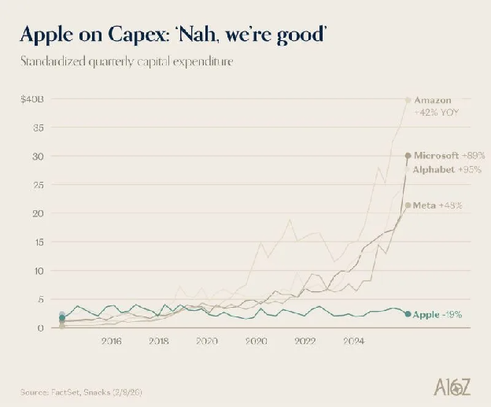
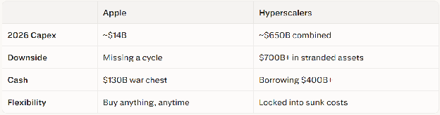

Everyone's laughing at Apple for "falling behind" in AI.

Analysts are worried. Twitter is roasting them. The vibes are bad.

But here's a question to ask yourself:

Is it whoever spends the most, wins?

Bigger capex = bigger moat = bigger returns. Right?

Historically? Companies that outspend peers on capital expenditure consistently deliver *worse* forward returns. The data doesn't even flinch on this one.

And right now, we're watching the most aggressive spending spree in the history of corporate America.

---

### **Everyone's Burning Cash Like It's a Competition**

Amazon: $200 billion in 2026 capex. Stock dropped 11% the next day. Rough.

Alphabet: $175–185 billion. Microsoft: $145 billion. Meta: $115–135

That's ~$650 billion *combined*, roughly 90% of their operating cash flow ... and they're borrowing over $400 billion to fill the gap.

Meanwhile, Apple is chilling with:

* $130 billion in cash  
* $100+ billion returned to shareholders, annually  
* A modest $14 billion capex plan  
* Record $416 billion in revenue

Wall Street: "They're falling behind!"

Apple: "Nah, we're good." ☕

courtesy of finance.yahoo.com

---

### **The Toyota Plot Twist**

Quick detour. Remember when everyone said Toyota was a dinosaur for not going all-in on EVs? Analysts downgraded them. The media wrote obituaries.

Toyota shrugged, doubled down on hybrids, and let competitors torch capital on first-gen EV infrastructure: range anxiety, charging deserts, margin compression.

Fast forward: 10.8 million vehicles sold in 2024. Fifth straight year as the world's #1 automaker. Hybrids now account for nearly half their U.S. sales. Stock crushed every traditional competitor over four years.

The late mover won. The patient capital allocator won.

Sound familiar?

---

### **Apple's Secret Weapon: Your Laptop IS the Data Center**

Here's what the market is sleeping on.

Apple isn't sitting still. They're executing a completely different playbook, one that doesn't require $200 billion in data centers.

They're turning every Mac, iPad, and iPhone into an AI machine.

The bottleneck for running LLMs isn't compute ... it's memory bandwidth. Apple's world-class silicon team built a unified memory architecture that places RAM directly on the same package as the CPU and GPU, dramatically boosting bandwidth.linkedin+2

The M5 Max hits 614 GB/s (up from 546 on M4 Max). The M5 Pro reaches 307 GB/s (up from 273 on M4 Pro). The M5 Max delivers over half the bandwidth of an NVIDIA RTX 3090 with 5x more memory.

Check out this nice article on the topic: [https://om.co/2026/03/03/apple-does-fusion/](https://om.co/2026/03/03/apple-does-fusion/)

Translation: Apple is building laptops that run 70-billion-parameter models locally. No cloud. No subscription. No data harvested. Just your machine doing the work.

Apple on capex: *"Our customers ARE the capex."*

---

### **The Real Moat: 2.4 Billion Desks**

AI models are commoditizing fast. Have your seen the open source models vs. proprietary models benchmarks -- intelligence/speed/costs at [www.artificialanalysis.ai](http://www.artificialanalysis.ai/) ? Prices are cratering. No single model stays king for long.

So the real advantage isn't the model ... it's the integration, the experience, and the trust layer on top of it. Sounds like Google too, huh?

Apple controls 2.4 billion active devices one of the most valuable front doors in tech. Their approach: privacy-first AI on their own silicon, complex tasks offloaded to cloud partners. Best-in-class AI *without* the balance sheet risk.

Apple's playbook has always been: *enter late, integrate brilliantly, win*.

---

### **The Risk Isn't Even Close**

comparison of Apple vs. Hyperscaler Strategy

If AI monetization arrives late, the hyperscalers are holding an expensive bag. Apple's worst case? They deploy that $130 billion war chest a year or two later than ideal. Manageable.

---

Sometimes the smartest move in an arms race is refusing to suit up.

Apple isn't behind. They're just letting everyone else pay for the learning curve — and when the dust settles, they'll be running your AI locally, privately, on a chip they designed themselves.

The market will catch on eventually. By then, it'll be too late. 😏

*Agree? Disagree? Think I'm giving Apple too much credit? Let me know below.* 👇

