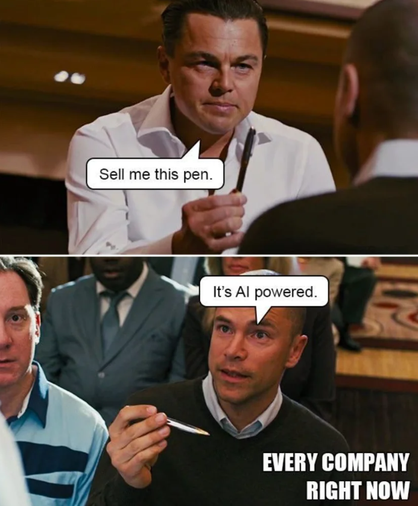
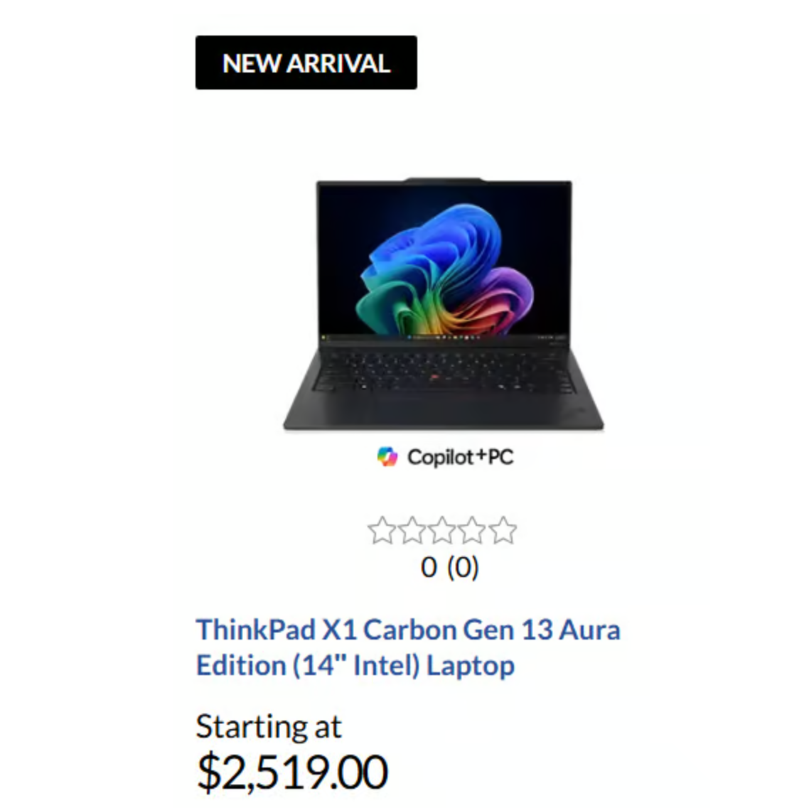

*Having AI is not a benefit*

When it comes to product management, understanding your core value proposition is crucial. Too often PMs focus all their energy on features without spending time on benefits. While features describe what a product does, benefits articulate why it matters to the customer.

[Research](https://www.gsb.stanford.edu/insights/feelings-first-how-emotion-shapes-communication-decisions-experiences) shows that 90-95 percent of decision-making and thinking is influenced by our emotional brain. Appealing to a customer’s emotions should be your top priority. By focusing on how a product can solve problems or enhance the customer's life, you create more compelling and relatable value propositions. This shift from features to benefits is essential for resonating with customers and ensuring long-term success.

This article walks you through the importance of prioritizing customer benefits and provides tips for crafting benefit-focused value propositions.

## Feature vs. capability vs. benefit

Features, capabilities, and benefits are all critical aspects of a product or service and they should be presented to the customer at different points in the journey. That said, many product teams lead with features, some lead with capabilities, and few will lead with benefits. I think this is upside-down. In order to turn it right side up, let’s dive into the differences:

|   | **Definition** | **Example** |
| --- | --- | --- |
| **Feature** | Physical attributes or descriptions of a product or part of a product | *“Longer battery life”* |
| **Capability** | What a feature does or its ability to do something | *“All-day battery”* |
| **Benefit** | The outcome or result that users experience by using a product or service | *“Leave your charger at home”* |

Have you ever left your charger at home for a device? How did that feel? Now imagine you left your charger at home with this new device. The benefit tells you up front that you can “leave your charger at home.” Feels good, doesn’t it?

Now imagine you had led with the feature of “longer battery life.” How does that feel? You’re probably not sure how to feel because you don’t know what “longer” means. Does it mean another hour or does it mean another day? This lack of clarity causes the customer some angst and increases their cognitive load. This feature is forcing them to research what “longer” means and in many cases, customers aren’t going to bother.

## Why benefits matter more to customers

One of the things that I’ve noticed over the years is that we get attached to our products. We get so attached because we’re the experts. We know every nook and cranny and technical piece of information about them. As a result, we start to lose touch with what our customers actually think about them and why they're using them.

Take the example above of a device that has an improved battery life. Most customers, the mainstream, aren’t going to dig into every technical spec as to why the battery life is better.

Imagine two teenagers talking about their new phone. Are they going to talk about how their new phone screen uses the “latest in OLED technology and therefore the battery performance has improved by 50 percent over the last generation?” Probably not. It’s just not a natural conversation in most cases.

Yes, in the case of power users or technophiles, you might have those conversations but they’re usually the minority (in most cases). Now imagine those two teenagers have been hanging out all day and one of their phones runs out of battery while the other one doesn’t.

The conversation could be one teenager saying, “Hey my battery is out of juice, do you want to plug yours in?” The other teenager responds, “No thanks, I won’t need to charge it until tomorrow.” As a result, the first teenager wants to know about the second teenager’s new phone. In short, benefits matter because they get to the VALUE delivered to the customer.

## The risk of overloading on features

You need to have a deep understanding of your customers and your customer’s problems. When you focus on features, you introduce a few risks into your organization:

| **Risk** | **Why?** | **Mitigation** |
| --- | --- | --- |
| Development team is handed the wrong feature to build | You made an assumption as to how to solve the problem and your assumption was wrong | Understand and depict the customer’s problem to the development team so they can collaboratively solve the problem |
| Customers dismiss positioning and messaging from the company | You presented features to the stakeholders (PMM, Sales, CS) | Develop a story around the customer, the product, and the benefits being delivered |
| The feature being presented has no bearing on the customer and the customer feels like you’re wasting their time | You didn’t segment the customer base and highlight which features applied to which segment of customers | Segment your customers by their needs and map specific features to those customers/needs |
| Feature bloat, product slows down and customers switch to another product | The product team believed that adding more features would help it acquire more customers or make current customers happier | Ruthlessly prioritize your features and understand the impact of each feature on the product’s performance |

The list above isn’t comprehensive by any means but it does give you a sense of what can happen if a product team’s focus shifts too far away from the customer and onto the product itself. The product team can get lost in the quagmire of requests that come in from various stakeholders.

## Shifting to a benefit-first mindset

If your team is feature-first and wants to shift to a benefit-first mindset, here are a few activities that can help you make the shift:

1. Conduct [customer discovery](https://blog.logrocket.com/product-management/customer-discovery/) to understand the most valuable outcomes for your customers
2. Develop customer journey maps by actively listening to your customers and take the time to map your product’s features to their pain points
3. Use the “feature-capability-benefit” framework above and describe each of your product’s features, capabilities, and benefits in the language of your customer

If your company isn’t used to doing these sorts of activities, you need to be patient with your teammates! Shifting your mindset to focus on benefits takes time and practice. The best thing you can do is to role-model the change you want to see in others.

One way to role-model the change is to use the “feature-benefit-capability” framework. I recommend to [use but not abuse the use of the framework](https://blog.logrocket.com/product-management/how-to-use-but-not-abuse-frameworks/). Feel free to use frameworks on your own liberally but conservatively with your team as some folks are put off by the direct use of frameworks.

That said, be sure to leverage it at times when it makes sense. One of the best times to leverage the “feature-capability-benefit” framework is when you’re in the customer validation stage. During this stage, you are trying to determine if you have a viable, repeatable sales process for your product.

You want to ensure that your positioning and messaging hits the mark with your broad customer base. Test your benefit statements (value propositions) and ensure that you’re receiving high conviction responses in return. This way, you can ensure that your product marketing and sales teams have the base platform to build their content and collateral from.

## An example of benefit-first

In this section, I’ll go back to our battery example in the context of a tech device, a laptop. The battery life of laptops (and most tech devices) are driven by a few things: type of battery, size of battery, screen size of device, type of screen, and the processor.

While there have been some battery advances over the last decade, battery technology hasn’t played much of a role in a device’s battery life. Screen technology and processor technology has. That said, everyday consumers rarely delve into the details of screens or processors.

Consumers really care about resolution of the images, quality of the images, and how long the device lasts on a single charge (along with a few other key features). Coming from the semiconductor industry, I’m always keeping an eye out for the latest and greatest processors and how they impact a user’s experience.

The latest generation of processors has significantly improved and reduced power consumption across all device categories, including laptops. Companies like Apple, Lenovo, Dell, and HP have all been promoting their laptop battery life improvements. Below is an example of the latest and greatest business laptop from Lenovo, [the Thinkpad x1 Carbon Aura](https://www.lenovo.com/us/en/p/laptops/thinkpad/thinkpadx1/thinkpad-x1-carbon-gen-13-aura-edition-14-inch-intel/len101t0108):

This laptop is targeted at the “prosumer” or “business” laptop market segment. These are users that are typically mobile professionals who require a high performance laptop with great battery life and decent graphics (but not the really high-end gaming graphics). Think executives, consultants, and international sales professionals:

You can see that the team at Lenovo has taken a benefit-first approach by stating “Powered from Dallas to Dubai.” This message focuses clearly on the benefit, that this laptop stays powered on for an entire international flight. If you forget your charger, don’t worry, this laptop has you covered.

Lenovo did a great job by tapping into the user’s emotions. Have you ever been in a conference room, cafe, or another place and your battery was running out? How did you feel? We can almost all relate to that situation and it doesn’t feel good.

Some of you may be coming back and saying, but wait, I thought you’re in the semiconductor business and that processors are driving this improved battery life? How does this relate back to your role as a product manager? The answer is simple, the processor and its performance/power consumption are delivering the benefit to the laptop maker who are then delivering the benefit (Dallas to Dubai on one charge) to the end customer.

As a semiconductor product manager, I not only have to understand the pain points of our customers (the laptop makers), I also need to understand the pain points of their customers (the businessperson, industry professional, etc.).

## Tips for crafting benefit-focused value propositions

Benefits should come from features, not the other way around. That said, most tech-forward individuals start with the features. Features aren’t going to tap into most people’s emotions so you need to reverse your thinking if you’re going to shift towards a benefits-first approach. Here are some tips for crafting value propositions that are focused on benefits:

- Keep it customer-centric: Always think about how your product improves the user’s life
- Be specific: Highlight tangible benefits and avoid vague statements
- In order to be specific, align the proposition to your **target audience**
- When you are struggling, use the feature-capability-benefit framework above

One more note here. Most people will struggle with the idea of focusing on a **target audience** when shifting to this approach. This is because most people fall into the trap of thinking that a “larger audience is better.” I’m calling B.S. on that. It always sounds great to appeal to as many people as possible but the reality is when you do that, you end up appealing to NO ONE.

## Conclusion

It’s crucial to shift focus from features to benefits because benefits get to the source of your responsibility, solving the problems of your customers. It’s important to revisit your product’s value propositions from time to time and ensure that you’re communicating the “why” behind your products and not just the “what.” Good luck shifting towards benefit-first, and comment with any questions. Until next time!

> This article first appeared on [Logrocket's Product Management Blog](https://blog.logrocket.com/author/joelpolanco/) on December 21, 2024
