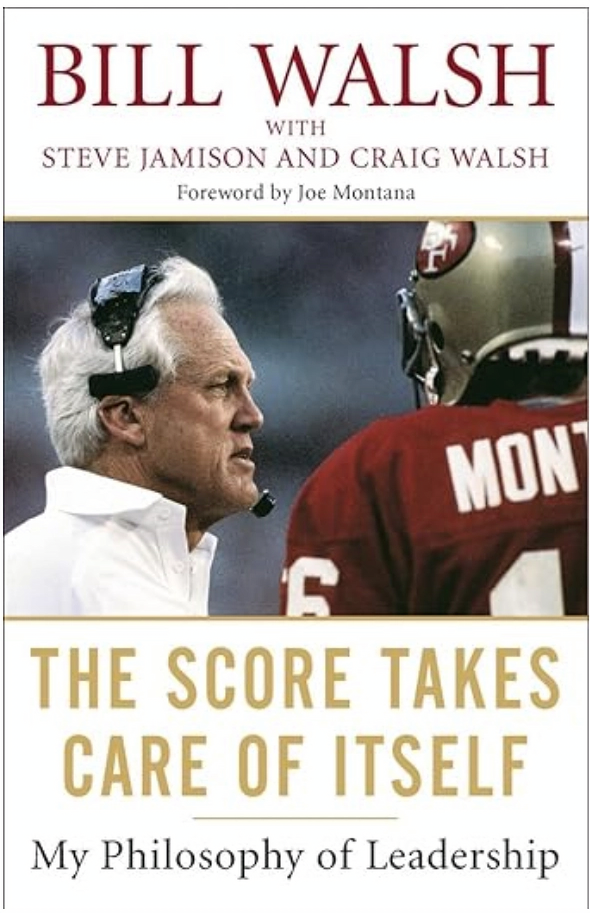

In the “Score Takes Care of Itself,” Bill Walsh presents a vivid picture of what it took for him to turn the San Francisco 49ers from the NFL’s worst team into a football dynasty. The premise of the title (and the book) is that fixating on the score (the outcome) isn’t going to change it. This book’s message is so powerful and resonates so well, that I felt compelled to write an article about how you can apply concepts from the book into product management.

This article will talk about product rituals and how they can position your team for success.

*Bill Walsh's book on leadership*

## Introduction

For many years, the product management mantra was “outcomes over outputs.” The phrase is catchy and the premise makes total sense. Articles promote the idea that we shouldn’t be celebrating when a team completes a story, feature, or initiative. That we should be celebrating when we hit 1000, 10,000, or 100,000+ users. What if I was to tell you that you should focus your attention on something else all together? What if you should throw all of that away and focus on your rituals. Well, that’s not sexy but I’ll tell you that your rituals are the inputs that are under your control. By focusing on your product rituals, you can improve your odds of success.

Product rituals are continuous, ongoing activities that product teams engage in. They are important because they create a sense of belonging, engagement, and shared understanding amongst team members. Establishing consistent rituals align your team, streamline processes, measure your progress, and drive product success. Product rituals are the embodiment of the idea that “the score takes care of itself.”

## Understanding product rituals

Product team rituals at their core are meetings, processes, systems, and behaviors. They form the basis of your product team culture. In isolation, any given ritual is not impactful. Rituals become impactful once they are integrated into an overall system. If we go back to the Bill Walsh example you would be hard pressed to find one NFL team holding extremely different meetings and processes than Bill’s. The magic though, was in how he prepared for and conducted those meetings along with the expectations he held of his players and coaches. In short, these rituals are a means for a team to gather and operate at its highest potential. The value of rituals is in their ability to build team cohesion, maintain focus, and to ensure consistent progress.

## Types of product rituals

### Daily Standups

It is important to have some sort of lightweight, regular team check-in. The most important thing here is that teams are prioritizing task level work - what was accomplished, what comes next, and where there are any blockers that need to be resolved. The best practices here are to ensure that the sprint (the current development period) has clear goals, the meeting is short, and to ensure everyone has a voice.

In some cases daily standups are not daily but weekly and in some cases they remote. How you schedule your daily standup depends on a lot of factors - your team maturity levels, your product and company maturity, your company culture, etc. One PM in the community noted “we prefer written communication as it’s explicit, recorded, and remote-friendly.” In the case of this company, daily standups were only held weekly as all other communication was conducted through slack or docs. Other companies may have a speaking and in-person culture where agreements are made in the meeting and notes are taken by a scrum master or product owner. In those cases, frequent verbal communication may be required to keep team members in sync.

### Sprint planning and retrospectives

Sprint planning meetings are held at the beginning of each sprint and sprints are generally one, two, or in rare occasions three weeks long. These meetings are planning meetings which plan out the next sprint and review the previous one through retrospectives. They help the team prioritize their work, reflect on what went well, and identify improvement areas for the team. Where daily standups are taking care of the details of a task, sprint planning is ensuring that entire tasks, groups of tasks, or product features are delivered.

Newer teams tend to struggle to understand their capacity, workload, and velocity (measures of team delivery) and this can lead to poor planning, milestone misses, or in the worst case, upset customers. Typically most teams can recover and quickly land on understanding what they can deliver and by when. If not, some product and engineering leaders will switch their teams from a sprint planning system to a kanban system. In a kanban system, they’ll work on one ticket (or story) at a time before moving on to the next one. This will help the team better understand how long each story is taking because they won’t be working on multiple stories simultaneously.

Another area that teams struggle with is in balancing discovery and sprint delivery. One product manager pointed out the following problem in a product community: “Our engineering manager says we need more product work in the pipeline, ready for development.” This statement is interesting as it points out a few issues that go beyond sprint planning:

1. The engineering manager sees their team as an engineering order taking team as opposed to a product team
2. The engineers likely aren’t doing discovery with the product manager
3. The product manager isn’t doing enough discovery to consume the engineering team’s time
4. Strategy and priorities aren’t clearly set and the engineering team doesn’t feel empowered to go beyond what is given to them

If the issues above are happening, it’s important to recognize that sprint planning isn’t the place to resolve these issues. Consider setting up some 1:1’s with your stakeholders and be prepared to have some vulnerable conversations to identify where the hang-ups are occurring.

### Monthly product reviews

Monthly product reviews are the team’s opportunity to align with executives on the current state of the product, to demo the latest progress, address the roadmap, and make strategic trade offs or decisions. The meeting is usually led by a senior member of the product team and requires a lot of input from all functions involved in the product development (product, engineering, design). Since executives aren’t involved in the day to day (daily standups) or week to week (sprint planning), it’s important that information is rolled up succinctly and materials are sent out ahead of time. This gives executives a chance to get caught up on progress, prepare their thoughts, and determine what questions they have of the product team during the meeting.

The main benefit of the product meeting is that it will ensure that the product team and the product stays aligned with customer needs and overall company direction. One of the challenges with the monthly product review is that you will have a lot of information to present but not all of it will make it into the presentation. In these cases, it's important to rotate presenters from month to month and to ensure that information not presented is placed in the back up. At the end of the presentation note that any questions that were not addressed can be addressed through email. Take good notes and summarize them along with decisions each month so that everything is documented and there is a record that can be reviewed. Keeping good records helps with the onboarding of new individuals who often ask the question “how did we get here?”

Monthly product meetings can feel like a high stakes meeting but they do not have to be. A good product lead knows that they need to keep their stakeholders aligned and informed between product meetings in order to ensure that there are no major surprises in the monthly product review. Ultimately, the product review should be seen as a place to get direct feedback on a product team’s progress along with ensuring that individuals are getting credit for their work. The product meeting is a great place to share in the successes (and failed experiments) as a collective team.

### Customer feedback sessions

Customer feedback sessions or customer discovery sessions ensure that your product stays aligned with customer needs. These sessions should be held multiple times per week and product managers should have a steady pipeline of them going at all times. These sessions are used to gather and analyze feedback from multiple data sources, discover new use cases, and to gain conviction for what the next set of product features should be.

Early on in a company’s history, customer feedback sessions will consume most of your days and weeks. Generally, you only have one product and that product is the lifeblood of the company. Over time, your company may expand into multiple products and customer segments. As a result of that success, you may speak with customers less and less frequently because more of your time will be spent managing internal stakeholders. My only advice here is to be mindful of this phenomenon and do your best to continue to meet with customers regularly. Your best bet is to prioritize your customer requests and ensure that you have a steady stream of feedback coming in.

### Cross-Functional syncs

Cross-functional syncs are meetings with your sales, marketing, or support teams to ensure there is go-to-market (GTM) and support (customer success, post sales support) alignment. These meetings offer an opportunity for teams to share dependencies and offer support for one another’s initiatives. Meetings with sales are important because your sales team is the one in front of your customers the most often and as a result, they generally have pointed feedback on what is working and what is not working. Your marketing team is often one of your key customers as you will want to provide them with many of the key insights on customer segments, value propositions and key personas to target. Customer success teams sit with customers for long periods of time and as a result, will provide you with both product improvements, onboarding improvements, and potentially future feature requests.

## Establishing effective product rituals

Establishing effective product rituals requires you to establish ground rules, open communication, trust, and a shared understanding of what each ritual entails. This can be boiled down to the following items:

1. Establish ground rules for each ritual

2. Each ritual has meetings and set frequency

3. Agendas are set for each ritual and they are communicated ahead of time

4. The ritual follows the agenda but leaves open time for Q & A

5. Time is kept in the meeting and someone in the meeting prevents it from going sideways

6. Minutes are taken, summarized and sent out after the meeting

7. Action items are taken in the meeting and are followed up on by the meeting organizer

While it looks like a lot of tedious work, I will say that not putting in the work will result in even more tedious work … and alignment meetings! Another angle here is that you can automate a lot of these tasks by leveraging technology. For instance, record your meetings and generate a transcript. You can then feed that transcript into an AI summarization tool to generate your meeting minutes. You can also cancel meetings and move them to asynchronous updates. The key here is that you remain consistent and set expectations of team members so that everyone follows through and remains engaged.

## Real world examples

Here is a list of best practices and how to implement from various companies and individuals in the product management community:

- [Rituals for hypergrowth: An inside look at how YouTube scaled](https://coda.io/@shishir/rituals-for-hypergrowth-an-inside-look-at-how-youtube-scaled)

Great for: ritual/meeting cadence, long term planning, setting ground rules

- [Product alignment framework at Miro](https://coda.io/@farbod/product-alignment-framework-at-miro)

Great for: monthly product reviews

- [Embracing Asynch Work](https://handbook.gitlab.com/handbook/company/culture/all-remote/asynchronous/) and [Directly Responsible Individuals at Gitlab](https://handbook.gitlab.com/handbook/people-group/directly-responsible-individuals/)

Great for: remote meetings and communication, culture/accountability

- [Figma Config 2023: Rituals of Modern Product Team](https://coda.io/@shishir/figmaconfig2023)

Great for: a wide range of rituals and the context behind them

The list above provides you with a wide array of rituals that different teams followed, the context behind them, and the culture that the team established. You will begin to notice that there is no single overarching method or framework that everyone uses. The key is to understand the dynamics of your company, your team, and your product maturity. What works for one team won’t necessarily work for another. The most important thing is to get started and to establish a rhythm which can then be assessed and refactored over time.

## Overcoming challenges in implementing product rituals

The hardest part in implementing new rituals or replacing old rituals will be in getting the team “bought in” to the process. Bill Walsh talks about this extensively in his book “The Score Takes Care of Itself” as he described the first two years as the coach of the 49ers who were considered the worst team in the NFL at the time. The challenge was getting people to believe and no ritual by itself will get someone to believe, it takes a leader to get someone to believe in a ritual. James Clear, author of Atomic Habits has this to say about Bill Walsh’s book:

***“The score takes care of itself.” The same is true for other areas of life. If you want better results, then forget about setting goals. Focus on your system instead.”***

In addition to finding the right set of rituals for your team, you will need to find (or sometimes manufacture) sources of motivation for them. You will need to be consistent all along the way. This doesn’t mean throwing away something at the first signs it isn’t working but rather sticking with it for some time.

## Conclusions and key takeaways

Throughout most of my career I focused on “outcome over outputs” or the “y’s” as I would like to say. After reading Bill Walsh’s “The Score Takes Care of Itself” and observing high performing individuals inside and outside of work, I’m convinced that I now need to focus on my rituals and systems or the “x’s (inputs).” Because the “x’s” (or inputs), their speed, cadence, consistency, and quality will be the key controllable things that you can deliver. The “y’s” or outputs, are affected by a number of other factors that you don’t have a control over. You can improve the inputs and your ability to deliver them and as a result the score will take care of itself. Establishing rituals and the context, cadence, and consistency of their delivery are something that every product team should strive to improve. Focus on designing rituals that work for our product, team, and company and fade away the ones that don’t work. In the end you should have control of them versus them having control over you.

Additional resources:[https://coda.io/@shishir/join-the-rituals-of-great-teams-braintrusthttps://blog.lucidmeetings.com/blog/better-meetings-booklist/](https://coda.io/@shishir/join-the-rituals-of-great-teams-braintrusthttps://blog.lucidmeetings.com/blog/better-meetings-booklist/)

> This article first appeared in [Logrocket's product management blog](https://blog.logrocket.com/author/joelpolanco/) in October 2024.
