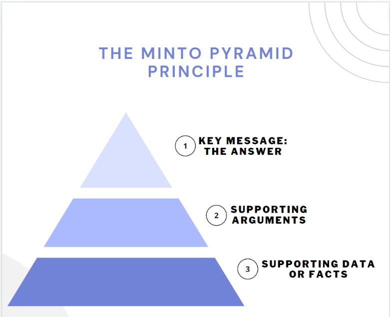

BLUF, or bottom line up front, is a communication strategy that starts with the key message you want to deliver to your reader.

The BLUF acronym is a powerful messaging technique, especially for emails directed at busy individuals like executives. It saves their valuable time by presenting the key takeaway right at the beginning, eliminating the need to sift through the entire message for the main point.

## Importance of effective communication

Out of everyone working in a company, executives have the least amount of time available. Context switching, endless meetings, and other issues consume much of an executive's time. And the last thing they will want to do is read through an entire email to get to the crux of the issue.

As a product manager, you wield significant influence through your communication. Your role is pivotal and your most important resource is [your time](https://blog.logrocket.com/product-management/4-ds-time-management-how-to-be-productive/) and that of those you work with.

So, by communicating effectively with your customers, teammates, and executives, you allow yourself and others more time to work on strategy, critical thinking, and other high-leverage tasks.

But when your communication is ineffective, you will have to spend more time administrating, coordinating, and clarifying all tasks, whether they’re high-leverage or not. When this happens, you end up working extra hours, likely resulting in burnout.

Remember, product management is a fundamentally influential role. And influencing begins with clear, concise, and [effective communication](https://blog.logrocket.com/product-management/guide-effective-communicator/).

## Introducing BLUF

The BLUF acronym stands for bottom line up front. But you’ll also see it as the Minto Method or the Minto Pyramid, named after Barbara Minto. Minto is an executive communication consultant and Harvard graduate who authored the book *The Pyramid Principle: Logic in Writing and Thinking* in 1985. Here, she laid out her ideas on effective communication with the BLUF acronym:

*The Barbara Minto Method Pyramid*

Here’s the key idea — most humans think and communicate in the following order:

1. Supporting data or facts
2. Supporting arguments
3. Key message

Minto, in her book, argues that this format is inefficient — the reader of the message has to spend a lot of time sifting through details before they can get to the key point. This is where she introduced her ideas on effective communication. With the BLUF acronym as a strategy, the reader is given the key message, i.e., the answer, right at the start of the message.

## How to craft a BLUF statement

Time to turn the BLUF acronym into a real strategy for you.My favorite technique for crafting a BLUF statement is first to ask myself two questions:

1. Who is this message for?
2. What do they need to know?

This sets me up to start with the key takeaway and/or the answer. Remember — that’s what they care about, and they will appreciate that you’ve quickly gotten to the punchline. Let’s go over an example of a situation where BLUF came in handy for me.

### Scenario

My segment needs support for a software driver update to enable a customer design win. I’m making a request to a stakeholder organization with a long list of priorities. But to take up and prioritize my request, they will ask about the ROI and weigh this task against other requests being made of them.

### BLUF statement

> Hello,

> I’m requesting resources to update XYZ driver in the next sprint, or else we risk losing our customer to competition (key takeaway: the answer).

> Our customer, who makes up 30% of our market (XXX units, YYY revenue), is interested in ABC features which are not available unless our XYZ driver is updated (supporting arguments).

> Plus, this customer has been our hardware for two generations and wants to stay with us, but the competitors are offering them another option (data and facts).Can your team support our request?

> Looking forward to your prompt response,

> Joel

Notice I begin with an impact statement that answers, “What is the impact if we do not work on this now”? The impact will be that we may lose the customer to competition, and we don’t have more time to lose. I then go into the impact value, the number of units, and the revenue in my supporting arguments. Finally, I speak of other data and facts that support the arguments I am making.

Now, you could reorder these sentences and start with the fact that this customer has been loyal, and the competition is offering them another option.

But many customers are loyal and are being offered alternatives, aren’t they?

And this way, the final sentence won’t get to the key point that we risk losing this customer. So, the reader may interpret this request as not being high on priority.

## Integrating BLUF with other communication techniques

A key communication technique that makes BLUF more impactful is [active listening](https://blog.logrocket.com/product-management/active-listening-skills/).

I say this because active listening allows you to develop empathy and understand the listener better. If you really understand the person you are speaking with, you will know what they care about and what will be impactful for them.

Active listening will supercharge your BLUF statements — you can position your BLUF statements in the most effective and impactful way for your readers.

Remember — communication is not about what’s in it for you; it's about what’s in it for them.

By focusing on who your BLUF is targeted for, you will understand how to craft your BLUF statement better.

## Challenges to using the BLUF acronym

Integrating BLUF into your repertoire may be a challenge for some.

For one, most people don’t think the BLUF acronym way and so, they don’t write this way.

So, if you tend to start with the facts, get to your arguments only later, and end with the key takeaway, don’t stress. I have a solution for you.

Just follow your usual route. But right before sending out your communication piece, rearrange it to follow the Minto Pyramid. Simply swap the key message from the bottom to the top and the supporting data and facts from the top to the bottom. Easy BLUF acronym application, right?

## Last words

Thinking and writing go hand in hand. Better writing tends to lead to better thinking.

But as Barbara Minto observed, effective communication requires you to tweak your communication occasionally. We tend to think through facts, develop arguments, and then come to an answer when we are thinking.

But when communicating with busy individuals, it’s better to get to the point quickly.

Some folks will want the details, and some won’t. By adopting the BLUF acronym — providing the punchline upfront and the details next (especially in your emails) — you’ll effectively communicate with everyone, and they will appreciate you.

> This article first appeared in [Logrocket's product management blog](https://blog.logrocket.com/product-management/using-the-bluf-acronym-to-improve-communication/) on July 3, 2024.
