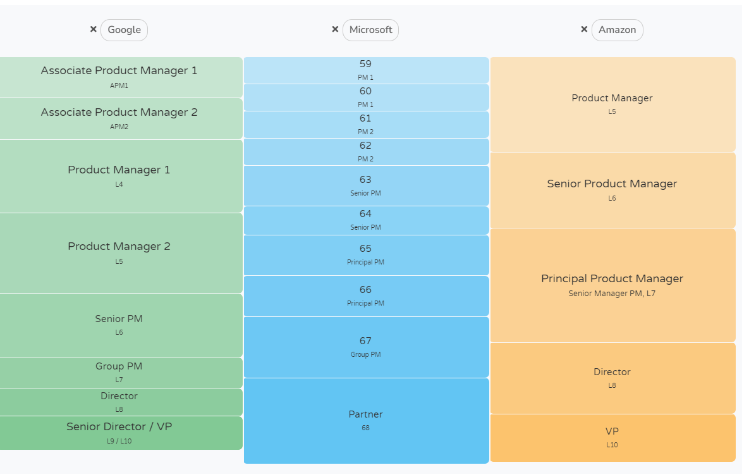

Now that the ZIRP era is in our rear view mirror, the product management career has shifted in a number of ways. It’s tougher to get into and it's even tougher to find roles that manage PMs.

Fortunately, the product management career path has opened up new opportunities for IC product managers and companies have begun hiring again. Despite all the turbulence, product management remains an excellent career option. This article will go over product manager career paths, skills, compensation and more.

## The role of a product manager in 2024

The role of a product manager is to drive success through products. I use the term product very liberally here as a product in this context could be a service, a digital subscription, or any other form of a business transaction with a user and/or customer.

A product manager focuses on three key areas: desirability, feasibility, and viability. Most will argue that a product manager plays a small role with regards to a product’s feasibility as engineering is the primary driver of that area. When it comes to a product’s desirability or business viability, no one will argue that a product manager isn’t playing a role.

There are two main paths when it comes to PMs:

1. **Individual contributor path** — Successive “hands on” roles into larger product areas
2. **Management path** — Successive people management roles in larger organizations

Each of these paths require different sets of skills and certain personalities tend to perform better along each path. These paths also aren’t independent and people often switch back and forth between them throughout their careers.

## Career progression for product managers

Product managers are known for having a wide array of degrees and experiences prior to entering into product management. I, for example, managed a data science team before becoming a product manager. In tech, it's common for individuals to switch from engineering to product management.

The chart below highlights the typical path for a product manager at tech companies that have a functional department structure:

As you can see there’s a fork in product manager’s career progression after the senior product level where one can opt for a senior individual contributor (IC) path or a manager path. In some cases, you may want to move between a manager and an IC role depending on your current and future career objectives.

One other consideration, companies such as Amazon and Intel have [a business unit structure](https://ceopedia.org/index.php/Strategic_business_unit) as opposed to a functional structure like the one above. In a business unit structure, general managers are in charge of a business unit that’s made up of functional areas such as product, marketing, and engineering.

Roles such as VP of product or chief product officer generally aren’t present in a business unit structure. In this case, a product director may opt to move to a marketing director or engineering director role in order to better position themselves for a general manager role in the future.

## Significance and level in a company

The significance of the product manager role depends on the company, its product culture, and how it hires into the product manager role.

Some companies, like Google, are famous for having an associate product manager program which encourages recent college graduates to apply for junior product manager positions in the company. These positions offer individuals to get ground level experience and direction from more senior product managers starting on day one. These associate product managers have a well-defined career path and have the opportunity to climb a clear product management ladder.

Other companies don’t staff product managers at junior levels. Those companies will typically hire mid to senior level product managers with experience from other companies. In other cases, a company might convert individuals into product managers from other departments after they’ve accumulated some product management skills over the course of their career. These companies don’t have formal product management training programs and all learning is done on the job or through outside education.

At most companies, a product manager is considered a strategic role and they’re expected to influence the direction of the business unit, product and or service. Note that I use the word influence and not command. Over the years there was a saying that the product manager is the “CEO of the product.”

I think that saying did more harm than good to both aspiring product managers and to the product teams that they worked on. No one wants to be told what to do by their peers. Product managers need to build their influencing skills like a CEO but they should never assume they have some sort of positional power over their stakeholders.

## Challenges in landing a product manager role

Landing a product manager role can be quite challenging if you don’t have any direct experience. While there are a number of ways to overcome those challenges, I will list my to “go-to’s”:

1. Leverage your current experience in an adjacent area
2. Identify a [secondment opportunity](https://blog.logrocket.com/product-management/what-is-secondment/)

The first one is my favorite as it leverages your current expertise in a given area (engineering, data, other) in a given product area. I was able to land a product manager role because of my experience in data science. While I didn’t have external facing customer experience, I was able to demonstrate my expertise in data, analytics and requirements gathering to show that I had the aptitude and skill to work with customers to solve their internet of things (IoT) challenges.

I also had several years of working on scrum teams and a good knowledge of agile practices. If you aren’t able to leverage your current expertise or if you are continually being told that you have a large skills gap, I suggest you identify [a coverage or project that you can work on](https://blog.logrocket.com/product-management/what-is-secondment/) to start building your resume around.

## Skills and qualifications for advancing in product management

Before assessing what specific skills and qualifications you’ll need in order to advance, you’ll want to take an inventory of the company you are working at. There are number of variables that can impact how a product manager needs to operate to be successful in a given company:

1. Is the company tech or non-tech?
2. What industry is the company in?
3. Company product culture — sales-led, design-led, engineering-led, etc.?
4. The maturity of the product - early, growth or mature ?
5. The maturity of the company - early, growth, or mature ?
6. The department in the company - product org, business unit, or IT department ?

This isn’t an exhaustive list but it does cover a lot of variables to consider. You’ll want to compare your answers to the questions above to your own personality, behaviors, and desires.

You may find that you’re in conflict with a company’s product culture or the department that you are working in. The first thing to do in those cases is to begin accepting your reality and that of the place you are working in and the next thing is to decide what you would like to do about your reality.

In some cases, you may opt to try to change the culture of your department and in other cases you may not want to take on that daunting task and just leave your department or company.

## How company stage plays a role

In one of my favorite career path posts called “[Stage of company, not name of company](https://theskip.substack.com/p/stage-of-company-not-name-of-company),” Nikhyl Singhal does an amazing job explaining the importance a company’s stage plays in your career path and development. In that post, he talks about the experiences a product manager would get if they were at a startup versus a growth versus a mature company.

Newsflash, the experiences are very different! Here are some key skills that are required for a product manager depending on the stage of the company they are at:

|   | Startup | Growth | Mature |
| --- | --- | --- | --- |
| Skills | Craftsmanship, experimentation, identifying PMF | Scaling processes, Hiring good people, transitioning technologies/systems | Optimizing processes, influencing across orgs/stakeholders, administrative tasks |
| Behaviors | Likes uncertainty, comfortable w/o metrics, close to early customers | Operator mentality, creates metrics, organization building, driving change in order to scale | Metric optimization, polished management, patience with slow change |

What I really like about this framework is that it gets you to think a little differently about what specific skills you’d like to develop versus other typical factors that we use like a company’s brand. If you think about your career as a product, you’ll want that product to fulfill certain jobs-to-be-done (JTBDs) and working at companies in different stages will be a key factor in fulfilling that need.

One observation I’ve made over the last several years is the transition of many product managers from growth to mature companies. During the ZIRP era (2010-2021), growth companies were where the action was in product management. These were series B-E companies that were focused on driving user growth and product-market fit expansion (many times, in an unprofitable way).

Since the rise in interest rates, many of these companies have gone through a lot of layoffs in order to achieve profitable growth or to just keep the doors open. As a result, the product managers at these companies now feel stuck or out looking for jobs. Many of these product managers never saw themselves working at stodgy mature companies as they were seen as slow and not innovative.

History shows us though that profit and sustainable business models matter so don’t discount mature companies! In fact, many of these mature companies are the only ones that are able to afford the latest and greatest (and very expensive) AI hardware to conduct cutting edge research and innovation.

## Product manager specializations

Another way to think about your skills and qualifications as a product manager is through specializations. Product managers are becoming more and more specialized. Below are some examples of product management specializations that I’ve come across over the last several years:

|   | Works at | Works on | Skills |
| --- | --- | --- | --- |
| Consumer product manager | B2C companies (ie - Startups, Meta, Google, etc) | Features and products that reach 100k+ customers | User-centered design, empathy, research |
| Enterprise product manager | B2B companies (ie - Startups, ServiceNow, Salesforce, etc) | Features and products that reach large enterprise customers | User versus buyer personas, customer workflows, enterprise legal agreements and Partnerships |
| Technical product manager | Platform companies (ie - Startups, Amazon, Samsara, etc. | Platforms that are scaled by other product teams | Technical, engineering, internal stakeholder management |
| Growth product manager | Growth companies (ie - TikTok, Growth Stage Companies) | Driving revenue through product metrics | Marketing, statistics, monetization, user flows/onboarding |

While these roles overlap and share some commonalities, each of them serves a different set of customers with a different set of needs. In the case of a growth product manager, you’ll be analyzing the same customers as a traditional product manager, but you’ll be responsible for the success metrics of the product more than the success metrics of the customer.

## Salaries and compensation

Product manager salary and compensation can vary widely based on your geo, company size (startup or mature), brand name of company (ex. - FAANG), and other factors. If you search on Google, the current response is “According to Glassdoor and Payscale, product managers can earn between $76,000 and over $200,000 annually.”

This generic response is fairly useless so I’ll save you a lot of time. Start researching with [www.levels.fyi](http://www.levels.fyi) which provides you with a rough “apples to apples” salary and compensation comparison across companies. The key thing to note is that the salary and compensation at one company level can be vastly different than at another company:

*A grade level snapshot comparison from Levels.FYI*

For example a senior PM at Google (as of April 25, 2024) makes an average of $478K per year in total comp while a senior PM at Amazon makes an average of $286K in total comp. In order for you to make the same comp at Amazon as you would at Google, you would have to be at the principal product manager level as the chart above shows.

Another interesting thing you might notice from the levels screenshot above is that both Google and Microsoft have several individual contributor (IC) product managers, senior product manager and principal product manager levels. Over the last several years, there’s been a lot of discussion in the community about the need to have better/stronger career paths for individual contributor PMs that aren’t interested in managing people.

Many companies have filled this need by carving out roles for senior individual contributors by creating more levels and defining roles with larger scope. At the same time, some companies have opted to have a “flatter” management structure.

One thing to note is that the information above doesn’t apply apples to apples to startups which rely heavily on equity as a form of compensation. Before joining a startup, be sure to do some due diligence on the company, its valuation, its potential, and what percent of equity you feel you’re worth.

Below is a table of resources that will help give you a sense of how wide the salary and compensation windows can be across mature and startup companies:

| Resource | Note |
| --- | --- |
| [www.levels.fyi](http://www.levels.fyi) | A great resource for comparing compensation across companies and levels. It’s helpful for established companies, not so much for startups |
| [https://www.skip.community/how-much-money-do-product-managers-make/](https://www.skip.community/how-much-money-do-product-managers-make/) | Great for top tier Silicon Valley tech companies, not for non-tech companies or companies outside of Silicon Valley |
| [https://topstartups.io/startup-salary-equity-database/](https://topstartups.io/startup-salary-equity-database/) | Great for startup salaries, not for mature companies |

## Key takeaways

There’s so much to the product manager role and charting your path is quite challenging (and fun)! I like to say that we think our careers are a steady climb upward, but in most cases they’re full of twists, turns, trap doors, and ladders. Sometimes you’ll want to take a lower paying role in order to gain new experiences in a deficient area and sometimes you may be focusing solely on total comp.

There’s no wrong answer, there's only an answer that's right for you at a given time and place. My only recommendation is that you break out your “wide lens” and look broadly when it comes to your career. For those that are stuck. I always recommend you reach out for help through a PM community, meetup, Linkedin and if you have the means, get help from a product career coach.

> This article originally appeared in [Logrocket's product management blog](https://blog.logrocket.com/author/joelpolanco/) on May 27, 2024
