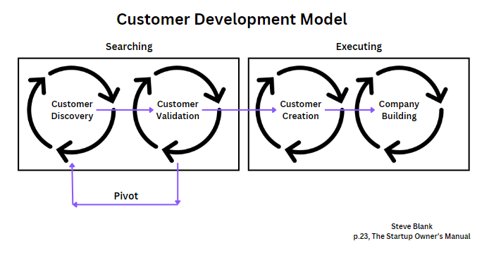

To build a successful product, you need to thoroughly understand the market you want to enter and your target customers. However, sometimes PMs spend too much time chasing a market when ultimately your customers dictate whether a product succeeds. You could identify a really strong market but without significant customer adoption you won’t be able to access any of it.

Because of this, you should take the time to add customer validation into your customer development model. Customer validation involves confirming that your sales process and product features consistently meet the needs of your customers.

Keep reading to learn the full benefits of customer validation, steps for implementation, tools and techniques you can lean on, and a real-life case study.

## What is customer validation?

Customer validation is the step in a customer development process where you validate your solutions against customer needs and expectations. You move into customer validation after [customer discovery](https://blog.logrocket.com/product-management/customer-discovery/):

*Steve Blank's Customer Development Model*

During customer validation, you test your future viability. Essentially you’re asking two questions: “can this product scale profitability?” and “can we set up a scalable, repeatable sales process?”

Sometimes people confuse the difference between customer and market validation. The first refers to whether you solve your customers’ problems effectively, whereas the second speaks to the size of the overall market, your competition, and the percent of the market you can reasonably expect to win.

## Benefits of customer validation

Customer validation reduces the risk of building something that nobody wants. By running customer validation you can:

1. Minimize your cash burn
2. Pivot quickly
3. Remain in a mode of continuous discovery with your customers
4. Easily go back to customer discovery
5. Prevent wasting time on sales and marketing that isn’t going work

As a PM, you’ll focus heavily on customer desirability during the [customer discovery phase](https://blog.logrocket.com/product-management/guide-to-customer-discovery-process/). As you move into customer validation, you’ll focus more on viability while monitoring feasibility with your engineering counterparts.

## Steps to conduct customer validation

By the time you’re ready to conduct customer validation, you should’ve already tested your hypothesis on customer segments in the discovery phase. This lets you hone in on what you want to validate with your sales team. As you move through validation, you’ll get a sense of whether you’ve reached product/market fit. The customer validation process involves four key steps:

1. **“Get to Market” activities** — Product positioning, sales/marketing “test” materials, hiring of key sales personnel, and developing your channels
2. **Initial “Go to Market” activities** — Selling your product (even if unfinished), meeting with customers, and getting feedback from them
3. **Positioning activities** — Refining your company and product story. You will also differentiate your product from your competitors in your defined market category once you have a few sales under your belt
4. **Validation activities** — Confirm that your product is selling, your marketing is resonating, and your metrics are moving in the right direction

At the end of customer validation you should have feedback from user adoption or actual sales to point towards. You’ll want to make sure that you continue to fine-tune your sales process to make it scalable and repeatable.

## Tools and techniques for customer validation

When it comes to customer validation, you want to ensure that you can deliver consistent, repeatable sales. You need to know people that want your product. Once you start seeing that shift towards determining whether you’re reaching your ideal customer.

Ideal customers live within your target market and are ready to buy now. They should have a burning problem no one can solve except for you. You might find that you’re not positioned correctly or to the wrong target audience.

The follow details the the activities and tooled needed for each customer validation step:

| **Customer validation step** | **Get to market** | **Go to market** | **Positioning** | **Validation** |
| --- | --- | --- | --- | --- |
| **Activities** | Hire sales closer Target audience Personas Solution briefs Tech briefs Customer stories Website | Sales calls Lead gen Demand gen Promotion Prototype testing Beta testing | Sales call reviews Transcript analysis A/B testing | First analytics hire Customer advisory Board Surveys Interviews Customer feedback |
| **Tools** | Canva PowerPoint Adobe tools CRM | Lead gen tools Social media | Zoom recording AI sales call tools Position frameworks | Excel, SQL Survey platforms Customer feedback platforms |

You’ll need to identify two additional team members: a sales closer and a data analytics hire. Your sales closer leads your sales calls, tests out all your get-to-market tools/collaterals, and provides you with valuable customer feedback. Your first data analytics hire builds your data foundation, establishes systems for storing and translating data into information, and assembles analyses.

These two hires are critical to your success and as a result, it’s important to hire people that have a growth mindset. They must be willing to test and learn, adapt to change quickly, and actively listen to customer needs.

## Challenges and solutions in customer validation

Customer validation can be really challenging as customers can lead you in multiple directions. To add to this, it’s estimated that [at least 40 percent of B2B deals end in “no decision.”](https://www.aprildunford.com/post/positioning-vs-strategy-vs-vision) I’ve personally experienced this myself and it’s incredibly frustrating because of the amount of time you will waste trying to convert that “no decision” customer to a “yes” only to find out that they’ve changed direction and are now working on a new initiative.

Large companies are notorious for this as they tend to take a long time to make purchasing decisions and your startup can only sustain a cash burn for so long. You can expect to experience some of the following challenges:

- **Confirmation bias** — Believing your solution is ready for “prime time.” Objectively set sales KPIs that are difficult but achievable
- **Data management** — Failing to organize, store, and plan your data foundation. Focus on your first data hire and their data management skills
- **Market size** — Believing your market is bigger than it really is. Run several scenarios and judge their likelihood of fruition. Collect data on potential adjacent markets outside of your target market to test your assumptions
- **Pivoting** — Either failing to pivot or pivoting too much. Put strong time bounds in place to avoid delaying a pivot too long or wanting to pivot too frequently

## Case study — Going narrow to scale

[Samsara](https://www.samsara.com), a leading IoT platform provider, was founded in 2015 by Sanjit Biswas and John Bicket. It is one of two companies to achieve both $1B in ARR and also continue to grow at 30 percent (the other is Crowdstrike). Samsara connects assets that have historically been disconnected from networks (think oil wells, train cars, street lights, etc.) and has them send data to your operations team.

While this is a very big and broad vision, Samsara started narrowly in order to build a platform that could achieve that vision. John Bicket, Samsara’s CTO, [recently said](https://diginomica.com/samsara-cto-and-co-founder-were-going-through-transition-and-expanding-platform) in an interview:

> “I think the approach we took from very early on was that we wanted to be really customer focused. Instead of building a big horizontal platform, which can be really technical and really interesting, it’s better to make a few people really, really happy, rather than make something that’s kind of useful for a tonne of people.

> In some sense, IoT platforms are really interesting, but in order to get them broadly adopted, you have to build applications on top of it to make them useful.That was our strategy: focus on where this would be really important and very useful for some people.

> So we started from there, an application that was really useful, before then trying something really broad.”

Samsara initially started with an internet gateway that could track a vehicle’s GPS location, temperature, and vehicle diagnostics. Its target customers were trucking companies and municipalities. By focusing on this narrow use case, it was able to develop a consistent and repeatable sales motion for its devices.

Bicket reveals the key to Samsara’s success was in its ability to stay focused on a key use case before scaling too soon. In the case of IoT platforms, or platforms in general, many companies will often start with too many use cases that are targeted at different customers and value chains. As a result of this high level of variability in target customers, personas, value propositions, and required features most IoT platforms never end up solving a problem end-to-end.

In the case of Samsara, it solved basic problems that companies and municipalities were having with their fleets of vehicles. Once it was able to develop repeatable sales, it moved into other use cases. This case study is a great example of why you should aim for short-term discipline to stay the course and solve a problem before turning your attention to your long-term goals.

## Key takeaways

Customer validation, or solution validation, is the step that follows customer discovery. Once you’ve validated your demand (customer discovery), you should quickly move towards validating your solution (ideally an alpha/beta solution) with real customers.

Throughout the customer validation phase you should be asking two questions: “can this product scale profitability?” and “can we set up a scalable, repeatable sales process?” If your answer to either of those questions is “no,” then you’ll need to do more validation or to pivot and go back to customer discovery. And as a best practice, it’s always a good idea to familiarize yourself with validation tools and case studies.

> This article first appeared in [Logrocket's product management blog](https://blog.logrocket.com/product-management/customer-validation-product-management/) on September 26, 2024.
