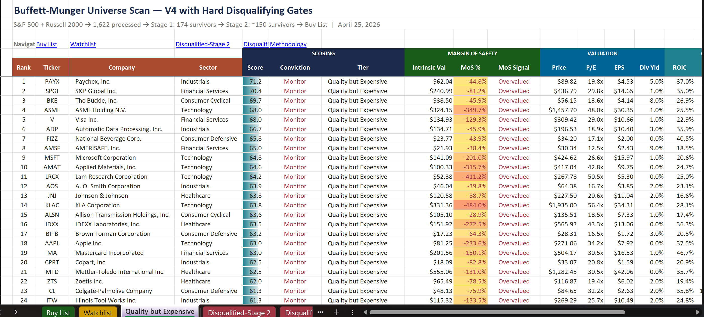

I Built a Buffett–Munger Stock Screener with AI. It Mostly Works — and That’s the Problem.

I wanted to answer a simple question: can you systematically replicate Buffett and Munger’s investment filter using AI?

So I built a two-stage stock screener using Perplexity Computer and ran it across 1,622 companies (S&P 500 + most of the Russell 2000).

## The architecture worked exactly as designed

Stage 1: Hard Financial Filters  
The system eliminated 1,448 companies immediately.

- 621 failed profitability
- 371 had weak ROIC/ROE
- 318 lacked a 10-year operating history

*In other words, it removed the obvious junk ...exactly what Buffett would do in seconds.*

Stage 2: Qualitative Filters (AI + Moat Durability)174 survivors entered a second layer that asked harder questions:

- Is this business vulnerable to AI disruption?
- Is the moat dependent on fragile workflows?
- Is this “too hard” to understand or predict?

That step eliminated another 22 companies, including names like ADBE, INTU, ACN, and META. The system refused to rank businesses where the moat might not survive structural change.

So far, so good. Then things got weird.

## The Buy List Problem

The final output produced:

- 9 “Buy” ideas
- 16 Watchlist
- 127 “Quality but Expensive”
- 22 Disqualified (Stage 2)

But the Buy List didn’t look like Buffett. At all.

Instead of high-quality compounders, it surfaced:

- Specialty insurers and financial holding companies
- A $200M MLM supplements company (LFVN)
- A fertilizer commodity business (CF Industries — which should’ve been excluded)

The only names that felt remotely aligned? Novo Nordisk and General Mills.

What happened?

The model optimized for statistical cheapness, not business quality.

It found companies with high ROE and low multiples in unloved sectors — not “wonderful businesses.”

Meanwhile, the companies Buffett actually owns or would admire — Apple, Microsoft, Visa, Costco — were pushed into “Quality but Expensive.”

Which is exactly where they belong.

## The Real Lesson

You can automate the elimination process.

You cannot automate judgment.

This system is extremely effective at telling you what NOT to buy:

- 1,448 companies failed basic quality filters
- 22 more failed durability tests

That’s a powerful outcome.

But identifying “wonderful businesses at fair prices” requires something the model doesn’t have:

Context.

- How strong is management really?
- How do customers behave in downturns?
- Does this business look the same after 5 years of stress?

Those answers don’t live in financial ratios.

## What V4 Actually Is

This isn’t a stock picker.

It’s a negative filter.

And that’s still incredibly valuable.

The real output isn’t the Buy List — it’s:

- The Disqualified list (what to avoid)
- **The Quality but Expensive list (what to wait for)**

That second group — 127 names — is probably the closest thing to a Buffett universe.

The Honest Limitations

- Russell 2000 coverage is ~80% complete
- Commodity exclusions need tightening (CF slipped through)
- Some small caps are statistical artifacts (LFVN)
- Acquirers like ROP, WM, and LIN get penalized due to goodwill distortion

These aren’t bugs — they’re reminders that investing isn’t purely mechanical.

Where This Goes Next

If you use this the right way:

- Ignore most of the Buy List
- Study the “Quality but Expensive” names
- Use disqualifications as a hard filter

Then you’re much closer to how Buffett actually thinks. Not by automating his decisions…

…but by systematizing his discipline.

And that’s the part most investors skip.

If you would like a copy of my Buffett-Munger V4 Screener, reach out to me on Linkedin: [www.linkedin.com/in/jpolanco](http://www.linkedin.com/in/jpolanco)
