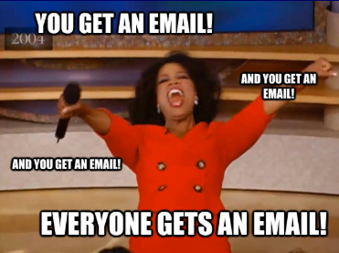
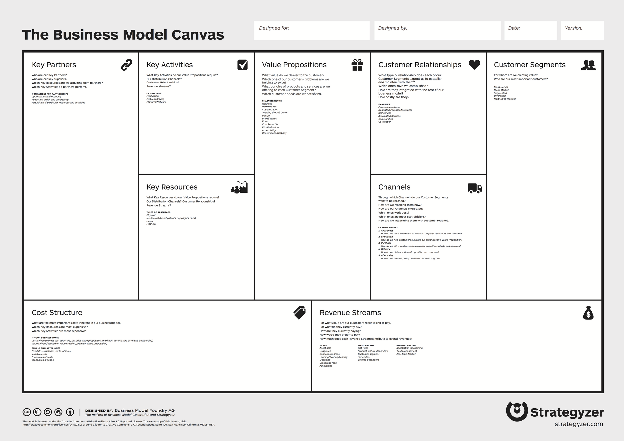
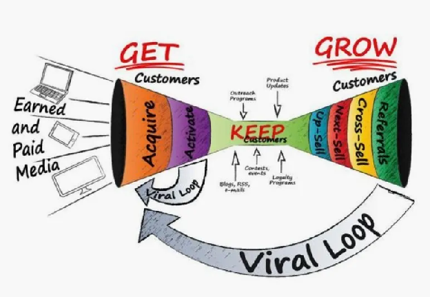

Most first-time founders share a common origin story. They have a brilliant idea, spend six months building it, and then launch. Then…crickets. Their customer segment has no idea the product is available, or that the way they planned to sell it. 

They built before they listened, and they assumed their way into a dead end.

The antidote isn't more market research decks. It's two deceptively simple questions: 

*How will customers find you?* And once they do, *how will you keep them?* 

Those questions sit at the heart of two Business Model Canvas elements that new founders often gloss over … Channels and Customer Relationships. Understanding these two building blocks before you write a line of code or pitch a single investor is one of the highest-leverage things you can do.

By Strategyzer, www.strategyzer.com

---

## What is a Channel?

Channels are where awareness is created, where evaluation happens, where the transaction takes place, and where support lives after the sale. Think of it as the full lifecycle of a customer's encounter with your product. From the moment they first hear about you to the moment they're happily using what they bought (or unhappily calling for help).

Channels break into a few broad types: direct channels, where you own the relationship entirely (your own website, your sales team, your store); and indirect channels, where you use resellers, distributors, or partners to reach customers at scale. Each type comes with a different cost structure and a different degree of control. A direct sales model means you get rich customer data and tight feedback loops. A distributor model means faster reach but thinner margins and less visibility into what your customer actually experiences.

Your channel has to match the context your customer actually lives in.

---

## Channels as Hypotheses, Not Declarations

Here's the mindset shift that separates good product people from great ones: treat your channel as a hypothesis to test, not a strategy to defend. The right question isn't "We'll sell through resellers" but rather "We *think* our customers want to be reached through resellers.”

Take Calendly as a real-world example. Founder Tope Awotona targeted a painfully specific problem: the endless email back-and-forth of scheduling a meeting. His initial segment was individual professionals like salespeople, recruiters, consultants who lost real time and credibility to that friction every day. Rather than building a sales team, Calendly went pure self-serve: no human assistance, no paid advertising, no enterprise procurement features. They kept CAC (Customer Acquisition Cost — what you spend to convert one paying customer) as close to zero as possible by letting the product spread itself. *Every scheduling link a user sent was a live demo*: the recipient experienced the product before they ever heard a pitch. That channel insight… that the customer *is* the distribution shaped everything from the freemium pricing to the deliberately single-purpose UI. They eventually added a sales team, because discovery revealed a specific signal: larger organizations wanted company-wide rollouts and preferred talking to a human first. The channel evolved because customers said it should, not because the founders assumed it would.

When you're doing your own customer discovery interviews, you're not just learning about pain. You're learning about channels. Ask: *Where do you find out about new tools like this? Where do you currently buy similar things? Do you need a demo, or do you just want to try it?* Those answers tell you whether your customer expects to stumble across your product on a community forum, be handed a trial link by a colleague, or sit through a 45-minute sales call.

---

## Customer Relationships: Get, Keep, Grow

Once a customer finds you through a channel, the relationship work begins. And it has three distinct jobs: Get, Keep, and Grow.

[https://medium.com/@youngstapreneur/how-to-maximise-your-customer-relationship-cycle-478dd1d004e1](https://medium.com/@youngstapreneur/how-to-maximise-your-customer-relationship-cycle-478dd1d004e1)

Getting a customer means moving them through four stages: Awareness, Interest, Consideration, and Purchase. This is the funnel you've probably heard about, but what matters for early-stage founders is that each stage has a cost — and those costs need to earn their keep. Think in terms of ROI (Return on Investment): for every dollar you spend acquiring a customer, how many dollars do you get back? If you spend $400,000 on marketing and close two customers who each pay you $50,000 once and never return, your ROI is deeply negative. But if those same two customers renew annually, refer others, and expand their contracts over time, the math flips entirely. The goal isn't just to close customers, it's to close the *right* customers, the ones whose long-term value justifies what it costs to reach them. If your acquisition spend consistently outpaces what customers return, you're not building a business; you're funding a very expensive experiment.

Keeping customers means reducing churn, or the rate at which customers stop using or paying for your product. *Churn is the silent killer* of companies. You can acquire brilliantly and still die if customers leave six months in because the product doesn't deliver ongoing value, or because support is nonexistent, or because onboarding was confusing. Keeping customers is often cheaper and higher-leverage than acquiring new ones, but it requires you to understand what "success" looks like for your customer after the sale.

Growing customers means expanding the relationship over time — upsells, cross-sells, and referrals. This is where a healthy customer relationship generates compounding returns. 

---

## Why Channels and Relationships Are Inseparable

Here's something that often surprises new founders: your channel *is* part of your customer relationship. The experience of discovering your product, evaluating it, purchasing it, onboarding, and getting support happens through your channels. If your channel is a self-serve website, your relationship model has to be built for low-touch engagement: great documentation, in-app guidance, email drips that reduce confusion. If your channel is a direct enterprise sales rep, your relationship model has to be built for high-touch engagement: business reviews, dedicated support, executive sponsorship. Misalignment between channel and relationship type is a common and costly mistake.

When you're asking customers about their expectations during discovery, you're gathering data for both decisions at once. How much support do they expect? Do they have existing solutions they'd need to switch from, and how hard is that switch? Do they follow industry thought leaders, attend trade shows, or live on LinkedIn? The answers simultaneously tell you what channel to prioritize and what kind of ongoing relationship will keep them around.

---

## Five Things to Do This Week

You don't need a finished product to start learning. Here's where to begin:

First, sketch a rough channel diagram. Where does your hypothetical customer currently buy products like yours? Draw out the path from manufacturer to end user and locate yourself in it. This forces clarity about who the intermediaries are and whether you want to use them.

Second, write down three channel hypotheses — not decisions, hypotheses. "We think enterprise buyers expect a direct sales demo before purchasing." Now design an interview question to test that assumption.

Third, run five customer discovery conversations and listen specifically for channel signals. Don't ask "What channel would you prefer?" Ask where they found the last tool they adopted, who recommended it, and how they evaluated it. Let the answer surface channel insights indirectly.

Fourth, map the Get-Keep-Grow model for one specific customer segment. What would it cost to get their attention? What would success look like for them at 30, 60, and 90 days? What would cause them to leave? Write this down even if it's all guesswork… it gives you something concrete to test and revise.

Fifth, calculate a rough ROI based on your assumptions. Even a back-of-napkin estimate will reveal whether your current channel assumptions are financially viable, or whether you're designing a business that requires you to spend more acquiring customers than you'll ever make from them.

---

The most important thing you can do right now is resist the urge to decide. Your channels and customer relationships aren't something you declare in a strategy doc, they're something you discover through relentless conversation with real people who have real problems. Every interview is a data point. Every assumption you surface is a risk you can now test. Start asking, start listening, and let your customers show you the path.  

