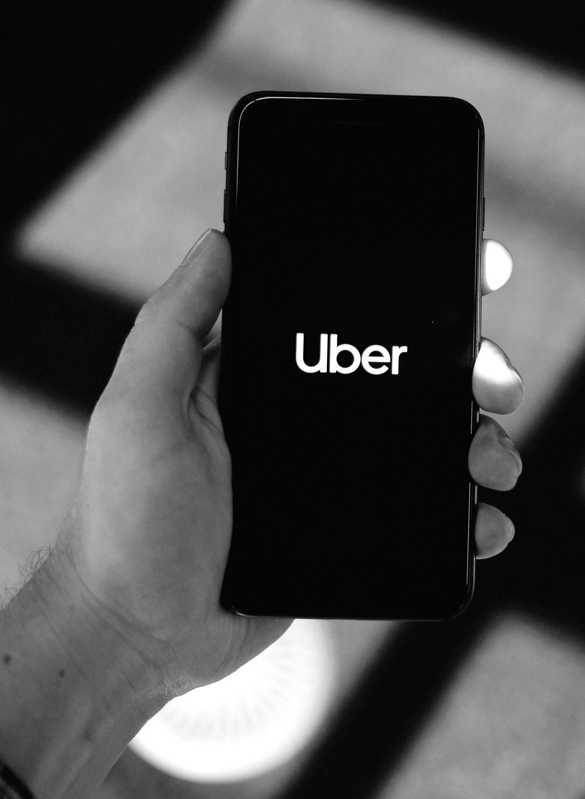
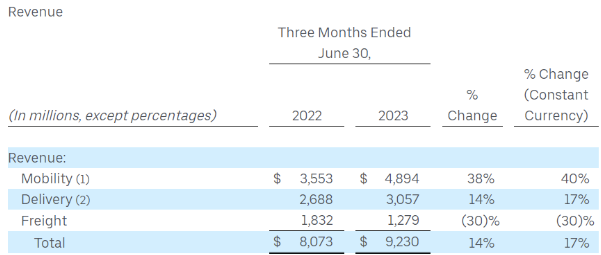

*Uber turned a profit in August of 2023*

If you can believe it, Uber finally just turned a profit. Yes, that Uber. After years of unprofitable growth (and a few controversies), the company’s efforts have resulted in 326 million dollars worth of income from operations.

*“Robust demand, new growth initiatives, and continued cost discipline resulted in an excellent quarter, with trips up 22% and a GAAP operating profit, for the first time in Uber’s history,” said Dara Khosrowshahi, CEO.*

This article will dive into Uber’s history and the products it developed, purchased, and shed on its way to becoming the world’s largest ride-hailing company.

## Background information

So far, 2023 has been the “year of efficiency” in tech. Interest rates are rising and the days of “ZIRP” are a distant memory. Almost every tech company has retrenched and focused on their core products, including Uber. In fact, after over a decade of profitless growth, Uber was finally able to generate a profit.

In Q2 of 2023, Uber grew:

- Gross bookings 18 percent (YoY) to 33.6 billion dollars (nearly equal to their 2018 entire year bookings)
- Revenue 14 percent (YoY) to 9.2 billion dollars
- Operating income up one billion dollars (YoY) to 326 million dollars

Uber wasn’t always so focused on the bottom line though. With low-cost financing flooding the market during the 2010s, Uber spent a lot of time focusing on growth, incubation, experimentation, and product-market fit expansion.

## Uber’s core businesses

Uber was originally founded in 2009 as UberCab. It was the birth child of Travis Kalanick and Garrett Camp when the two were unable to find a cab in Paris. By the spring of 2010, Ubercab was operating as a high-end limo service in San Francisco.

Due to complaints from taxi drivers and the realization that it wasn’t truly a cab company in the traditional sense, Uber dropped the “cab” from its name. By 2011, Uber began its meteoric rise with launches in New York, Chicago, and Paris.

As it turns out, Uber is a textbook model when it comes to network effects, marketplaces, balancing supply and demand, and product/design. In 2011, Travis Kalanick stated that Uber is:

*“A mix of UI and experience with hardcore math…efficiency with elegance on top.”*

On the product/design side, Uber built incredibly strong competencies in calculating arrival and departure times for its riders and drivers. It did this because the core of its product was built around trust and reliability, something that taxi companies could not deliver consistently.

Uber estimated that its ETAs were 42.5 percent  more accurate than Google’s API (note: Uber used the Google Maps API and overwrote Google estimates). This core value proposition of providing trusted arrival times really resonated with riders and as demand for the app kept growing, a new problem presented itself, ensuring there were enough drivers (supply).

Matching supply (drivers) with demand (riders) presented another complex math problem that had to be solved on a city-by-city basis. When Uber launched in a new city, it had no users. No riders means no drivers. This is what is referred to in the industry as the “cold start problem.”

Uber had to ensure there were enough drivers to meet the rider demand and vice versa or else the city network would topple over. As it turns out, that’s an incredibly hard (and expensive) problem to solve. To solve this, Uber developed an ops-led, hustle culture.

City-by-city, Uber set up operations teams that subsidized driver pay to artificially grow the number of drivers it needed while promoting the Uber app to riders through promotions and incentives. Uber was able to capitalize on network effects and eventually remove the artificial incentive systems once there were enough riders and drivers.

By 2015, Uber was hailed (no pun intended) as the most valuable startup in the world with an estimated valuation of 51 billion dollars. Investors were all in on Uber because of its explosive growth as Uber was operating in 300 cities across 58 countries. To put this valuation into perspective, it took Facebook seven years to reach a 50 billion dollar valuation while it only took Uber five years.

In 2015, Uber launched UberEats to compete with DoorDash, Grubhub, and Postmates in local food and retail delivery. In three years Uber Eats grew from an experiment on the Uber network to a full-fledged business unit within Uber.

In 2017, Uber launched Uber Freight which connects shippers to carriers with capacity. Uber Freight is probably the least well-known division within Uber still operating today. Here are the latest quarterly results for each of Uber’s core businesses:

*Uber's 2023 P/L*

By leveraging Uber’s core network technology and knowledge of building marketplaces from a cold start, it has been able to expand beyond delivering humans to deliver food, retail, and shipments. Delivery, while not as profitable as mobility (ride-hailing), is still generating substantial revenue and growing.

Not all of Uber’s product incubation efforts have turned into billion-dollar businesses though.

## Additional product offerings

In 2018, electric scooters and bikes were all the rage and Uber announced that it would invest in Lime, an eScooter company. In 2020, Lime announced that Uber had led an additional 170 million dollar investment round and that Uber has the option to buy Lime in the 2022 to 2024 timeframe.

Lime eScooters are available for rental on Uber’s app as of today. In February of 2023, Lime reported its first profitable year. In 2018, Uber acquired electric bike-sharing startup JUMP Bikes and Uber Bike is a product listed on its site as well.

Uber has also moved into public transit and launched numerous partnerships with public agencies around the world. Building off its core network and math prowess, Uber aims to increase public transit efficiency. Uber’s website claims that over 70 public transit agencies are partnered with them today.

Their options include bolstering public transit agencies with Uber rides, providing accurate ETAs, new public transit payment options (through the Uber app), and paratransit rides.

## Product misses

For over a decade, autonomous driving has been one of the most talked about topics in tech. In 2015, Kalanick made a bold move in the autonomous driving space by recruiting 40 robotics engineers from the National Robotics Engineering Center at Carnegie Mellon and setting up their self-driving advanced technologies group (ATG) unit.

Uber then acquired an autonomous trucking startup, Otto, in 2016 for 680 million dollars. Uber then set out on its ambitious plans to scale its autonomous driving technology locally and nationally.

However, those plans were put on pause in 2018 due an unfortunate accident in Tempe, Arizona where a woman was struck and killed by a self-driving Uber vehicle. Uber shut down Otto and eventually sold off its ATG unit in 2020 to (and took a stake in) Aurora, a Sequoia and Amazon Capital-backed startup.

Uber remains invested in autonomous driving although it isn’t developing the technology on its own. Uber has the following partners listed on their site: Waymo, Aurora, Cartken, Motional, Nuro, and Serve. The interesting development in this space will be how Uber’s partners, who control autonomous driving technology, decide to monetize their offerings.

Today, Uber is responsible for both sides of its marketplace, the riders and the drivers. In the case of the drivers, Uber is not supplying the vehicles in most cases, but it does connect drivers with car rentals. In an autonomous world, the same dynamic could play out where Uber is supplying the demand (riders) while connecting autonomous vehicle supply (autonomous cars) on their network.

In theory, Uber would have less control of its “take rate,” or the cut it takes on each ride, given that it is no longer recruiting drivers on its own. In addition, the companies who’ve invested billions of dollars into autonomous driving will want to recoup their investments as autonomous robot taxi rides gain in popularity.

## Final thoughts

Like most tech companies in 2023, Uber focused on profitability in its core businesses. Interest rates rose to 40-year highs and companies had to start showing investors that they could grow profitably.

Over the last 10 years, there have been a number of startups that attempted to build “[Uber for X industry](https://jungleworks.com/11-uber-for-x-startups-that-failed-are-you-making-the-same-mistakes/)” and failed. Their product and growth teams weren’t able to build their growth loops, their marketplace supply networks, or capitalize on their core value propositions with their customers as Uber did.

Uber was able to turn a profit last quarter and I suspect they will do so for the foreseeable future.

Their future is a bit uncertain though with the growth of autonomous driving. Will they be able to partner with Tesla like they have with Waymo and others or will Tesla build their own “Uber-like” app?

Will X (Twitter) turn into the all-in-one mobile app that allows you to hail someone else’s Tesla (that they are monetizing) while they sit at work? It’s really hard to say exactly what will happen but one thing is for certain, the ride-hailing business will certainly be going through some major changes over the next 10-15 years.

What do you think will happen to Uber in the long term? I’d love to hear your thoughts.

> This article first appeared on [LogRocket's Product Management blog](https://blog.logrocket.com/author/joelpolanco/) on August 17, 2023.
