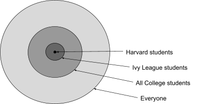

When it comes to customer segments, many PMs make the mistake of defining them too broadly, resulting in weaker product-market fit, higher churn, and wasted resources. To avoid falling into that trap, you should follow a systematic approach that starts with a broad customer segment and then gradually narrows down into a very specific “beachhead segment” that enables you to test your product and business model hypotheses.

This post helps you get started by unpacking how to level your customer segmentation skills and then turning to real-world examples of Facebook's exclusive Harvard launch and Tesla’s deliberate progression from high-end sports cars to mass market vehicles.

## How NOT to define your customer segments

Before we dig into what you should do, let’s take a look at what you shouldn’t do when defining your customer segments.

A lot of people I see start with the biggest, baddest, grandest, and largest segment. I’m talking BIG. Let’s call it the total available market (TAM) approach to customer segmentation.

You’d probably take this approach for one of the following reasons:

- You believe if your customer segment is small, you won’t make enough money to survive
- A large customer segment means you’ll make A LOT of money
- You believe that everyone in that segment will want your product or service
- Investors won’t invest in your company unless your customer segment is large

These reasons might be problems for you, but they’re your problems, not your customer’s problems. After instructing over 30 early stage startups, I can tell you that more than half of all individuals take this approach initially. Rather than taking the TAM approach, let’s explore some reasons why you shouldn’t take that approach.

## Your customer segment defines your initial product and GTM strategy

Strategy is more about what you’re NOT going to do than what you’re going to do. Yes, eventually you’ll want everyone using your product but the initial problem is that you need to get some customers using your product consistently and not churn.

You also need to build a sustainable business that can replicate and scale so it doesn’t collapse on itself due to complexity. Here’s a list of the top issues I’ve seen happen when startups fail to define their beachhead segment and early customer profile:

| Issue | Description |
| --- | --- |
| Weak product-market fit | Scattered feedback from diverse users produces unclear signals and slows meaningful product improvement |
| Higher customer churn and poor retention | Product is less tailored, leading to customer disappointment and increased churn rates |
| Internal misalignment | Teams work toward different versions of the “ideal customer,” resulting in friction and diluted focus |
| Difficulty scaling beyond unstable foundation | Absence of loyal early users limits testimonials and makes it hard to expand into new markets later |
| Diluted messaging and weak value proposition | Messaging becomes generic, failing to strongly resonate with any segment, resulting in weak conversion rates |
| Wasted resources and inefficient go-to-market strategy | Marketing and sales spend is spread too thin, draining resources with limited results and slower revenue |

Defining your initial customer segments

After years of testing different approaches, I landed on a method that starts with your total addressable market and ends with your beachhead segment. Think of your total addressable market as your total aspirational market, or the large market that you would EVENTUALLY like to serve.

Think of your beachhead segment as customers that you KNOW you can serve today because they share your view of the world. These are a small group of your biggest fans:

I use the following table to help me narrow down to my beachhead segment. I fill out the audience and the audience rationale for each row (segment/step). I’ve found through myself and others that the easiest place to start is with your total addressable market then to scale down to your beachhead segment in the next two or three steps.

Generally, people have a tough time describing their beachhead segment at the start because they’ve made too many assumptions about who will like or use their initial product so I have them start with their total addressable segment first then narrow down from there.

The table below follows the process for an edtech company that’s targeting teachers as its primary users (teachers are the primary USER segment and not the BUYER segment):

| Step | Audience | Audience rational |
| --- | --- | --- |
| 1. Total addressable segment | Teachers | Broadest possible segment |
| 2. Narrowed segment | Elementary Teachers | Product tech works better for elementary school teachers |
| 3. Beachhead segment | Elementary Teachers at Charter Schools in Phoenix, AZ | Tech is being adopted by charter schools in AZ at a faster rate due to less regulation. Have critical mass and word of mouth in Phoenix |

The key to finding your beachhead segment is to do the initial work — secondary market research, “ride alongs,” and customer discovery interviews on potential segments to determine your beachhead segment.

In order to form a strong rationale, you need lots of evidence. If we come back to our fictitious edtech example from above, you can see that we’ve landed on a very specific beachhead user segment:

Notice that the beachhead segment is tiny relative to the total addressable market but that’s a good thing at this point in your development. A quick prompt into Perplexity created an analysis that resulted in an estimate of “There are 4,000 to 6,000 elementary school teachers at charter schools in Phoenix, Arizona.”

Some of you are likely telling yourself, “this segment is too tiny to build a viable business.” I totally agree with your assessment. That said, we need to remember that the goal is to drive usage and to find our biggest fans.

To do that, we need to start with a small segment where we can gather feedback quickly so we keep our signal to noise ratio high. Let’s revisit the customer segment issues table as a result of focusing on a beachhead segment:

| Issue | Description | New focused result |
| --- | --- | --- |
| Weak product-market fit | Scattered feedback from diverse users produces unclear signals and slows meaningful product improvement | Feedback is focused to a region (Phoenix) and targeted segment (charter schools). Signal to noise ratio should increase significantly |
| Higher customer churn and poor retention | Product is less tailored, leading to customer disappointment and increased churn rates | The product can be much more tailored around a local community and support is much more manageable |
| Internal misalignment | Teams work toward different versions of the “ideal customer,” resulting in friction and diluted focus | The ideal customer is now clearer and focused |
| Difficulty scaling beyond unstable foundation | Absence of loyal early users limits testimonials and makes it hard to expand into new markets later | If the foundation is stable you should be able to scale it to the next major locality |
| Diluted messaging and weak value proposition | Messaging becomes generic, failing to strongly resonate with any segment, resulting in weak conversion rates | Messaging can be tailored for the Phoenix charter school market and conversion can be tested by moving from school to school |
| Wasted resources and inefficient go-to-market | Marketing and sales spend is spread too thin, draining resources with limited results and slower revenue | Marketing and sales will be managed closely and only scaled as results are delivered |

One of the key things that I want you to take away is that focusing on a targeted audience makes everything more TESTABLE. Your team will be much more aligned, your hypotheses will be clearer, your GTM resources will be more efficient and your value proposition testing will produce much clearer signals.

This doesn’t mean that everything will go splendidly and you’ll have identified the beachhead. In fact, you may learn that you selected the wrong beachhead altogether. That said, you’ll have the confidence to know whether you should keep going and test another potential beachhead, pivot your product strategy, or to wind down your efforts.

## Developing your business model canvas

Understanding your customer segment is the first step in developing your initial business model blueprint. You can document your blueprint (and many future versions of it) using a business model canvas.

Your business model canvas is your blueprint for how you intend to create, deliver, and capture value in order to eventually generate a sustainable business. There are a number of business models but these four capture the lion’s share.

### Business to consumer (B2C)

In this model, you intend to sell directly to consumers, usually through a website. Sometimes this is also called “D2C” or direct-to-consumer. Some characteristics of this model are:

- Large numbers of customers
- The user is the decision maker and the buyer
- Segmentation is challenging
- Purchasing decisions are driven by social and emotional dynamics

### Business to business (B2B)

Here, you intend to sell a product and/or solution to other businesses. You’re typically selling a solution to help a business increase revenue, drive down costs, or improve their customer experience. Some characteristics of this model are:

- Smaller numbers than consumers
- Segmented by size (mom/pop, small Biz, SMB, enterprise)
- They purchase as a committee (operations, finance, IT, legal, etc.)
- The user of your product is rarely the buyer or decision-maker

### Business to business integrator (B2B-I)

With B2B-I you intend to sell an ingredient to other businesses for their solution OR you integrate ingredients from other businesses to deliver a solution to the end customer. Some characteristics of this model are:

- Even smaller numbers than B2B
- Less emotional, tend to be technical
- Complex decision making involving multiple parties
- Need to drive value to the integrator and the integrator’s customer

### Business to government (B2G)

Finally, with B2G you intend to sell an ingredient to other businesses for their solution OR you integrate ingredients from other businesses to deliver a solution to the end customer. Some characteristics of this model are:

- Small numbers of customers
- Less emotional
- Longer procurement cycles
- Complex decision making and specific procurement procedures

## Examples of customer segmentation

Now that we’ve gone through the fundamentals of customer segments, let’s go through two of my favorite customer segment and product strategy examples from industry.

### Facebook (Meta)

Facebook was launched at Harvard in Cambridge, Massachusetts in February of 2004. The service was developed a year after MySpace and two years after Friendster, two other popular social networks at the time.

One of the interesting things early on about Facebook was its exclusivity. Facebook was only made available to Harvard students at first. Beyond exclusivity, early users enjoyed the ease of connection, finding their friends, and the clean/intuitive interface. This contrasted with MySpace which had a lot of functionality (and users) that caused site loading and other usability issues.

Word of mouth rose and Facebook was a huge hit at Harvard by the end of February 2004. In March 2004, Facebook then expanded to Stanford, Yale, and Columbia. The expansion continued to all Ivy League and Boston-area schools:

This is a textbook example of the advantages of scaling from one customer segment (Harvard) to another (Ivy League) to another (all schools). Students loved the idea of a social network that was only available to other students and not parents. Facebook didn’t officially open registration to everyone aged 13 and older until September 2006.

### Tesla

In Elon Musk’s famous “[secret master plan](https://www.tesla.com/secret-master-plan),” he outlines in a one page memo a clear overall strategy that aligned business and product and tied directly to the customer segments Tesla eventually went after. At the end of his one page memo he states:

“ So, in short, the master plan is:

- Build sports car
- Use that money to build an affordable car
- Use that money to build an even more affordable car
- While doing above, also provide zero emission electric power generation options

Don't tell anyone.”

If we break that plan down into the products and customer segments you get something like this:

| Master plan element | Tesla product | Initial market price | Customer segment |
| --- | --- | --- | --- |
| Build sports car | Tesla Roadster | ~$200K | Environmentally friendly upper class |
| Build an affordable car | Tesla Model S | ~$80K | Early tech adopter middle upper class |
| Build next affordable car | Tesla Model 3 | ~$45-$50K | Eco/cost conscious middle class |

You can see that Tesla was both going after a very large market (eco and cost conscious drivers) while fully knowing it didn’t have the means or resources to reach that audience initially.

As a result, Tesla defined a fairly narrow segment (environmentally friendly upper class) that was small but high margin. This beachhead segment would need a product that was high end and exclusive, two key value propositions that Tesla could deliver early on.

Once Tesla solidified its place with this segment, it could then focus on a larger, adjacent segment with similar tastes but smaller pocketbooks. This would be the upper middle class individuals. By focusing there next with the Model S, Tesla could then ramp up production to the next level and so on:

By aligning its vision with product and business strategy to specific customer segments, Tesla was able to overcome the challenges of starting a capital intensive business.

## Key takeaways

It’s extremely important to always start with your customer segment when developing your initial business model. This goes double when developing software products and [go-to-market (GTM) strategies](https://blog.logrocket.com/product-management/go-to-market-strategy-guide-examples/). Your specific audience and their key problem that you’re solving for will drive the majority of your early decisions.

The better you are at narrowing that initial audience, the better you’ll be at meeting their expectations because the signal to noise ratio will be much higher than a segment of random people. One of the keys to defining a segment is noting whether it’s a consumer, business, integrator, or government. Other key elements include demographic, geographic, psychographic, and behavioral factors, which can be further broken down into narrower and narrower customer segments.

Ultimately, the goal is to establish a beachhead segment for your product or service that’ll allow you to establish a foothold in the market that serves as your blueprint for scaling to subsequent segments. Good luck, and comment below with any questions!
