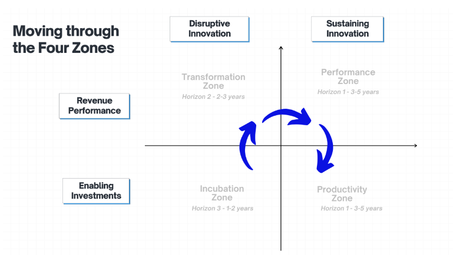
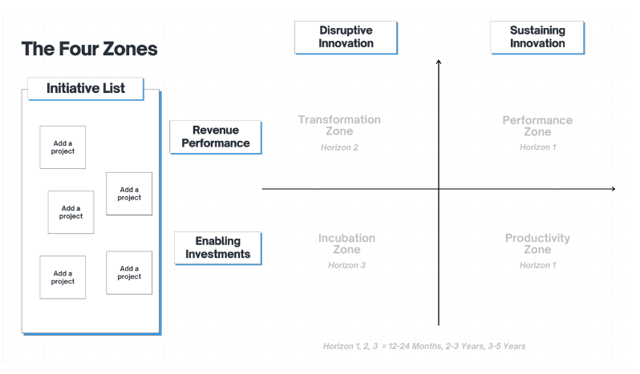

When a company matures and moves out of its growth phase, it tends to focus more on profitability, margins, and productivity. As a result, it can begin to atrophy in other areas like managing innovation, developing new products, and executing new strategies. This can create a problem if the company gets too comfortable, as new disruptors can creep in and steal market share.

American consultant Geoffrey Moore noticed this trend as he interviewed managers at Salesforce and other organizations. He wanted to investigate why large, successful companies sometimes struggled to commercialize new innovations. This ultimately accumulated in “[Zone to Win](https://www.amazon.com/Zone-Win-Organizing-Compete-Disruption/dp/1682302113),” which outlines his thoughts on how to manage innovation.

Keep reading to learn more about the Zone to Win framework, including how you can integrate it into your role as a product manager.

## What is the Zone to Win framework?

Zone to Win provides a playbook on organizing and managing innovation within a company of any size. The book makes a strong case that most companies end up struggling to innovate and transform because they become “too good at what they do.” In other words, they become so maniacally focused on their core competency that they fail to defend what they’ve built.

Zone to Win provides a framework that divides a company into four distinct zones. The premise states that you need to manage some zones like an offensive team, where you want to win a new line of business to “catch the next wave.”

However, he thinks you need to manage other zones like a defensive team, where you fend off a disruptive innovator’s attack on an existing line of business. You want to manage zones accordingly, distributing resources so that the enterprise can compete at its optimal strength.

## The four zones and the three horizons

The four zones theory relies on the idea that you need to manage different parts of your company under different operating principles, philosophies, and behaviors to ensure that individual initiatives operate at their full potential. By applying zone management, senior leaders can then allocate resources to initiatives in each of the zones at the right time and at the right level.

The table below provides you with some insight into each of the zones, how they’re viewed, and over what time horizon their investments are measured and managed:

| **Transformation zone** *2-3 year horizon* Moves out of incubation and receives larger investment Goal is “hypergrowth” CEO’s big bet to redefine business | **Performance zone** *3-5 year horizon* “Material size”, still growing Drives top line revenue growth Similar to BCG’s “cash cow” Profitable Core business |
| --- | --- |
| **Incubation zone** *1-2 year horizon* Small, speculative bets Managed like early stage venture capital Foster innovation and ideas | **Productivity zone** *3-5 year horizon* Functions not accountable for revenue (e.g. - finance, marketing, supply chain) Operational efficiency, improve profitability |

Most companies have a system for managing investments, typically through an annual plan process. While the plan process does a great job of assessing individual initiatives and allocating resources in isolation, it does a poor job of segmenting initiatives by their investment profile and optimizing resources at the global level.

As a result, all initiatives tend to be measured in a similar manner. For example, take an early incubation zone initiative based on a brand new, unproven technology and compare it to a performance zone initiative that generates 50 percent of your current revenue.

Without a Zone to Win lens, a CEO might say, “We need more resources for our core business” and pull resources from incubation initiatives as a result. But this decision could cause two different results 3-5 years from now:

**Scenario one** - Adoption of unproven technology at scale, but defunded incubation puts the company in a poor position to capitalize on the adoption

**Scenario two** - Unproven technology X flops and you never adopt, ultimately seeming like a wise decision

In 3-5 years, the CEO who made the decision might not be around to be held accountable for the decision that was made. But how can you know what decision to make?

Zone to Win tells you that you don’t need to make “all or nothing” decisions and instead need to allocate your investments across your zones in order to maximize the return on your overall investment. You should manage the unproven technology X like a speculative investment. Yes, you should give it resources (headcount and dollars), but those should come in small increments over time as the initiative, the technology ecosystem, and the market play out.

Eventually, as you collect data over multiple quarters, you can make a final decision.

## Moving through the four zones

Consider the following image to help you think about how you might move through the four zones:

*Zone movement: From incubation to productivity*

The transformation zone should serve as your “big bet.” For a large tech company like Google or Meta, this would make or break the next decade or so.

An example for Google would be Android. Early on Google won the desktop search market with its website but it knew that mobile was a different market. People were becoming more familiar with apps and so Google needed a way to drive mobile traffic to perform Google searches.

Enter Android, the open source mobile phone software that took the world by storm. Google had to pour a lot of time, effort and investment into Android in order for it to scale. Transformation zones require this.

Once an investment moves out of hypergrowth and into low teen or even high single digit growth, that investment generally enters the performance zone. The performance zone marks your largest, most productive investments. These are your initiatives that make up the lion’s share of your revenue.

In organizations without Zone to Win, performance zone investments often starve all other zones for resources. In companies using Zone to Win, performance zone initiatives receive a lot (but not all) of the allocated resources and are measured using traditional Wall Street profit and loss type metrics.

Finally, you have the productivity zone investments. These are all of your functional support investments such as finance, marketing, and supply chain. The name of the game here is efficiency and cost leadership.

## Integrating Zone to Win into product management

Zone to Win takes a “portfolio view” of the initiatives in an enterprise and then says, “how can I optimize this overall portfolio?” You then optimize the overall portfolio by placing initiatives in their respective zones and measuring them accordingly.

As a product manager, it might be difficult to apply Zone to Win early on in your career. In fact, other tools might work better for prioritization, scoring and managing initiatives, and feature prioritization (e.g., impact versus effort matrix, etc.). That said, the earlier you start to understand Zone to Win concepts, the better.

Zone to Wins provides you with insights into how senior leaders, executives, investors, and venture capitalists assess initiatives and companies. These are the same individuals you need to influence to gain support for your own initiatives or maybe even your own startup.

As you move into more senior levels in product, Zone to Win becomes more relevant. To get started with Zone to Win, create a list of all your funded initiatives. Then assess them based on their attributes and place them in the appropriate zone:

*Applying Zone to Win to a product portfolio*

For most companies, implementing Zone to Win takes months and sometimes years. A cross-functional team often does the heavy lifting to establish a robust operating model, set the measures, and review at appropriate intervals.

## Case Studies: Companies successfully integrating Zone to Win

Salesforce and Microsoft implemented Zone to Win to drive product success. This section should help you see how you might apply the framework within your own context.

### Salesforce

[Salesforce](https://www.salesforce.com/) installed a top-down model of Zone to Win that augmented its existing portfolio planning process. In fact, Salesforce runs multiple corporate VC funds and has been known to make large acquisitions (e.g., Slack for approximately $27B in cash in 2021).

Salesforce distinguishes itself from other companies through its emphasis on zone offense, which occurs when a company onboards a new business while maintaining its commitments to its existing businesses. Zone offense can be hard to execute because you have to bring on a different workforce, with a different set of skills, and a different set of methods than the ones your current core business has to offer.

### Microsoft

Unlike Salesforce, [Microsoft](https://www.microsoft.com/en-us/) installed a bottom-up form of Zone to Win and was playing zone defense. In the early 2010s Microsoft found itself in a defensive position in each of its three main lines of business: Windows OS, Applications, and On-Premises Servers.

Windows was losing developer mindshare to other operating systems; applications were losing market share to the Google productivity suite; on-premise servers were missing out on the growing trend of the cloud.

Microsoft’s initial strategy was to acquire and incubate several businesses to compete. It acquired aQuantive to compete in digital advertising and Nokia to compete in mobile. This strategy didn’t work and both of these acquisitions ended up in large write-downs. Microsoft was able to transform once it installed new leadership that moved the culture from competition to collaboration.

Satya Nadella led with a mobile, cloud first strategy which transitioned its on-premises server computing resources to its small and growing Azure line of business. In addition, Microsoft began to embrace, rather than compete with other mobile OS by deploying Microsoft Office for Android and iOS. As a result of these and other changes, Microsoft was able to defend and solidify its position in the enterprise while initially ceding share in consumer.

The results below speak for themself. Salesforce and Microsoft beat the market by 200 and 1000 percent, respectively, over the last ten years.

## Challenges in adopting Zone to Win

When it comes to adopting zone to win, there are three main challenges that you might face:

### 1. Clearly defining your zones

Let’s face it, humans aren’t robots. We’re competitive, we’re ambitious, and we are always going to try and find a way to win. The leader of an initiative seeks out ways to maximize their resources in order to make their initiative successful.

When it comes to Zone to Win, this could mean pushing for an initiative to be moved into a zone that receives more resources such as the performance zone or the transformation zone. The objective here though isn’t to award resources based on “who pushes the best.”

The objective is to optimize your resources so that the overall enterprise is transforming or at a minimum, defending itself from further loss. This is why it’s important that your zone definitions and the metrics for each zone are clear and concise. There should be room for disagreement and discussion between the organizers and the participants, but the goal should be to minimize the opportunity for those disagreements to arise in the first place.

### 2. Operationalizing Zone to Win

In many cases, a single individual or department introduces Zone to Win into the enterprise. Getting Zone to Win operationalized requires investment from all departments.

Initially, many folks in your organization will view it as a “passing fad” or “just another program” and as a result, they won’t be fully invested. At one company I spoke with, Zone to Win was viewed by the organization as a finance program. If you read the book, it’s clear that finance is a key contributor and participant but Zone to Win isn’t meant to be a new flavor of enterprise financial planning.

Whether you go for top-down (Salesforce) or bottom-up (Microsoft) implementation, it's evident that you need to have senior levels of sponsorship and support to rally all the functions.

### 3. Sticking with it, even when management changes

Reorgs are a way of life in most large companies. At one company I spoke to, Zone to Win had been implemented in one of the business units, but was abandoned after a large reorg that consolidated three business units into one.

Zone to Win didn’t scale to a large enough cross section of the company to have the visibility it needed. It was never adopted outside of that single business unit. Apparently, many employees continued to ask senior managers in the newly formed business unit “will you be bringing Zone to Win back?”

After several quarters of asking, a new controller, and some low decision-making transparency scores, the new leaders decided to bring back Zone to Win into the new organization.

## Key takeaways

For years, innovation was talked about as if it was some kind of magic art that only a select few could wield. Geoffrey Moore debunks this myth by creating the Zone to Win framework. Be mindful, as real world practitioners still need to navigate the challenges of change management, company culture, and worker skills gaps particularly when it comes to incubation.

One senior leader I spoke with explained that Zone to Win really helps when it comes to rightsizing your investments, but it doesn’t help you generate and sustain incubation. Her guidance on incubation was to root your incubation initiatives in employee’s passion areas.

People need to work on problems that have an impact or else they won’t be intrinsically motivated to sustain an incubation effort. As a Pm, you can be a key contributor by identifying problems that need to be solved or in helping fellow employees prioritize and scope their passion projects into products that have an impact on people’s lives.

> This article first appeared in [Logrocket's product management blog](https://blog.logrocket.com/product-management/zones-to-win/) on August 14, 2024.
