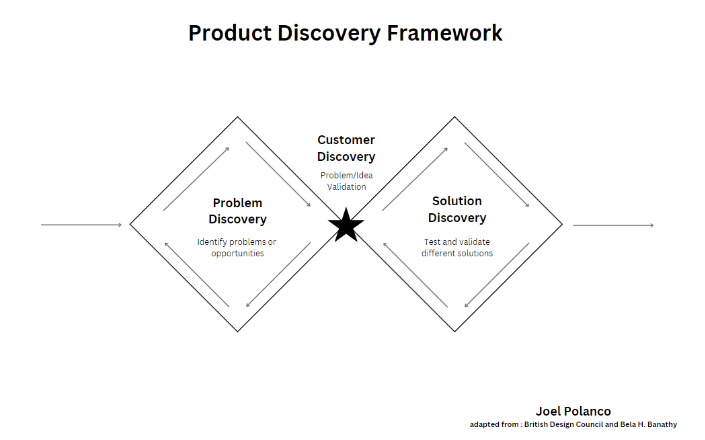
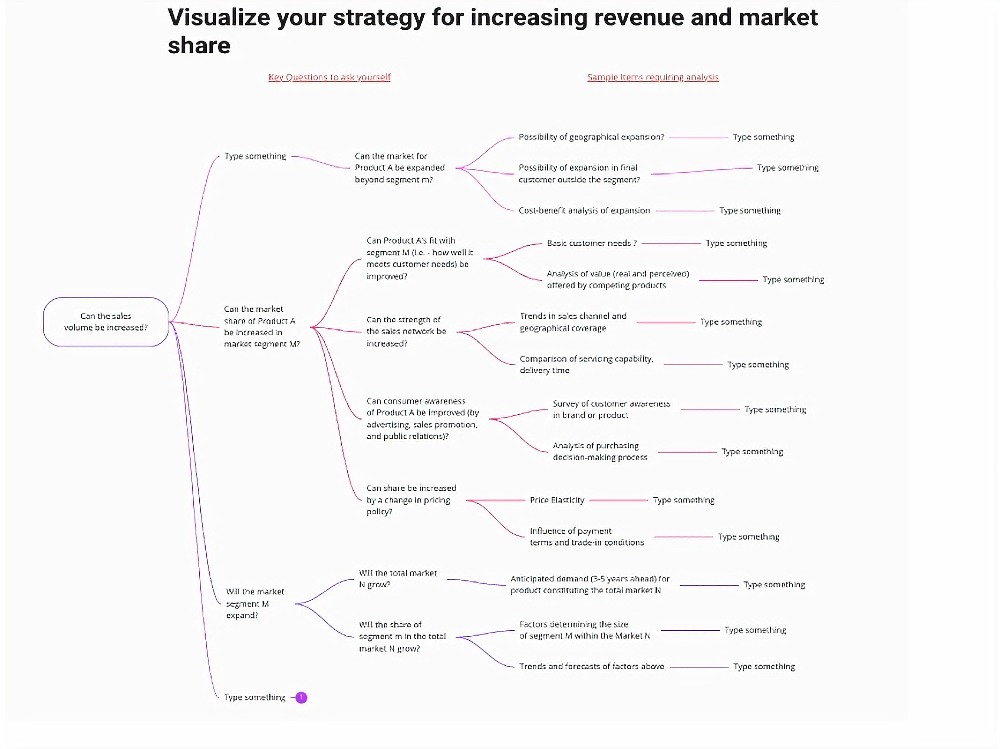

In one of my previous blogs, I talked about [customer discovery](https://blog.logrocket.com/product-management/customer-discovery/) and why it’s an important process that ensures that your team is working on new, high leverage opportunities.

If you’re taking on customer discovery initiatives, it might be because your team has been asked to re-establish a foothold in an existing market, or because you’re the new person joining an existing team. In either case, you’re likely in a business that’s past the startup phase and becoming a mature player in the market. In this article, I’ll talk about how to apply customer discovery techniques in this type of setting — usually at medium or large companies.

## Customer discovery: Is it only for startups?

Most customer discovery articles are tied to startups. Sometimes, I get asked, “I work at an established, mature company, so how does this apply to me?” As it turns out, it applies a lot!

As a product manager, you should ALWAYS make it a point to be gathering data about your customers. One of the worst habits you can form in product management is assuming that you know what is best solely based on your past experience. I cannot emphasize how important it is to develop the following skills:

1. Empathy
2. Active listening
3. First principles thinking

The following quote from Robert Frost’s *The Road Not Taken* perfectly summarizes my observations about this topic:

*I shall be telling this with a sigh*

*Somewhere ages and ages hence:*

*Two roads diverged in a wood, and I—*

*I took the one less traveled by,*

*And that has made all the difference.*

(The Road Not Taken, 16-20)

I find that the road less traveled is often the one that involves talking to customers consistently. I don’t mean to say that the conversations aren’t happening — in many cases they are, but they don’t incorporate the three skills I listed above.

The challenge in a large company is that, well, you are established. You’ve reached product-market fit. As a result of that success, you are likely living in a success bubble, in which you assume that your solution is the right solution for a customer’s problem and it is your role to convince them of that.

Your challenge lies in shedding those biases and re-establishing a learner’s mindset in order to uncover new sources of value.

## New team, old segment

I recently joined a new segment (industry) team at my company. My company is a platform company and our product is used by many industries. As a result, industry teams are formed in order to be the voice of the industry — to represent its needs internally while positioning our products externally.

The challenge set before our new team was to re-establish ourselves in an existing (industry) market segment. The challenge at the time — and this challenge applies to everyone who is new to their job — was that we had very little information to get started. We were new. We really only had some revenue data and some aged documentation, so we needed a way to get ramped up about what was going on.

Customer discovery interviews proved to be an invaluable resource for quickly developing insights that ultimately formulated our strategy. I like to visualize customer discovery as the focal point between a problem and a solution. It is the point at which you are focused on validating or invalidating (mainly invalidating) your ideas about the problem(s) you are trying to solve:

*My Product Discovery Framework*

I prefer to visualize discovery using the [double diamond](https://www.designcouncil.org.uk/our-resources/framework-for-innovation/) diagram with a few small twists. The double diamond was popularized by the British Design Council in the mid-2000s. In this case, our team wasn’t validating a product idea, but rather ideas about what were the causes and effects that impacted our business in a particular market segment.

## The difference between a narrative and a hypothesis

One of the questions that we got asked early on was, “What happened to your segment over the last several years?” It’s a simple question and I would have loved to give a simple answer like “COVID” or “competition entered the space.”

The reality was there was a lot happening over the last two years. In addition to COVID and competition, we had a tech bubble that burst, retirements, layoffs, supply issues, pricing changes…the list goes on. Yes, all those issues happened to all segments, but you need to remember that each segment is affected differently at any given time (just ask anyone who is reliant on sales in China).

My point here is that someone who has a learner’s mindset will be OK with saying “I don’t know” because they don’t want to resort to building a narrative too soon. A narrative is great once you’ve reached the point of promoting something, but is horrible when you don’t have a handle on what the real problems are.

Hypotheses are your best friends that will eventually get you to the narrative you want to convey. Hypotheses allow your brain to stay flexible yet alert by saying, “I think X, Y, or Z may have happened, but I’m going to collect some data to validate those thoughts.” It’s an excellent way to approach life in general — it helps prevent you from being caught flat-footed when something changes and you are not prepared.

## Existing market strategy blueprint

If you know me well, you know that I am a big fan of frameworks. Like most product managers, I prefer to structure information in a logical way to make decisions, present ideas, or collect information. Frameworks are a mechanism for structuring information efficiently.

A couple of notes of caution to less experienced product managers: do not become over reliant on frameworks and don’t feel a need to share all your frameworks with your team. Your team probably isn’t as excited about the frameworks as you are and, in some cases, they may misinterpret your usage of them. Pick and choose when and where to use them sparingly with your team.

In the case of this existing market segment challenge, I faced a problem where customer discovery on its own would have been quite inefficient as the market we were looking at existed for quite some time. This was when I came across this [post by Jon Itkin on LinkedIn](https://www.linkedin.com/posts/jonitkin_from-the-mind-of-the-strategist-by-kenichi-activity-7079904121171922944-2vGU/).

Jon is a B2B marketer who focuses on positioning. His post shared a key diagram from “The Mind of the Strategist” by Kenichi Ohmae, which provides a framework for visualizing your strategy to increase revenue and market share. The framework breaks down the key questions you want to ask yourself when going after a segment in a market. Some examples of these questions are:

1. Is the total market growing?
2. Will the share of your segment in the total market grow?
3. Can the market for your product be expanded beyond your segment?

By marrying this framework along with customer discovery techniques, I was able to create several [templates](https://miro.com/miroverse/existing-market-strategy-blueprint-template/) to collect our data as a team in a very scalable way:

*A framework to brainstorm growth strategies for a mature business*

## Customer discovery to the rescue

Now that we had a framework that aligned really well with the problem we were solving, we were able to get specific about what we wanted to understand about our segment. We took about a week to define our hypotheses and questions that we would ask our interviewees about. This would help us to validate and invalidate each one. Let’s talk about this process more in-depth.

### Formulating hypotheses and questions

Since we were working on an existing market, we decided to focus on understanding what changes were happening in our market segment internally and externally. We documented hypotheses based on the existing market blueprint above and what little internal data we could find.

From our hypotheses, we came up with 10 specific but open-ended questions that we could ask of various stakeholders — mainly from sales. These questions would serve two purposes:

1. Help us validate/invalidate a hypothesis
2. Collect new insights about our market segment — customers, products, personas, etc.

By structuring our thoughts into hypotheses and questions around the existing market blueprint, we were ready to start interviewing internal stakeholders.

### Internal interviews

Interviews are the lifeblood of customer discovery and executing them well requires practice. In some cases, your team members may not have customer discovery experience, so you will want to prepare your team by providing a template that has the interview questions and a place to collect the data.

Be sure to structure the template in a way that the data can be easily analyzed after all the interviews across the team are complete.

In our case, we relied on CRM data to help guide us to the right individuals to speak with. We were quickly able to set up a list of interviewees to go out and speak with. We found that in most cases, our internal interviewees were quite knowledgeable and provided us with a lot of insights on where we did and did not have information (where we needed to speak with external customers).

### Bringing the data together

Once all the interviews were complete, I assembled all the data into a single template and read through all the insights. I also spoke with individual team members to get a sense of what was discussed and if an interview went off topic at any point.

The next thing to do was analyze all of the findings and visualize them into a whiteboard. A whiteboard is great for this step in the process because it offers you the opportunity to share common findings and differences in a collaborative team setting. I opted to lead a two-part whiteboarding session where I first presented the overall findings and, second, led a team [mind mapping session](https://blog.logrocket.com/product-management/what-is-a-mind-map/).

The mindmap session was great because it presented each team member an opportunity to talk about the unique insights that they discovered during their interviews. At the end of the discussion, we arranged those insights into a mind map which helped further solidify our shared understanding of our segment.

### Ready to meet with customers

You may be thinking, “This is customer discovery, not internal discovery.”

Our team deliberately delayed speaking with customers, as we didn’t want to start the conversation on the wrong foot. In a large B2B company, it is very important to ensure that you establish credibility with your enterprise sales representatives before speaking with customers. Thorough internal analysis and market research is a prerequisite to customer meetings in the B2B world.

That said, once you go into a customer conversation having completed some internal customer discovery work, you will be much better prepared as to which questions to ask your customers.

## Conclusion

I hope this article gave you a sense for how customer discovery techniques can be used not only to build a new business, but improve an existing one. In addition, if you are in a new role (newly hired), some of the techniques in here can help accelerate your ramp into your new role.

At its foundation, customer discovery is really about learning quickly and efficiently. The key to doing that is not in finding out the answers (analogy thinking) but in asking the right questions. By continuing to ask the right questions, you will position yourself and your team for success in the future.

> This article first appeared on [Logrocket's Product Management Blog](https://blog.logrocket.com/product-management/customer-discovery-in-a-large-company/) in April 2024
