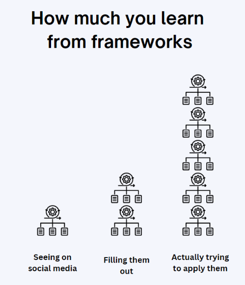

Frameworks are a really important tool in any product manager’s tool belt. If you’ve seen product management thought-leadership posts on Linkedin, X, or Medium, you will regularly find articles about frameworks people use.

While frameworks are fun to geek out on, it’s important to know when and how to use them. This article will talk about how to use, but not abuse, frameworks while providing some tangible, real-world examples.

## Frameworks and their significance in product management

A framework is a structured approach to solving a problem or set of problems within a defined area. You can think of a framework as a high-level map. It isn’t going to provide a set of instructions but it will provide you with a general starting outline that you can then fill in the details with for your situation.

Most product management problems translate from company to company or industry to industry.  Whether it's growing the user base or deciding what feature to work on next, product managers are often faced with similar, but nuanced, problems.

Product managers are also generally under a time crunch due to meetings, updates, and customer interviews. It is no wonder why product managers would want to leverage existing frameworks to help facilitate their problem solving process (and maintain their sanity).

## Categorizing product management frameworks

There is a long list of frameworks that a product manager can apply to various aspects of their job. At first glance, the list is overwhelming and a bit confusing.

My mental model is to take a given framework and place it into one of the following groups: **product, prioritization, growth, and investment.** Each of these categories represent a key area of product management that one needs to understand to be an effective product manager.

Here is how I define each of these categories:

1. **Product**— Frameworks that focus on your demand and solution hypotheses in order to help you deliver a successful product or service
2. **Prioritization** — Frameworks that help you prioritize what feature your team needs to work on next
3. **Growth** — Frameworks that help you acquire, retain, and monetize customers in a consistent and predictable way
4. **Investment**— Frameworks that help you decide on how much to invest in large, strategic initiatives over time

Each of these categories isn’t used with the same frequency. How often you apply a framework and update it really depends on your level of tenure and job role, as well the stage of the initiative you are working on.

For instance, if you are a junior product manager, you may be expected to spend a lot of time on prioritization activities (agile, scrum, etc.) while spending no time on investment activities (the next company initiative). That said, it’s still important to understand all of the categories and examples. One day, you will be asked for your opinion on a given category and having a strong point of view is a great skill to develop.

| **Category** | **Product** | **Prioritization** | **Growth** | **Investment** |
| --- | --- | --- | --- | --- |
| **Frequency used** | Varies | Weekly | Monthly | Quarterly |
| **Examples** | - [*Double Diamond](https://blog.logrocket.com/ux-design/modern-double-diamond-design/) - [*Jobs-to-be-Done](https://blog.logrocket.com/product-management/what-is-jobs-to-be-done-framework-examples/) - [Customer journey map](https://blog.logrocket.com/product-management/customer-journey-maps-examples/) - [CIRCLES](https://blog.logrocket.com/product-management/circles-method-pm-guide-talking-about-design/) | - [*Impact vs. Effort](https://blog.logrocket.com/product-management/impact-effort-matrix-prioritization/) - [RICE](https://blog.logrocket.com/product-management/rice-framework-prioritization-made-simple/) - [DACI](https://blog.logrocket.com/product-management/daci-framework-examples-template/) - [Kano model](https://blog.logrocket.com/product-management/understanding-kano-model/) - [MoSCoW](https://blog.logrocket.com/product-management/moscow-method-prioritization-agile-examples/) | - [*AARRR](https://blog.logrocket.com/product-management/what-is-aarrr-pirate-metrics-framework/) - *Growth loops - [Hook model](https://blog.logrocket.com/product-management/what-is-the-hook-model-how-to-build-habit-forming-products/) | - *Zone to Win - [BCG matrix](https://blog.logrocket.com/product-management/bcg-growth-share-matrix/) - [Ansoff matrix](https://blog.logrocket.com/product-management/the-ansoff-matrix-comprehensive-overview-examples/) |

I placed an asterisk next to some of my preferred frameworks. I’m not saying these are the best, but they are the best for me (on average). Again, depending on your job role, stage of company or product, or some other factors, you may prefer another framework. It’s best to try them out, test them, and see what resonates.

## Benefits of using framework

Frameworks give you a jumpstart on critical thinking, brainstorming, and organizing unstructured thoughts that apply to your unique situation. For an early career product manager, frameworks offer a way to get inside the heads of senior product managers (and general managers) to understand how they think about business problems and the structured approaches they take in solving those problems.

In addition, if you are applying to a modern product company or a FAANG company, you will be expected to know certain frameworks and how to apply them. During [your interview](https://blog.logrocket.com/product-management/common-product-manager-interview-questions-and-answers/), you will likely be tested on your ability to think through problems. Having these frameworks at your disposal will help you think on the spot.

## What framework abuse looks like

While frameworks have clear benefits, it's important to understand how and when to use them, as they are often overused or used in the wrong context or setting. Most product managers I know are passionate about their jobs and, let’s be honest, we like to geek out on this stuff. That doesn’t mean that your team shares your level of enthusiasm for problem solving, though. And in some cases, using a framework with them may put them off or give them the wrong impression about you and your abilities.

Early on in my career, I was using a new framework with an incubation product team that had been together for a little over six months. I had just started with the team and was eager to make a big impact. I prepared for that meeting for a few days and was excited to present them with an update on some customer research that I had been doing.

In that meeting, I began reviewing my findings using a framework that I had used in my prior role. I started going through my work and the general manager in charge stopped me cold and said, “I cannot stand it when we use business jargon here at work.”

I froze and asked him what he meant. In front of the other six team members, he gave a lecture about the use of business jargon and how annoying it is. I paused for a moment to let him say his peace and then politely made a joke about the situation. The team laughed and I closed my framework so we could just talk about the customer research.

I later found out that this general manager absolutely hates frameworks! This was a case where I was excited about something that my indirect superior (I reported to the group product manager) had an allergy to! While I don’t agree with how that general manager handled that situation, I reflected on it and realized that using a framework in front of that particular team came across as junior.

If we break down that situation above, we can identify some ways that frameworks should and should not be used:

1. **Most important: frameworks are not a replacement for critical thinking**. They are critical thinking aids, not substitutes. Be original, be creative but do not pencil whip to show off some new framework you just saw on social media
2. **Just because you are excited about frameworks, doesn’t mean that your team is**. Use them sparingly (in public) and know your audience before presenting them
3. **Frameworks can make you look junior in front of senior audiences**, especially if you are over relying on them. Again, use them in the right context and use them sparingly
4. **Frameworks, like models, are all “wrong”** but some are useful (credit: George Box). Understand the framework you are using, how others apply it, and how you plan to apply it to your business

I believe that frameworks are a lot like artificial intelligence — they can make you more productive and give you some time back but they are not a substitute for critical thinking, creativity, and empathy. Beware of how, how much, and when you use them with yourself and with your team. They should be an aid, not a crutch.

## Write it down, apply it, repeat

I believe the most important skill you can develop to improve your critical thinking skills is writing. When we write something down, we are putting our thinking on display for the world to see. Through writing, we can examine our thought process, question it, and improve it. The next time you come across a framework in your social media feed, I encourage you to build your own version of the framework in a [template](https://miro.com/miroverse/existing-market-strategy-blueprint-template/) and attempt to apply that framework to your situation:

*Learning from frameworks increases as you apply them to your real work*

Oftentimes, we will learn about a new tool, technique, or framework through social media, but fail to take the next two steps of filling out the template and applying it. This failure to practice and apply limits our ability to translate knowledge into product wisdom.

## Conclusion

Frameworks, when applied properly, are tremendous aids that can make product managers more productive, effective, and collaborative.

When abused, frameworks actually harm a product manager’s standing with their team and make them appear as if they are more interested in the framework (tool) as opposed to the outcome (a successful product).

The next time you go to use a framework, ask yourself, “Am I using this framework as an aid or a crutch?” Remember, a framework is a map and the map is not the territory.

> This article first appeared on [Logrocket's product management blog](https://blog.logrocket.com/product-management/how-to-use-but-not-abuse-frameworks/) on June 4, 2024.
