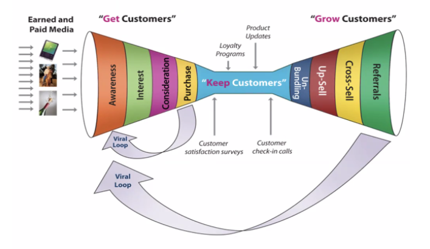
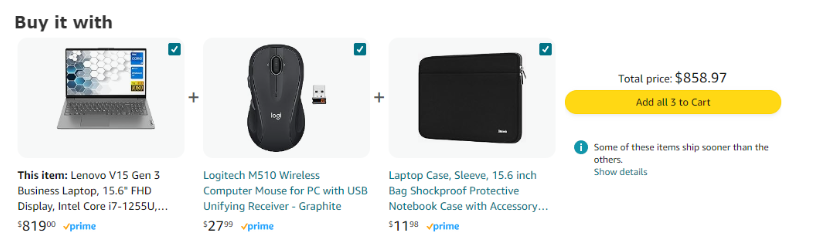
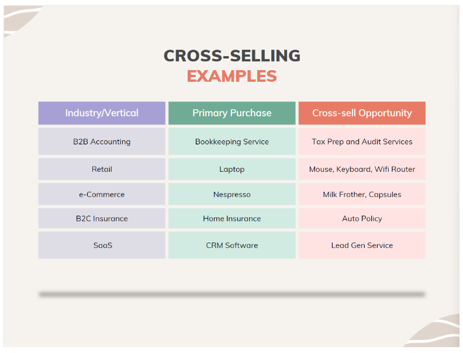

Would you like fries with that? Back in the 1970s, marketers at [McDonald’s](https://www.mcdonalds.com/us/en-us.html) made a startling discovery: A large number of customers only bought a burger and nothing else. The marketers decided to run an experiment. What if the sales clerk simply asked the customer, “Would you like fries with that?”

The results? This simple cross-sell at McDonald’s increased its annual sales by a whopping 15 to 40 percent. Here, bundling saves customers time when ordering their meals by making the decision-making process easier, while also increasing sales for the restaurant.

That said, cross-selling isn’t always so simple. This article covers benefits, strategies, and challenges with cross-selling, along with some practical cross-industry examples to help you master the art of cross-selling.

## What is cross-selling?

Cross-selling is the process of introducing complementary products or services that add additional value to a current sale or post sale. Different businesses define cross-selling in different ways. I like the picture below because it shows where cross-selling sits both from a sales funnel and growth loop perspective:

*Sales and Marketing Funnel*

You can see that cross-selling sits on the right side of the picture within the “grow customers” funnel. This isn’t because cross-selling always happens after a purchase, but because the right-side of the funnel depicts a growing revenue stream (as opposed to the left side of the funnel, which represents a shrinking conversion stream).

The timing of cross-selling might happen at the time of purchase (like in the case of McDonald’s) or after the purchase (e.g., adding on new insurance coverage after having a kid). The key across these cases is that characteristics of the customer, product/service, and circumstances should inform the timing of suggesting a cross-sell to a customer.

**Timing is everything.**

Next to cross-sell on the picture above is up-sell and these two terms are often confused with one another. One simple example of an up-sell is when McDonald’s added the phrase, “Would you like to supersize that?” to their customer order process. Suggesting a larger size is an up-sell, while suggesting another product, like an apple pie, is a cross-sell. In the tech space, up-sells can show up in the form of entry-level versus premium offerings (more storage, faster speeds, more users, etc.).

## Benefits of cross-selling

Cross-selling benefits both the customer and the seller. For the customer, cross-selling often helps the customer save time while improving their overall experience. Most products don’t  provide all the features necessary to help a customer maximize their experience.

For instance, most hardware products’ value are maximized when other complementary products are purchased along with them. I recently upgraded my Lenovo work laptop to one that has Wifi-6E enabled on it. Wifi-6E is great because it enables a dedicated 6 GHz spectrum that isn’t available to my other home devices (minimizes interference).

As a result, I purchased a new Wifi router that is Wifi-6E enabled. If you educate yourself on new technologies and what they enable, you can propose compelling value propositions to tech forward consumers such as myself. As a result, a retailer can increase an average order size on a tech purchase such as mine by 50 percent or more at a very low cost.

## Examples of effective cross-selling

There are a lot of great examples of cross-selling out there, however, there are a few companies that cross-sell really well:

### Amazon “Buy it with”

[Amazon](https://www.amazon.com/) has a number of ways that it cross-sells on its site. The most famous is the “customers who bought this, also bought” which has been renamed to “buy it with.” Amazon and other retailers build or leverage recommendation systems that use apriori, neural networks, and other algorithms to analyze a number of factors that determine what additional products the platform should recommend to a shopper:

*Amazon cross-sells using market basket analyses*

In addition to making the recommendation, Amazon does a great job with its UX by enabling checkboxes and buy buttons to go along with the additional product recommendations. By doing all this, Amazon delivers one of the easiest to use e-commerce shopping interfaces available.

### Airbnb “Experiences”

[Airbnb](https://www.airbnb.com/?c=.pi0.pk36239956_25650614176&c=.pi0.pk36239956_25650614176&ghost=true&gad_source=1&gclid=Cj0KCQjwhb60BhClARIsABGGtw_grPCsWJFhEcxA3kJz_TCnfTQ5ovaf1r-fnRQUZL1IOISvpqna9ikaAvjuEALw_wcB) is creative when it comes to cross-selling as it doesn’t own the real estate, the services, or anything that it offers on its site. That said, Airbnb does one thing really well: It brings together buyers and sellers and offers them a great user experience.

One area Airbnb has excelled in is bringing on non-rental offerings onto its site. Airbnb recognized that its users not only wanted to book a place to stay while they were on vacation but they also wanted to have things to do. Enter Airbnb Experiences:

*Airbnb cross-sells "experiences" with accomodations*

As you are searching for a place to stay on Airbnb, experiences such as goat yoga, ocean sailing, or making Japanese mochi are all offered up during the search and booking process. In the not so distant past, you would have to search the open internet and book experiences like these through other third party review sites or top ranking Google results.

Airbnb simplified the user journey by integrating these experiences right into the rental booking process. Airbnb is a great example of how you can leverage partners to enhance your overall product/service offering.

### Other cross-selling examples

There are countless ways to introduce cross-selling into your sales/marketing process. The table below provides you with some additional cross-selling examples across several industries:

*Comparison of cross-selling across industries*

## Strategies for effective cross-selling

Cross-selling can be simple or complex depending on your industry and customer workflow. If you sell many products to a wide variety of customers, offering the right complementary product requires a lot of data and analysis.

For an accounting service, cross-selling may be as simple as offering up one of your other two or three other services. Here are four key elements of a cross-selling strategy that need to be looked at prior to execution:

1. **Data** — Collection, curation, and analysis
2. **Analytics** — Modeling, testing, and monitoring
3. **Partnerships** — Featuring partners along with your offering
4. **Communication and timing**— Triggering messages at the perfect time

One thing I found as I researched this topic was that data, analytics, and partnerships were company specific and those elements don’t necessarily apply to all businesses. The one common thread was communication and timing.

Like the McDonald’s “Would you like fries with that” example, a business needs to understand exactly where and when it should propose a cross-sell to the customer. Fortunately, there are a lot of tools, like [LogRocket](https://logrocket.com/), that offer product teams clues as to when a customer may have a higher intent or likelihood of converting on a cross-selling opportunity. By analyzing customer behaviors, either offline or online, you can build a series of experiments to understand if your cross-sell strategy works.

## Challenges with cross-selling

When done right, cross-selling should add value to a customer’s experience. Whether the customer makes a cross-sell purchase or not, the customer should walk away with a neutral or positive experience with regards to the cross-sell. What you don’t want is your cross-sell to harm the customer experience.

Poor cross-selling can come across as pushy, intrusive, or in the worst case, greedy. This tends to happen when you offer too many complementary products, have bad timing, or offer irrelevant recommendations.

In order to avoid being seen as pushy or intrusive, run some cross-sell experiments with your customers. Following those experiments,get out and speak with your customers so that you can marry your behavioral data with customer attitudinal data. For instance, you may find that your recommendation engine does a great job of recommending products to your overall customer population but for a certain subsegment, the recommendations are irrelevant.

In some cases, you can identify this sort of insight through data science and in others you might find that your recommendation model has some gaps. Your recommendations may also be great, but your timing is bad or too frequent. In those cases, you can run tests to compare conversion in various points of your workflow, as well as test for whether adding additional messages impact customer satisfaction metrics.

## Key takeaways

Effectively cross-selling can result in a huge boost to your top line, while minimally impacting your bottom line. However, to accomplish this you need a solid understanding of your customer, their behaviors, their attitudes, and your sales process. Companies like McDonald’s, Amazon, and Airbnb have all used different cross-selling strategies to deliver value to customers.

The key in each of these cases was that these companies focused on the customer, their needs, and the timing of the message. When cross-selling isn’t implemented effectively, you can come across as pushy, intrusive, and greedy. In order to avoid that, invest in data, analytics, partnerships, and the testing of communication timing. In the end, if your core product offering is solid, adding cross-selling into the mix is a great way to drive customer satisfaction and long term revenue.

> This article first appeared on [Logrocket's product management blog](https://blog.logrocket.com/product-management/cross-selling-guide/) on July 7, 2024.
