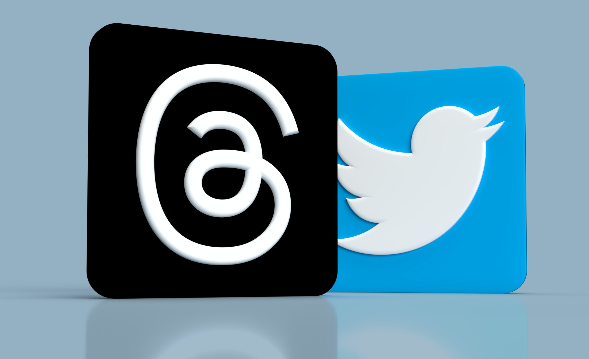

*Threads is going up against X (Twitter) in 2023*

Zuck is looking at Elon. Meta launched its new service called Threads, an alternative to Twitter. Within 24 hours, the user count has ballooned to over 30 million users and counting.

*“The volatility and the unpredictability of what seemed to be going on there” presented Instagram with an opportunity.*

-Adam Mosseri, Head of Instagram

Product folks are divided with some saying “Threads will kill Twitter” and others saying “This seems more like a Coke vs. Pepsi situation.”  While many agree that Threads is certainly missing some features and looks more like Twitter in 2010, most folks believe that Threads has certainly earned a space on their home screen.

Let’s dive into some important background information, Twitter’s past competitors, my first impressions of Threads, and what product people think about it.

## Background information

Twitter was founded in 2004. It became the first successful microblogging platform in 2007 after it was presented at the South by Southwest (SXSW) Music Conference in Austin, Texas.

Twitter rose to fame as a place to disseminate real-time news from around the world and has grown to over 360 million monthly active users.

But over the last few years, the company has been surrounded by all kinds of controversy: CEO changes, a buyout/going private, mass layoffs, and, most recently, the capping of daily usage for each user. Despite all of that, Twitter has maintained a fairly loyal user base, and attempts at replicating Twitter’s microblogging success fell to the wayside, until two days ago.

This past Wednesday (5 July 2023), Meta released “Threads,” a Twitter-like service that allows the >3 billion Instagram users to port over their accounts in a few clicks. Within the first 24 hours, 30 million users have signed up for Threads and several people are asking “Is there room for two microblogging apps in the social media space?”

The jury is still out on whether Threads will be able to overtake Twitter in popularity though and this left me wondering, what is the product community saying about the whole thing?

## Past Twitter competitors

One of the biggest draws (and criticisms) of Twitter is the ability to freely express your thoughts with little restriction. There have been many alternatives created over the years, the list includes: Tumblr (2006), Mastodon (2016), Amino (2012), Diaspora (2017), [Gab.ai](http://Gab.ai) (2016), Plurk (2008), Minds (2015), [Micro.blog](http://Micro.blog) (2017), Pleroma (2015), T2 (2022), and Spill (2022). All of these companies are alternatives to Twitter but their business models and product features vary and some are targeting specific demographics.

I’ve personally only heard of a few of these apps and have never used any of them. I was surprised to see that several of them had significant (>100 million) user bases, so it goes to show you how big this space really is in the grand scheme of things.

None of the apps above have the same notoriety as Meta and what is clear is that Meta decided to take on some risk. Given all the issues at Twitter, Meta saw a window of opportunity that hadn’t presented itself in the past and decided to pull together its resources to make Threads a mainstay in the social media space.

## Why this time may be different

This time is definitely different. Past Twitter competitors were missing a key ingredient to making any social app successful — a clear path toward growth and distribution. Threads has instant access to three billion Instagram users! No other company has instant access to that many users. Zero, Zilch.

Additionally, it appears that Meta has a new level of focus and it is prioritizing social media over its metaverse vision for the near term. Like many tech companies, Meta has dialed down its innovation budget in search of near-term revenue that is closer to its core business and strengths. Meta hasn’t completely given up on AR/VR but it sure has dialed up its positioning and messaging around recapturing [video traffic in social](https://techcrunch.com/2023/04/26/meta-says-time-spent-on-instagram-grew-24-thanks-to-tiktok-style-ai-reel-recommendations/?guccounter=1&guce_referrer=aHR0cHM6Ly93d3cuZ29vZ2xlLmNvbS8&guce_referrer_sig=AQAAAK8yrBsQn90bpVBfam-f4l3_3U1p-myyk-affpIbuoVK1rZB5g10WhRKsDJA14P5od7DHPpRLuHliW9yQrjtLwvHNsSWwWbdGcZ5AUJbVPXOaO0miwrxL4dTnq1MVuAv_lEqUuxW3TWPfwfyF2Jbh8S0h_8m66isGrv6vo54G_K4) and [open-sourcing its AI models](https://www.technologyreview.com/2023/05/12/1072950/open-source-ai-google-openai-eleuther-meta/).

As a side note, Meta now projects that material revenue from AR/VR will not happen until 2030. If that is the case, its renewed focus on social is definitely keeping its competitors on high alert and the stock market is taking notice.

*“A separate app is way less likely to succeed because you have to bootstrap a user base from very little or from nothing. But if you do it, if you succeed, the upside is so much more significant.”*

- Adam Mosseri, Head of Instagram

Product purists will always highlight how one product is superior to another when it comes to features, UX, and functionality, but the fact of the matter is that distribution plays a key role in a product’s success. Google “Slack vs. Teams” and you are bound to find the age-old graph of Slack vs. Teams which shows Slack steadily growing its user base from 2014 to 2019.

Meanwhile, Teams, which was introduced in mid-2016, was able to surpass Slack’s active user count in less than three years. Slack may have a better user interface, slicker features, and a loyal following, but Teams definitely has a stronger distribution model due to Microsoft enterprise sales bundling.

Like Microsoft, Meta is placing a risky bet, but because its distribution model is so strong it feels that it can de-risk the product by creating a seamless onboarding experience through Instagram’s account system.

## What the product community is saying

Surprisingly, I found that the product community has been fairly quiet on this particular topic.  Of the conversations I’m in, the product community has noticed a large increase in user adoption but most are noting that the true test of a product is not its initial hype, but its ability to retain users.

In one poll run by a product influencer, six out of 10 respondents (n>500, primarily product managers) believed that threads will eventually surpass Twitter in popularity. Other conversations surrounded what Threads has to offer versus Twitter.

First and foremost is the difference in how each of the platforms connects people. Threads’ users will initially connect with other users or friends. This differs from Twitter’s social graph which prioritizes users to follow one another through topics of interest. Hardcore Twitter users who are looking for a topic search function aren’t going to find it as the initial search function only allows you to search for people and not topics.

At the same time, the initial release of threads is different from Instagram in that a user’s feed is showing them posts across the platform vs. posts from their friends, which is how Twitter operates. For some users — users who never used Twitter — this feature is a strange divergence from their Instagram experience.

In a Reddit community, [someone noted](https://www.reddit.com/r/assholedesign/comments/14s19fw/so_apparently_youll_lose_your_ig_account_if_you/?utm_source=share&utm_medium=ios_app&utm_name=ioscss&utm_content=1&utm_term=1) that Meta won’t allow you to delete your Threads account unless you delete your Instagram account. In another community, one product person commented “FOMO will get the majority on Insta to sign-up, retention is the judge of all though, let’s see.”

## My initial impression of Threads

The biggest differentiator may have been called out by Zuck, where he called Threads an “open and friendly public place for conversation.” This contrasts with Elon’s vision of Twitter being “the de facto public town square” where anyone can say whatever they want in the name of free speech.

In the case of Threads, it's easy to predict that a number of individuals will value moderation and keeping the platform friendly. On the Twitter side, individuals will question Meta moderation and whether or not the platform is truly open. While neither approach is “wrong,” it's easy to see that the platforms’ user bases will splinter into different factions. One faction will likely value moderation (Threads), another faction will value no moderation (Twitter), and another faction will be present on both platforms because they value promotion (marketers).

Like Snapchat before it, it looks like Twitter may lose some users initially, but Snapchat continues to grow its user base. As of Q1 2023, Snapchat logged 383 million daily active users and it has been growing (albeit slowly) in the low to mid-single digits quarter after quarter for several years.

Twitter’s user count, on the other hand, declined in Q1 2023 as it regrouped and decided what it really wanted to be in the future. While we all would love to predict whether one is going to win over the other, we are likely to end up in a scenario where we have two apps that are similar on the surface (think Teams vs. Slack) but are positioned to different users who value different experiences.

Additionally, having these two apps further expands the total digital advertising market and potentially reduces a user’s time in a given app which will further challenge marketers trying to reach their audiences at the right time and place.

> This article first appeared on [LogRocket's Product Management blog](https://blog.logrocket.com/author/joelpolanco/) on July 7, 2023.

Sources:

[So apparently you’ll lose your IG account if you try & delete your Threads account](https://www.reddit.com/r/assholedesign/comments/14s19fw/so_apparently_youll_lose_your_ig_account_if_you/?utm_source=share&utm_medium=ios_app&utm_name=ioscss&utm_content=1&utm_term=1) — Reddit

[Threads App vs. Twitter](https://sourceforge.net/software/compare/Threads-App-vs-Twitter/) — Sourceforge

[10 Best Twitter Alternatives (Competitors) After Elon Musk Takeover](https://theninehertz.com/blog/alternatives/best-twitter-alternatives) — Nine Hertz

[Threads post by @Mosseri](https://www.threads.net/t/CuW3CzRtm9z/?igshid=MzRlODBiNWFlZA%3D%3D) — Adam Mosseri

[Meta’s Twitter rival Threads has launched — here’s what you need to know](https://digiday.com/marketing/metas-twitter-rival-threads-has-launched-heres-what-you-need-to-know/) — DigiDay

[Zuckerberg’s First Tweet in 11 Years Is Playful Jibe at Musk](https://www.bloomberg.com/news/articles/2023-07-06/zuckerberg-posts-first-tweet-in-11-years-in-threads-jibe-at-musk?utm_source=linkedin&utm_content=business&utm_medium=social&cmpid=socialflow-linkedin-business+&utm_campaign=socialflow-organic) — Bloomberg

[Welcome to Threads, Zuckerberg's friendly internet utopia where everyone gets along while watching Twitter crash and burn](https://news.yahoo.com/welcome-threads-zuckerbergs-friendly-internet-113137950.html) — Yahoo News

[Tweet by @TitterDaily](https://twitter.com/TitterDaily/status/1677025032554545153) — @TitterDaily

[Why Instagram is taking on Twitter with Threads](https://www.theverge.com/2023/7/5/23784870/instagram-threads-adam-mosseri-interview-twitter-competitor) — The Verge
