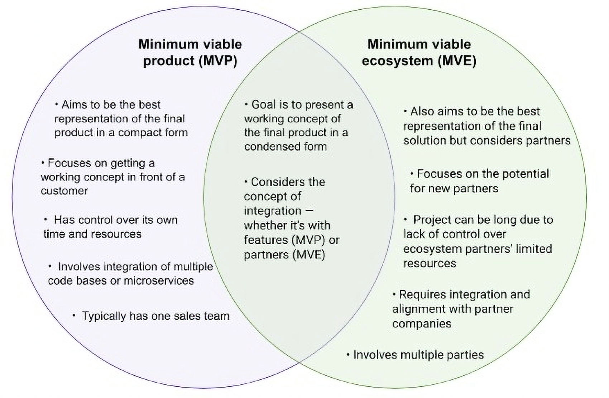

There are many companies that rely on partnerships and ecosystems to bring their products to market. These are typically B2B companies that are not vertically integrated and do not service the end customer at every point in their journey. If you are a product manager at a B2B company, this article is for you. Sometimes developing great products means developing great partnerships and ecosystems.

### Background information

Unlike most consumer goods, B2B companies often need multiple products to bring a successful solution to market. The role of the B2B product manager during early product development is to sort through the various permutations and combinations of ways of getting your product integrated into an ecosystem.

Oftentimes, customers are looking to solve enterprise-level problems and a single product company isn’t able to meet the needs of the potential customer. As a result, the product team then has a decision on its plate — shall we build, buy, or partner?

More often than not, the solution will take too long to build and it is too expensive to buy. As a result, there is only one option left and that is to partner. In this case, it's important for B2B product managers to identify their company's early set of ecosystem partners. This activity is referred to as identifying your minimum viable ecosystem, or your MVE.

Identifying your MVE is not for the faint of heart as there isn’t a lot of discussion on this topic. That said, there are examples from ingredient products and brands along with several books from Ron Adner that provide insights on how successful MVEs have helped solutions scale.

### What is a minimum viable ecosystem (MVE) and why is it important?

I work at an ingredient company, Intel, and our success is highly dependent on the ability of our channel partner ecosystem. In our case, a channel partner could be a reseller, solution provider, retailer, or distributor that partners with us to sell our product alongside (or inside) their product or service.

For example, in my industry, semiconductor manufacturers partner with original equipment manufacturers (OEMs), system integrators (SIs), and independent software vendors (ISVs) to architect and build enterprise-level Internet of Things (IoT) solutions for end customers. The identification of the opportunity and the initial concept comes from the identification of pain points at a set of customers by ourselves or one of our channel partners.

The challenge is that opportunities are generally very large in scope and involve multiple systems and products. No single company is generally able to solve a given customer’s problem unless they bring in other companies. That’s where the minimum viable ecosystem comes in.

So what is a minimum viable ecosystem (MVE)? Ron Adner, author of *The Wide Lens* and *Winning the Right Game* defines an MVE as:

“The smallest configuration of activities (and partners) that can create evidence of value creation to attract new partners. Because the purpose of the MVE is to attract partners, the key contribution of customers in the MVE stage is not to drive profit, but rather to create evidence to drive partner commitment.”

The intent with an MVE initially is to test and learn both with customers and partners. For customers, you are trying to determine if the overall concept is valuable and to see if they are willing to invest time and money into solving the problem. This activity is no different than testing [a minimum viable product (MVP)](https://blog.logrocket.com/product-management/what-is-minimum-viable-product-mvp-how-to-define/).

The additional layer of complexity for an MVE gets added on the partner side where you are also testing whether or not your partners are committed to solving the customer’s problem. If a partner is committed, they will be actively engaged and present alongside you in solving the end customer’s problem.

Adner makes a great call-out regarding the initial phase of an MVE, which involves measuring success based on confidence rather than profit. Therein lies the rub for many product managers and organizations.

Many organizations these days are retreating to their core businesses and are unwilling to invest in large, transformational efforts. Those corporations that tend to be more transactional in nature will struggle with the idea of not being able to generate a profit in a short time frame. When you are incubating an idea or starting a company, profit will not show up on day one.

Furthermore, for B2B ingredient companies trying to incubate ideas, profit will not show up until your downstream partners are showing a profit on their end (and your profit will take even longer to funnel through). That said, for organizations that both rely on their channel partner ecosystems and are interested in transformational wins, building an MVE is a great way to measure confidence in your idea. By measuring your ability to attract new partners to your overall effort, you’ll be able to test your idea’s desirability with both your end customer and your partners.

### What’s the difference between an MVE and an MVP?

Like an MVP, an MVE aims to be the best representation of the final product or solution but in a compact and lightweight package. In the case of an MVP, you may have many ideas around what additional features you will want to add to your product but are focused and trying to get a working concept in front of a customer. As a result, you deliberately choose not to invest more development time into those features [without feedback](https://blog.logrocket.com/product-management/customer-feedback-why-you-should-seek-how-to-obtain/).

In the case of an MVE, you may have similar ideas but instead of features, you think about new partners and the unique capabilities that they bring.

Another key difference between the two is the time to get to market. You need to be selective with your ecosystem partners as you don’t have control over their limited time and resources and, as a result, bringing on more of them can result in a very lengthy sales cycle. This contrasts with an MVP in that you control your time and resources (in theory) and as a result, you can manage your time to deliver the solution.

Another aspect of an MVE beyond coordination is integration. Just like internal product teams integrate multiple code bases or microservices in an MVP, you will need to do the same with an MVE. The only difference is your company’s culture and style may not fit with those of your partner’s which can cause additional alignment, meetings, and clarification between your engineering teams before meeting a customer.

This also translates to the sales team as well. An MVP in theory has one sales team from one company, while an MVE has multiple parties involved and the sales team needs to coordinate heavily before meeting with a customer:

*A minimum viable product (MVP) versus a minimum viable ecosystem (MVE)*

### Characteristics of a minimum viable ecosystem

The initial construction of an MVE should take into account the overall value proposition to the end customer and the value chain involved in delivering that value proposition. An MVE has some of the following key characteristics:

- All the players align on a common value proposition to the end customer
- Several players represent key parts of a segment or market’s value chain
- The players make up enough of the value chain to deliver a solution of value to the end customer
- Each of the players contributes a business-viable product or solution to the overall solution, resulting in them staying in the MVE
- An initial concept or MVP will be developed by the MVE and then tested

### Considerations when identifying your MVE

When identifying your MVE, take both internal and external considerations into account. On the internal side, you will first want to examine your or your team’s ability to educate your partners and manage their expectations.

For startup companies, this may mean the product manager is taking this responsibility as a part of their role, while in larger corporations, a business development representative may be dedicated full-time. Nonetheless, each partnership has its unique needs and those needs require time and attention.

On the external side, the single most important question to ask is, “Is this partner easy to work with?” If the answer is no or if you are not sure, then you should seriously consider if you would like to begin building with them at the start. Remember, you are going to be spending the next few months or possibly years working intimately with them. Just like you would interview a candidate for a role at your company, you should interview your initial set of partners for capabilities, fit, and culture.

Many companies have made the mistake of simply bringing on a partner because of their capabilities while ignoring the fact that they were difficult to work with and perhaps were not bought into the overall vision. The risk there is that your partner sees this opportunity as another way to get in front of new customers with their own product.

As a result of all that, your overall initiative will stall and your customers will see working with you as a waste of time. If you have more than one partner involved, the other partner will begin to question whether or not they should work with you in the future even though it wasn’t you who was holding up your end of the partnership.

Another thing to test for is your partner’s [appetite for experimentation](https://www.google.com/search?q=site%3Ablog.logrocket.com+experiment&oq=site%3Ablog.logrocket.com+experiment&aqs=chrome..69i57j69i58.3232j0j7&sourceid=chrome&ie=UTF-8). Are they willing to test the overall value proposition of the overall solution with the understanding that it may need to be tweaked or that the solution may need to pivot? Do they understand that the initial phase of the initiative may involve some discovery work or are they under the impression that deals will start flowing in?

### An IoT MVE example

To visualize an MVE, let’s start with a hypothetical example of a retail end customer seeking to enhance their customer experience in all of their retail locations. They would like to take advantage of the latest advances in edge computing, computer vision, and sensing applications to detect things like long lines, point-of-sale systems going down, and out-of-stock inventory.

You work at a system integration company and will need to architect the solution for the end customer. Your initial MVE will involve mapping the IoT value chain like so:

| Devices | Connectivity | Platform | Integration (YOU) | Applications | End Customer |
| --- | --- | --- | --- | --- | --- |
| Cameras Switches Routers Appliances POS’ | Network Connectivity | Cloud Service Comms Service Analytics ERP | APIs Hardware Data Mgt Other… | ERP System POS Software Inventory | Retailer |
| Partner 1 Partner 2 | Partner 1 Partner 2 | Partner 1 Partner 2 |   | Partner 1 Partner 2 | Customer 1 Customer 2 |

As you can see, putting together an MVE for an IoT-based solution requires a village! To meet the customer’s three requirements above would create a fairly complex solution and a lengthy sales cycle.

[One way to mitigate risk](https://blog.logrocket.com/product-management/effectively-manage-product-risks-product-manager/), in this case, would be to identify which one of the problems the customer is looking to solve immediately for the highest ROI. This would allow you to test a single application of the concept and the feasibility of the platform sooner, rather than later. This would also help you decrease the scope and size of the MVE from the start.

Remember, the goal of the MVE is to attract more partners while the goal of the MVP is to determine if the product will be both feasible and desirable.

### Closing thoughts

Product partnerships are the equivalent of going from single-player mode to multiplayer mode. In single-player mode, you only have to worry about yourself, your customer, and the competition. In multiplayer mode, you introduce a whole new set of players and variables to consider: partners, “frenemies,” and co-opetition to name a few.

You will also find that you need to expand your thinking beyond a small problem into something much larger. As a product manager, you will not only have to understand the customer’s (much larger) problem set but all the potential ways you and your partners could go about solving it.

That said, developing strong partnerships can lead to long and lasting benefits as each company brings its unique value to the partnership.

> This article was published on [LogRocket's Product Management blog](https://blog.logrocket.com/author/joelpolanco/) on August 23, 2023.
