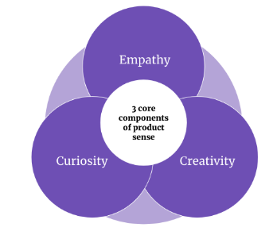

There are a lot of misconceptions about product sense, what it is, and what it isn't. The term “product sense” itself implies you are born with it (not true!).

Product sense is one of the five natural powers of a product manager but like any power, you need to cultivate it and practice it to develop it. The journey towards senior product levels requires that you develop high ROI skills like product sense.

*Skip ahead*:

- [Background information](#background-information)
- [What does product sense mean?](#what-does-product-sense-mean)
- [The 3 core components of product sense](#the-3-core-components-of-product-sense)
- [Examples of product sense](#examples-of-product-sense)
- [How to develop your product sense](#how-to-develop-your-product-sense)

## Background information

Like many individuals that find themselves in product management, I’m an accidental product manager. I never went to school for product management and in fact, I didn’t know the role existed for the early part of my career. I actually started my career in semiconductor manufacturing, where my time was spent making sure the latest generation of processors were produced at ever-increasing speeds and quality levels. Semiconductor manufacturing is one of the most automated, yet highly complex environments an engineer can work in.

In terms of execution and analysis, I had world-class training. I left the factory and transitioned into analyst roles which eventually led me into product management. In product, I was viewed as someone with a superior execution focus, establishing me as someone who could be counted on to get things done.

At the time, I was working in established product areas that were well-funded in terms of headcount and dollars. Eventually, I was asked to move on to a 0–1 product that had very few resources and I found myself struggling. I had a hard time articulating what a series of end states could look like along with their potential paths to get there.

In some cases, my gut told me the team was wasting time on certain customer activities, but I couldn’t clearly articulate why half the time. I discovered that I was weak in terms of my product sense.

If you find yourself struggling in the same way that I was or if you are new to product management, this blog post will help set you on a path to building better product sense.

## What does product sense mean?

So what is product sense and why is it important? Like common sense, product sense means that you are making sound, practical judgments when it comes to your product. For some individuals making good calls on their product frequently and consistently comes naturally. For others, not so much.

In the product community, there are two schools of thought around product sense: (1) that it’s a magical trait you possess and needs to be developed or (2) that it’s a complete misnomer — it's not a “sense” but a skill and it requires a ton of hard work and experience to develop. I believe product sense falls between these two extremes.

### The 3 core components of product sense

If you break product sense down to its core components of empathy, creativity, and curiosity, you’ll discover that both skills and traits are present.

Empathy and creativity are skills and curiosity is both a skill and a trait. Empathy is your ability to see things through the lens of your users (the needs of stakeholders over users in many cases). Creativity highlights your ability to come up with original ideas and produce original work. Curiosity is something we are born with a certain level of and as a result, your ability to be a curious person may be limited at times.

All in all, each of these skills and traits must be developed to improve your product sense:

*Product Sense Skills and Traits*

#### Empathy

Early in my career, I was a user of systems and eventually grew into a superuser of data and analytics systems. I had a lot of [internal stakeholders](https://blog.logrocket.com/product-management/what-stakeholder-management-tools-techniques/) reaching out to me asking for help with product features — how they worked, where they were located, and what features integrated with other systems. Over time, I was able to build empathy for other users as I had once been in their shoes.

Things changed for me when I moved into an external-facing product role where I was no longer in a cost center but in a profit center. In a cost center, your objective is to save money for the company whereas in a profit center, your objective is to make money for the company. I began to feel a pressure — a pressure to sell the products I was working on before they were ready to scale. Over time, I learned the valuable balance between product and marketing, each of which has very different roles to play.

The product manager should be representing the views of the user while identifying a business-viable product. If the product manager’s empathy muscles begin to weaken, they can find themselves in a situation where their product isn’t meeting the needs of the users. To build your empathy muscles, you have to be able to set boundaries with your internal stakeholders and educate them on what the users are telling you. This is a skill you can develop over time and it takes a lot of communication and stakeholder management to execute it well. No one likes to hear “bad” news!

#### Creativity

Creativity, like empathy, is a skill that can be developed. Your company culture, your teammates, and your surroundings will play a large role in developing your creativity.

Over the last several years, I’ve been leveraging [techniques from design sprints](https://blog.logrocket.com/product-management/transform-product-culture-with-paper-prototyping/#design-sprints) as a way to spark my and my teams’ creativity when tackling problems. Design sprints turn an otherwise dull meeting into a set of fun exercises that push you and your teams out of your comfort zones. I am especially fond of leveraging design sprints to facilitate customer discovery work.

You may find another purpose for leveraging design sprints or some other creativity-sparking technique of your choice. The point here is that your creativity is only limited by your own imagination and your ability to harness it.

#### Curiosity

Curiosity, as I mentioned before, is a little different from empathy and creativity in that it is both a skill and a trait. Curiosity can be developed up until a point, but there are limits to it. I like to say that everyone is curious, but some people are just more naturally curious than others.

When it comes to product sense, curiosity is certainly required as you will need to continually research your competitors, new products, technologies, and everything in between to ensure that you understand your domain.

I have always been a curious person as I tend to try and understand how things and people work. If you fall into the less curious side of the spectrum, you’ll want to identify motivations that will spark your curiosity. One of the best examples of curiosity is children. Why is it that children are more curious than adults? Children are more curious than adults because they don’t assume that they know the answers.

The trap that we run into over time is that we assume that we know the answer and as a result, we glance over hints and clues as to how to develop successful products. We usually assume one of two things: (1)[we know the answer to the problem](https://blog.logrocket.com/product-management/you-are-not-your-customer-how-to-avoid-building-the-wrong-product/#confirmation-bias) or (2) a problem doesn’t exist. Both of these assumptions can lead to poor product choices, for different reasons.

In one case, we try to push our solution but there is little to no uptake. In the other case, we fail to see a product opportunity because we cannot envision the world working differently. A consistent dose of childlike curiosity can help break these assumptions.

## Examples of product sense

Now that we’ve talked about the key underlying product sense skills and traits, let’s dive into a few examples of bad product sense.

One example where a healthy dose of product sense could have resulted in a transformational product was Google Glass. Google Glass was introduced in 2013 as a very futuristic set of augmented reality glasses that could display info on the lens of the glasses. The glasses were an engineering marvel at the time! They were also kind of creepy and very few people were actually interested in using them.

Another example of poor product sense was Zune, Microsoft’s MP3 player that launched in the mid-2000s. At the time, Zune MP3 players were very high-end and had a lot of features. Unfortunately, Apple had already released multiple generations of the iPod while establishing iTunes as the de facto marketplace to purchase music. Microsoft simply did not have a strong position in the consumer device market and the companies it acquired didn’t help it secure the most important thing of all, a differentiated media marketplace for consumers.

## How to develop your product sense

To develop your product sense skills, you will need to be intentional and thoughtful about how you use, analyze, and develop products at work and home.

As I mentioned before, design sprints are a great way to get your team on the same page while executing some customer discovery. You can also hold [user experience (UX) walk-throughs](https://blog.logrocket.com/ux-design/conduct-heuristic-evaluation-tutorial/) of your product. A UX walkthrough allows you to view a potential user go through the process of discovering your product, learning what it is, and how it works. The process can help you identify a ton of usability and usefulness issues with your product.

Another activity that helps build product sense is performing product teardowns. Have you ever compared the features between Slack and Teams? They are very similar products but are positioned in the market in very different ways. They have several similar features but they are catered to very different user segments. Why is that? A product teardown will help you better understand the inner workings of the product features, its distribution model, and how it is positioned for different users.

## Conclusion

In summary, product sense is a bit of a misnomer as it is primarily made up of skills like empathy, creativity, and curiosity. That said, curiosity is both a skill and a trait, so in theory, you may have limited upside in your ability to hone your product sense if you are not motivated to ask key questions and gain a deeper understanding of your domain. Being naturally curious helps you improve your product sense but it’s not a requirement.

Building product sense takes several years of intentional practice and experience. If you are a product manager looking for that next promotion, developing your product sense may prove to be the best return on investment activity for you.

> This article first appeared in [LogRocket's Product Management blog](https://blog.logrocket.com/author/joelpolanco/) on June 15, 2023.
