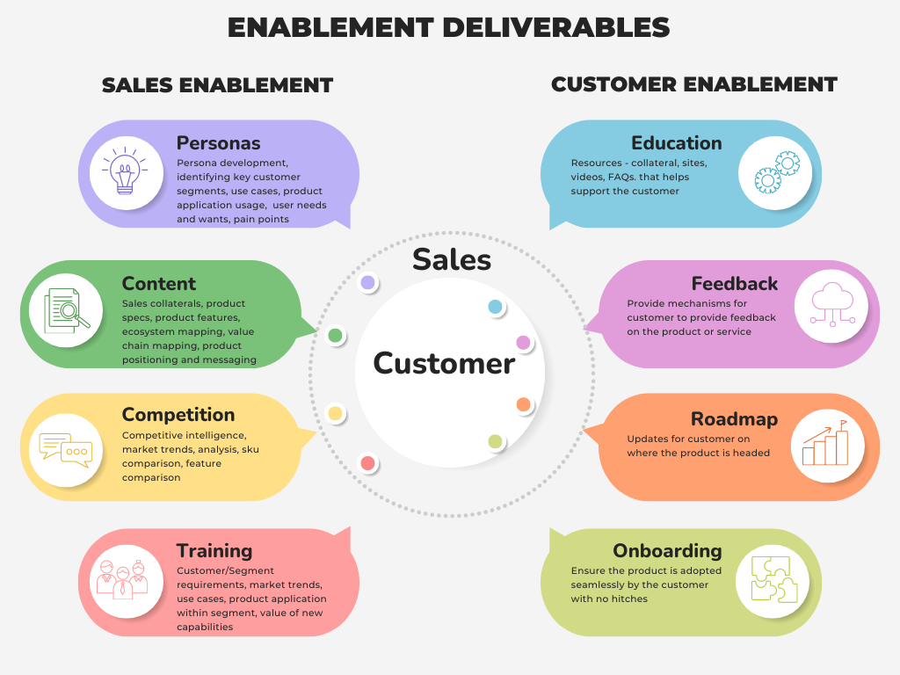
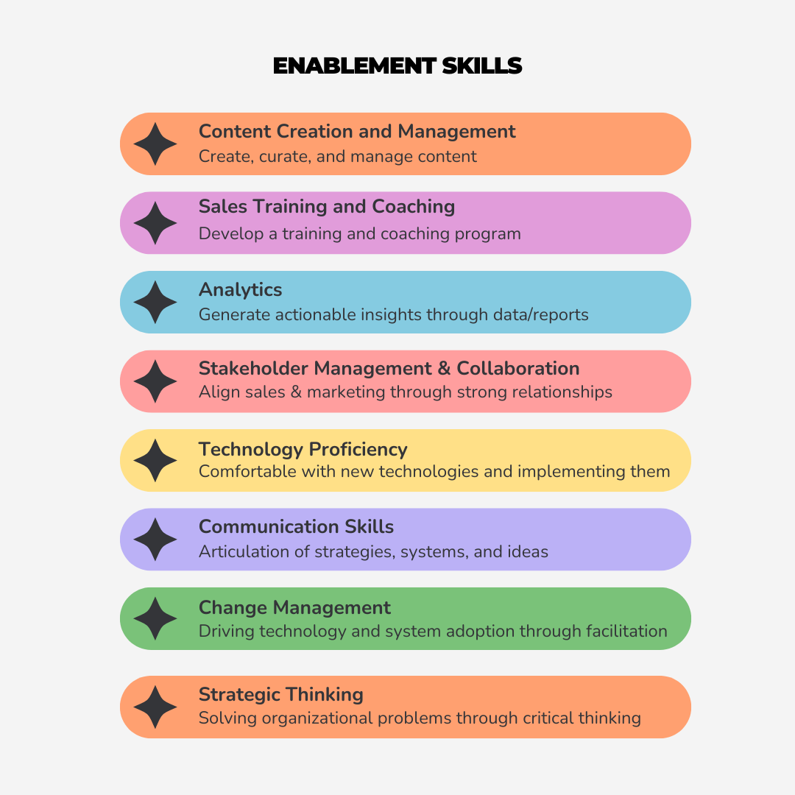

Have you ever struggled to keep your sales and marketing teams aligned? Did you ever find yourself struggling to organize information for your sales team? Do you wish that there was someone to help you implement sales systems, create and manage sales-facing content, and keep your sales team up to date?

This article talks about these challenges and the role enablement managers play in ensuring your sales team (and customers) remain happy and productive.

## What is enablement?

Enablement refers to the process of providing others with the means to do something that they otherwise weren’t able to do. In business, this could mean building a training program for partners, creating a self-service product, or training an AI to perform a task for someone.

Enabling others through education, automation, or new experiences creates growth loops that allow your business to scale quickly. You can achieve this by focusing on understanding user needs while pairing the right technology, capability, or media during the delivery to the user.

## Types of enablement

As a product manager, you play a key role in delivering sales and customer enablement resources. Together, these provide sales teams with the tools they need to sell more efficiently and customers with the resources they need to use your product:

*Sales Enablement vs. Customer Enablement*

Sales enablement involves you figuring out what you need to deliver to your sales teams so they can develop repeatable sales motions. As you move out of discovery, you should have a better understanding of who your ideal customers are, where they reside, and how you can better position and message your product to them.

In terms of customer-facing resources, most customers would prefer to have information they can access themselves, instead of having to speak to a representative. Customer enablement allows your product, customer success, and sales teams to scale through self-discovery resources and product improvements. Depending on your product, you might even consider creating user forums or communities where users can speak with and help one another with questions or concerns they have.

## Why enablement matters

By focusing on enablement, whether it’s sales or customer focused, you can scale your time (the one thing you cannot make more of). For every process that you automate, educate, or replicate you save your company a lot of money (less hiring, more sales opportunities).

Enabling others also allows you to focus on other activities that require your attention such as: developing a new customer segment strategy, performing discovery on the next feature, or ramping up a new teammate.

## Enablement strategies

Depending on the maturity of your company and its salesforce, you may decide to focus on a few different strategies. The three most common refer to the:

1. **Buyer’s journey** — Resources needed for each step in the purchasing cycle
2. **Sales process** — Support for each step in the sales pipeline
3. **Technology/platform** — An enablement platform connected to your CRM

You should always start with the buyer by understanding who they are ([persona development](https://blog.logrocket.com/product-management/user-persona-template-examples/)) and their needs and wants (what their problems are). Once you understand those things well, you can work with your sales team to run a [gap analysis](https://blog.logrocket.com/product-management/gap-analysis-template-definition-examples/) to determine what tools or resources are missing in each step of the buyer’s journey.

Maybe your onboarding experience fails to capture your customers or they require more information than they have. Try to map your sales enablement resources to your sales process. Over time, your top sales people will have worked through so many deals that they’ll flush out many of the bugs in the sales process.

Dig up conversion statistics from your CRM and identify your top converting salespeople and lowest converting sales process steps. With your team, decide whether sales enablement could result in higher conversions.

Modern sales enablement platforms can connect to your CRM system (and your customers/contacts), track what sales enablement resources your customers consume, and organize your sales enablement resources for easy consumption.

## Case study: How Runway uses AI to qualify leads

A little over a month ago, I attended a webinar hosted by [Siqi Chen](https://www.linkedin.com/in/siqic), CEO of Runway, called “Practical AI Prompt Engineering with No Code.” In that seminar, I learned that Runway was using Zapier and ChatGPT to qualify incoming leads, much like a sales development representative would.

Runway was receiving a lot of inbound leads through its website during signups. Those signups were then sent to ChatGPT, which filtered out general (non-work domain) emails and sent a list to a Slack channel for further processing (review, data enrichment, etc.). By automating a number of lead processing activities, Runway effectively enabled its salesforce with higher quality leads while minimizing its cash burn as it ramped up its business.

## Role of an enablement manager

According to data from [Gartner](https://www.gartner.com/en/newsroom/press-releases/2023-02-15-gartner-expects-sales-enablement-budgets-to-increase-by-50-percent-by-2027#:~:text=Sales%20enablement%20budgets%20will%20increase,%2C%20according%20to%20Gartner%2C%20Inc), enablement roles have continued to grow over the last few years and that growth doesn’t show signs of slowing down. Sales organizations see the role as important for driving sales productivity and aligning marketing and sales functions. Here are some of the key responsibilities of an enablement manager:

1. Content development and management
2. Training and onboarding
3. Sales process optimization
4. Performance analytics and reporting
5. Cross-functional alignment and collaboration
6. Technology and tools management

The scope of responsibilities that a sales enablement manager takes on depends on the size of the company, the company need, and the specific role. For example, I was involved with the implementation of a new CRM at a Fortune 500 company and over a two year period, most of my team focused on sales process and technology.

After the CRM implementation, individuals shifted towards content development, management, and cross-functional alignment. You might also notice that the job goes by a different title, but still has similar responsibilities. Related job titles include:

- Learning and Development Manager
- Content Marketing Manager
- Customer Success Manager
- Sales Operations Manager
- Product Marketing Manager

Success in an enable manager position depends upon your strategy, communication, collaboration, and technology skills. The following list illustrates additional skills that help support the role:

*Key skills for enablement role players*

Depending on the company and situation, one of these skills may be in higher need than others. For instance, if your company wants to implement a new sales system such as a CRM or a commissions system, an enablement manager may be expected to drive a significant portion of the change management work in partnership with the IT department.

This would involve creating content about the changes, holding training sessions, collaborating with IT on the roadmap, and communicating sales process or systems changes to the sales team. Other situations may require the enablement manager to focus on creating customer facing content for the sales team. Situations can vary widely between companies based on the stage of the company and the maturity of the salesforce and/or IT systems.

## Final thoughts

Enablement has grown into a critical function and plays an increasingly bigger role in improving sales and marketing productivity. Remember that enablement efforts tend to fall under either customer or sales. On the customer side, provide your users with the resources they need to accomplish their tasks. Sales takes a more internal approach by ensuring your team has what it needs to effectively close deals and increase productivity.
