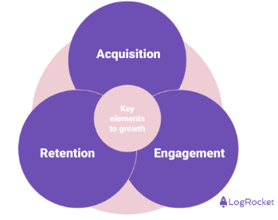

One of the greatest skills a PM can have is prioritization. In order to become a skilled prioritizer, PMs need to understand their user growth metrics in detail. I recently spoke about this topic to a live, online audience. To view the recording, just click on this [link](https://www.youtube.com/watch?v=qWednDKUydM).

This article will go over the basics of growth and provide an overview of where and when to place focus when building a new product or feature. It will also provide recommendations on how to quantify the value of a new user versus a retained user. I hope you enjoy it!

## The basics of growth

Before we get into the value of a new user versus the value of retaining a user, it's important to talk about the basics of growth. There are three key elements to growth: acquisition, engagement, and retention.

*The key elements of growth*

Acquisition is the practice of acquiring new users (or customers) through either paid or non-paid sources (we will get into the types of sources later). Engagement looks at how and how much your users interact with your product. Retention is your ability to retain your users and prevent them from churning or leaving your product.

Growth is a maturing but still relatively new area in product that relies on different disciplines such as marketing, statistics, product, design, and finance. While product organizations focus on the core user experience and features that are delivered to the user, growth organizations will focus on the metrics or outputs that those features are delivering and look for ways to improve them.

Keep in mind that no two companies look alike and in some cases, a growth org may not be present, and as a result, other individuals may be focusing on growth strategies as part of their core job. In companies that are more growth-oriented though, specific orgs or cross-functional teams are built to measure growth.

In my experience, it's often better to have a separate team looking at these metrics to reduce organizational politics and bias that arises when measuring one’s own performance.

### Acquisition

Acquisition is the practice of gaining new users for your product. Note that I said, “Acquisition is the practice of acquiring new users (or customers)” and put customers in parentheses. The reason is that sometimes your users are not your customers. especially in B2B.

The consumerization of IT has led to several successful SaaS startups that often deploy [product-led growth](https://blog.logrocket.com/product-management/what-is-product-led-growth-strategies-principles-examples/), or PLG, models that focus first on building a product’s user base using freemium tactics. These tactics result in the company offering up a free, but limited, version of the product for a basic user while offering up paid, enterprise versions of the products for companies.

In this case, a user is not the same thing as a customer and you need to separate user acquisition from customer acquisition in some sense. For the purposes of this post, we will focus on new user acquisition to keep things simple.

There are two types of sources for acquiring new users: paid and non-paid. Paid sources include social media, digital media, search, SEO, and events. Non-paid sources include word-of-mouth, press, earned and owned social media, and email.

Over the last decade, prior to our current interest rate period, several companies benefited from large infusions of VC capital along with lower-priced social media advertising. As a result, companies were able to drive big numbers in terms of new user acquisition at fairly low costs. These companies were then able to show investors significant growth over that period, which resulted in a strong IPO market and some successful exits.

This strategy is no longer working as interest rates and the cost of advertising have gone up, and the amount of capital available has gone down. The result is that companies that are looking to drive new user acquisition are having to do that through new feature introductions, new product offerings, or non-paid sources like word-of-mouth or earned social media. Later on in this article, we will get into ways of measuring the value of acquisition through paid and non-paid sources, so bear with me.

### Engagement

While this article is focused on acquisition versus retention, engagement is a critical piece of the puzzle and cannot be left out. Engagement is simply the measure of how much your users are interacting with your product. It can be measured in different ways but is typically tracked by your users’ daily, weekly, or monthly activity levels.

Determining the optimal top-level engagement metric is dependent on a typical user’s usage frequency. For instance, in the case of Instagram, a growth team would typically measure its daily active users (DAUs). In the case of Redfin, a residential listing broker, a growth team would likely look at monthly active users.

It is great to have a topline metric like DAUs to measure engagement, but it's even more important to segment your users based on their engagement level. Why would you want to do this? To understand who your power users are. Andrew Chen wrote an amazing [blog post on power users](https://andrewchen.com/power-user-curve/) where he says, “Power users drive some of the most successful companies.”

Most, if not all, products will have “power users” — users who are engaging with your product the most. They are inviting others to engage with them in your product, they are engaging with others in the product, and in some cases, they are driving the majority of your product’s monetization.

That being said, you need to keep in mind that the behaviors of this group do not always apply to other segments and should be careful not to over-cater to power users. If your goal is to drive overall usage up, you may need to identify ways to encourage other segments to become a new type of power user through new feature introductions or other means.

Hopefully, you can now visualize the importance of engagement as a bridge between acquisition and retention. If a product doesn’t have some level of consistent engagement, it will have no retention. In addition, poor engagement and retention can have a negative effect on your future acquisition efforts as the word gets out that your product isn’t worth someone’s time, and/or the word about your product doesn’t get out at all.

### Retention

Retention measures a company’s ability to retain a user over a defined period. In many companies, measuring retention is straightforward. Companies like Netflix or Verizon will measure their [churn rate](https://blog.logrocket.com/product-management/churn-rate-formula-definition-how-to-reduce/) or the number of users who stopped paying for a service.

Building off the engagement section above, many companies will simply measure the difference in their topline engagement numbers (DAU, MAU) month over month or year over year. The change in the percent of your daily or monthly active users over time reflects your ability to retain (or churn) users.

In other companies, retention is more difficult to measure. Let’s go back to the Redfin example. How often does someone list and sell their home? Maybe once every 5–7 years, on average? You can see how the time between transactions can vary widely between companies like Redfin (buy/sell every 5–7 years) versus Netflix (daily/weekly watching or monthly billing).

There are tactics for infrequent transaction companies to help drive continued engagement like developing quality content, newsletters, press releases, and email marketing content. That said, the examples above highlight the need for companies to develop a retention metric or metrics that make sense for them given their product and/or service.

## Things to remember when comparing acquisition vs. retention

Now that we’ve covered the basics of growth, there are a few points to think about when you’re weighing the value of new users vs. returning users — that value depends on timing, that CAC might not always be the best way to gauge value, and that, if neglected, retention can be a silent killer for your business.

### Value depends on timing

Your product or platform’s life and health will play a large role in where you place your focus. Early on in a product’s life, you won’t have many users and as a result, you’ll be spending more time and resources on new user acquisition.

As you get more users and are hopefully retaining them, you’ll get more leverage so, in theory, you’ll spend less time on acquiring new users and more time on keeping them engaged and retained. As a result, the formula for your return on your investment for spending more time and resources on acquisition versus retention will shift over time.

### CAC vs. return on investment

Acquisition has historically been measured using a metric called CAC, or [customer acquisition cost](https://blog.logrocket.com/product-management/what-is-customer-acquisition-cost-how-to-reduce/). CAC is measured by dividing all of your sales and market costs to acquire new customers by the number of customers you acquired during a time period. To get a return on investment, you will then couple your CAC with your LTV or lifetime value of your user.

The lifetime value of your user is the amount of revenue you expect to generate from your user. The goal is to drive an LTV:CAC ratio that is greater than 1. In other words, you want to ensure that you are generating enough revenue to cover the costs of acquiring a new user.

To measure the return on investment for retention, measures like customer retention cost (for SaaS companies) are often used. CRC measures expenses such as customer success costs, professional services, training, or marketing. Companies will then divide CRC by their ARR or annual recurring revenue to get an understanding of how their recurring retention costs compare to their recurring revenue. This analysis helps provide a good understanding of how a company can improve profitability.

One question that comes up around calculations like CAC or CRC is what if you didn’t spend directly on the metric? In other words, what if you had non-paid sources of acquisition like owned and earned media? These questions raise some greater issues with measures like CAC and there are some solutions.

Some individuals will say “Calculate a blended CAC that averages your costs over paid and non-paid sources.” The argument here is you now have a measure of your customer acquisition cost over all of your sources and so you have a more accurate measure of your LTV:CAC ratio.

The argument against this approach is that this approach is flawed in terms of both the LTV calculation and the CAC calculation. The reality is that LTV is a rough estimate of what a user will spend over their lifetime (I mean, do we really know?) and CAC can be manipulated easily (simply put more effort into non-paid sources).

A better approach, in my opinion, is to simply calculate a basic return on investment and payback period on your direct paid spend. In this case, you calculate how much you spent and how many customers you acquired at a given price. So what is a good payback period? [Elena Verna, a leading growth expert](https://elenaverna.substack.com/p/cost-of-acquisition-cac-trap#:~:text=In%20summary%2C%20the%20good%20payback,loop%20from%20a%20leaky%20funnel.), estimates that a good payback period is less than three months for B2C and less than eight months for B2B.

### Retention can be a silent killer

Now that we’ve established the value of acquisition and retention, I want to highlight a key point that often gets missed. After numerous conversations, ad hoc polls, and 1:1’s at work, I’ve come to the conclusion that most teams will overemphasize acquisition over retention.

There appears to be an inherent bias towards always focusing on growing your user base. As a result of this bias, teams will often fail to analyze how many people they are retaining on their platform. What ends up happening is that new user growth eventually stalls and by failing to keep users engaged and retained, the company in question ends up going bankrupt (in the case of a startup) or the team gets a reorg (inside a large company). [Reforge](https://www.reforge.com/blog/retention-engagement-growth-silent-killer) wrote about this phenomenon and did a deep dive on their blog with several case studies. The authors went on to say:

*“Retention — not only does it make companies, but it also breaks them. For this reason, poor user retention has become the silent killer.”*

There are many reasons why this happens, but the main culprit tends to be a lack of long-term thinking. As I mentioned above, you don’t have users early on so the focus will be on acquisition. The failure occurs when teams become addicted to only acquisition and fail to look at their product’s retention. Why wouldn’t they? In many cases, new user growth can continue to trend upward for a long time.

We all need to remember that new user growth will begin to tap out at some point and we’ll be left with those users that we’ve acquired. If those users don’t stick around, the product won’t remain viable. In this [blog](https://caseyaccidental.com/caseys-guide-to-finding-product-market-fit/), Casey Winters takes a quantitative approach to finding product-market fit where he shows, mathematically, that retention is the key metric to look at when answering the question, “Does your product have product/market fit?” Casey explains that product-market fit is when users stop leaving.

## Summary

You can see that I am clearly biased toward retention as a higher-value measure of growth, but I tend to take a long-term view of things. That said, my experience tells me that someone on the team needs to bang the retention drum because most members will tend to focus and promote acquisition.

Obviously, the answer to whether acquisition or retention has more value is really dependent on where you are at in your product’s maturity. Early on, you won’t have many users so you should focus on acquisition. As your product and growth matures your growth strategies and tactics will need to follow suit. Ultimately though, you’ll always want to make sure that you can keep your users engaged and retained if you want to achieve sustainable growth.

> *This article was featured on*[LogRocket's Product Management blog](https://blog.logrocket.com/author/joelpolanco/)*on November 8, 2023
> I also spoke about this topic on a*[*Logrocket webinar*](https://www.youtube.com/watch?v=qWednDKUydM)*on March 6, 2024*
