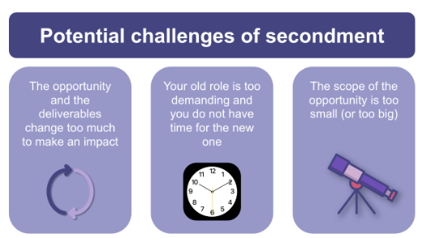

I like to refer to myself as an “accidental product manager.” I didn’t take any official product management courses in college and didn’t expect my career to pan out the way it did. This is more common than you think, as many companies implement opportunities for secondment so their employees can try out professions they don’t have a background or education in.

Secondment is a neat way to pilot a specific role or career without having to go all-in to it right away. If you are considering a career in product management or are looking to improve specific product management skills in a new industry or technology, this article is for you.

We’ll talk about what secondment is, some of the benefits and challenges, as well as some real-world examples of secondments in product management.

## What is secondment?

Secondment is when a company assigns an individual to another department or where an individual works in another department but their salary and benefits are paid by the original department.

Many medium and large-size companies have formal secondment or job rotation programs that are managed by the human resources department. These opportunities can offer individuals opportunities to gain a new skill, give them exposure to a new job function, and allow them to “test the waters” before making a career change.

For aspiring product managers, secondment opportunities provide a means to learn about the mysterious day-to-day functions of a product manager. In many cases, secondment opportunities often come with mentoring and support, which enable the mentee an opportunity to ask questions and learn about the product management function.

## The role and benefits of secondment in product management

The role of secondment in product management can vary based on the company, its resources, and the hiring department. Some companies have a formal secondment program while others offer opportunity-based programs.

Google’s Associate Product Manager (APM) program is probably the most famous formal, entry-level product management job rotation program out there as well. Created by Marissa Mayer, former Google VP of Product and CEO of Yahoo, the program provides recent college graduates with exposure to several divisions in Google before they settle into a single department.

The program rotates you through several roles as a full-time product manager and you gain experience in market research, strategy, and design.

Where I work, at Intel, we often have people going out on maternity leave or sabbatical, so having a secondment program is crucial for business continuity and employee development. That said, if your company doesn’t have a formal secondment program, don’t worry! You can always make the case to your manager that you would like to create your own opportunity but landing it may be a bit of a challenge if you aren’t prepared to have the conversation.

You will want to identify an area of the company that is short on resources for one reason or another and then have a chat with a potential “hiring” manager who’s willing to bring you on as a rotational product manager. In this case, you will want to have a good understanding of the organizational needs, your own skill set, as well as the set of skills that you are looking to develop from this potential opportunity.

The benefit of secondment is that you will have the opportunity to learn on the job while focusing on specific skills that you would otherwise not be able to develop in your current role.

## How to make the most out of a secondment opportunity

To make the most out of your secondment opportunity, you will want to take your secondment opportunity seriously. You will want to come in and first learn as much as you can about the new department, customer, stakeholders, market opportunity, and/or new industry you will be focused on.

If you are currently not a product manager, one great tactic is to identify a product management “buddy” in your new role. Although it sounds informal, the role of a buddy is really important, as it formally offers you someone you can go to (besides your new manager) that you can confide in and ask questions.

Let’s face it, your new manager is probably very busy and won’t be available every moment, so having a buddy around whom you can DM when you have a simple question is really important. Additionally, a buddy can provide additional perspectives on situational questions that you come across in your new role.

On top of identifying a buddy, it’s important to put together a formal research plan. What is the problem or opportunity this department is trying to solve? Who are the top five,10, or 20 customers that make up that department’s revenue? What are their key pain points and what is your field sales team saying about the current state of affairs?

By putting together a research plan, you will be showing your incoming manager that you are taking the opportunity seriously while exhibiting a high level of agency.

Another way to make the most of your new role is by doing a “reverse interview” on your new org while you are in the role. Remember, one of the reasons the opportunity is offered to you is a chance to advance your career. A reverse interview is just exactly as it sounds, you the interviewee, are actively interviewing the new organization as you work in your new role. Ask and answer interview questions about the role along the way.

What is the culture of this organization? Is it a hustle culture or one that values work-life balance? Is the pace moving at the pace that I expected? Is this place going to be additive to my career and will there be opportunities for advancement in the future? These are just some examples of the questions that you will want to ask yourself as you work in your new role.

What is important is that you stack rank the variables that are most important to you and ask questions during your role to uncover how this new organization scores versus the current role you are in.

Finally, be sure to enable some sort of feedback mechanism for yourself throughout the opportunity. Prior to starting your role, you will want to align on objectives and deliverables with your incoming manager and ensure that you are checking in on your progress throughout the engagement.

Toward the end of your rotation, I also recommend that you present the work you accomplished and the outcomes you drove to both your old and new managers. This formal recognition of your work is important for your end-of-year review as it shows that you took the initiative to take on a new opportunity while developing new skills and shows that you have a growth mindset.

## Potential challenges of secondment and how to overcome them

While a secondment opportunity can come with a lot of benefits, a lot of challenges can present themselves along the way. Here are three distinct challenges that typically come up and how to overcome them:

1. The opportunity and the deliverables change too much to make an impact
2. Your old role is too demanding and you do not have time for the new one
3. The scope of the opportunity is too small (or too big)

*Secondment comes with a few challenges*

### The opportunity and the deliverables change too much to make an impact

My best advice is to ensure that you define the target up front. Be sure to document expectations, goals, and objectives before starting an assignment. When those goals and expectations shift, be sure to document those changes and ensure that everyone is nodding their heads that these changes need to happen.

In some cases, you’ll find that people are “shooting arrows and drawing targets around them” versus aiming for the target in the first place. Change happens, but when it happens multiple times within a small assignment, beware!

### Your old role is too demanding and you do not have time for the new one

This is challenging but can be managed in multiple ways. A lot of prep is required on your part ahead of the engagement. Is your boss prepped and supportive of you taking another job assignment? If not, that’s a sign that you may not have the freedom to break away from your old role at this time. You will want to work with your boss on a coverage plan.

Remember, it's your responsibility to ensure your old role is covered so you’ll want to play an active part in ensuring that your coverage plan is in place. If the person covering for you isn’t bought into covering for you or they don’t have adequate skills, you may need to find someone else or you will have to spend some extra hours training them.

If they continue to hound you post your transition, you’ll need to set some boundaries with them and determine if they aren’t being a good collaborator or if they just don’t have the skills to cover for you.

### The scope of the opportunity is too small (or too big)

This is really about your ability to negotiate with your new boss. If the scope is too small, you can and should take on more initiatives if you want to maximize the opportunity. If the scope is too big, be sure to communicate that with your new boss and think about what resources (time, money, or scope reduction) you will need to meet expectations.

Reducing scope is generally a good option but sometimes can be scary, especially if you haven’t negotiated much in the past. Ultimately, you want to ensure that your expectations are aligned with those of your new boss.

## Real-world examples of secondments in product management

Now, I’ll share a few examples of secondment in product management.

### Secondment while covering for someone on leave

This first one is near and dear to my heart, as I opened up a secondment opportunity when I went on a sabbatical a few years ago.

The gentleman covering for me was a hardware product manager looking to gain software experience. We sat down and went through his coverage plan several times before I went out on sabbatical. We were investigating potential initiatives to execute in a new market. My objective was to perform customer discovery and identify product concepts that we may want to build and test in the future.

I explicitly warned him that the team he was working on was made up of sales and marketing team members (he was the only product person) and they had very strong opinions about what and how he should be doing his work. I was concerned, as no one on the team had experience with customer discovery and concept testing, and preferred to fund partners with marketing dollars over building and testing concepts.

When I returned from my sabbatical, the product manager explained that the team had pressured him into a specific direction and that they were working with a partner’s sales team that was mainly interested in lead generation. I was disappointed in the outcome and for the product manager.

### Secondment as an introduction to a new career path

My second example is bittersweet. A software engineer I was working with was really interested in product management and had approached me for mentoring. After a few months of development, we created a secondment opportunity for him to work with me on a product incubation effort I was leading.

After aligning his management and mine, he worked on a product discovery effort that was looking at expanding our product into a new vertical market on an adjacent use case. He did an amazing job at the conclusion of the engagement and presented his findings to our management teams. He really showed that he could be a great product manager.

This person determined that he really wanted to leave software engineering for product management and expressed his interest in joining our product team. Unfortunately, his managers weren’t willing to let him move from software engineering to product management. He eventually left our company to join another one — as a product manager, with a raise! While it wasn’t the best outcome for our company, it was a great outcome for him.

## Conclusion and key takeaways

Secondment opportunities are one of the best ways to gain experience as a product manager, especially for individuals who are looking to break into the profession. They allow you a way to “test the waters” without having to be fully committed.

In some cases, people find that product management isn’t the glorious position that they thought it was. In other cases, a secondment opportunity provides them with a clear path to make a career change.

Secondment opportunities are not without their challenges and my recommendation is to always put a lot of time into aligning expectations with all of your stakeholders upfront, especially your managers. In closing, be sure to watch out for the following three things when taking on a secondment opportunity:

1. The deliverables keep changing
2. Your old role is too demanding
3. The scope of the new opportunity isn’t sized appropriately for your level

Resolving these three elements ahead of starting your secondment opportunity will enable you to maximize your learning and engagement in your new role. If you have the opportunity to take on a secondment opportunity, whether formal or informal, I highly recommend it.

> This article first appeared on [LogRocket's Product Management](https://blog.logrocket.com/author/joelpolanco/) blog on September 6, 2023.
