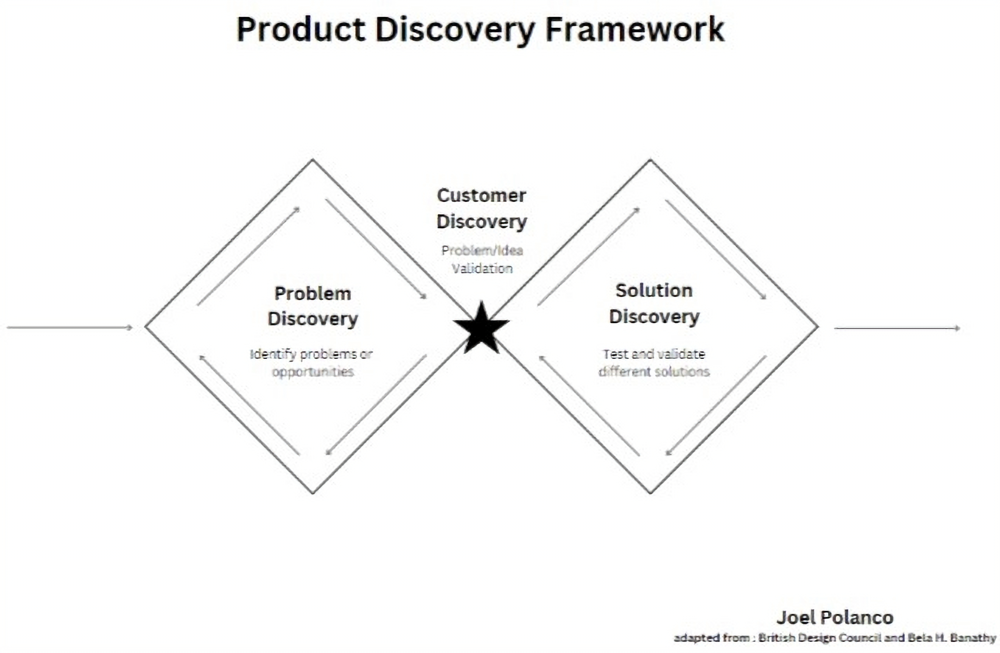

In order for a product to have sustained success, you have to understand your potential customers so that you can build products that speak to a need that already exists within the market. Too often PMs neglect the importance of the customer and end up spending valuable time and resources on a product that never had a chance in the first place.

This article will provide a broad overview and framework for how I view product discovery and then focus on one of its key components, customer discovery. The purpose of customer discovery is to gain a deep understanding of customer segments, potential markets, and potential value propositions before developing and launching a product or service.

## A good idea equals a good product?

I clearly remember an engineer going over a product idea a while back. I was recruited to help a small team as its product manager. It was a software automation tool for hardware deployment that would help our partners replicate a software image and allow each piece of hardware to confirm it was at the right location after it was deployed.

At the end of his presentation he concluded with, “And there it is…we built it and now you (marketing) will go promote it and make it a wild success.” While I loved his energy and optimism, I couldn’t help but think about one key thing.

We hadn’t spoken to a single customer about the problem that was supposedly being solved.

It was a difficult position to be in and one that I had been in before. After speaking with my network, it turns out it’s a common situation at large companies. There tends to be an assumption that new products will scale similarly to existing products.

More recently, I’ve been working with startups where technical founders have conceptualized a solution to a key problem. They’re passionate; They’re able to talk about the solution and all its features in detail. The challenge often lies in that they have a difficult time translating features into customer value.

I meet with them to understand how they plan to go to market with their initial product offering. I’ll typically ask them what customer segments they’re targeting and what their value propositions for those segments are. That is where things can begin to be a little dicey…

Despite their understanding of the problem space and a potential solution, they haven’t spoken with potential customers very much (or sometimes at all). We’ll then set up a customer discovery plan for them to begin interviewing potential customers and find out that many of the founder’s assumptions were incorrect.

Whether you are a solopreneur, a startup founder, or a corporate innovator you need to have a clear and compelling value proposition. Without customer insight, you’re relying on luck, not skill, to reach the nirvana of “product-market fit.” It’s my mission to help individuals shed their fears of talking to customers so that they can focus themselves and their organizations in the right direction, sooner rather than later.

## Product discovery framework

I prefer to visualize discovery using the double diamond diagram with a few small twists. The double diamond was popularized by the British Design Council in the mid-2000s. It depicts a process that consists of diverging and converging ideas that go through several loops.

You place the problem on one side and the solution on the other. The arrows inside the diamond depict the loops that an individual goes through as they iterate through problem discovery and solution discovery. In my adapted version of the double diamond, I bring in the field of “customer discovery” at the center of the two diamonds. This adapted version combines different ideas from the teachings of [Steve Blank](https://steveblank.com/), [Alexander Cowan](https://www.alexandercowan.com/), and [Jim Morris](https://productdiscoverygroup.com/) into a single diagram:

*My product discovery framework*

One thing to note when you look at the diagram is that this framework can be linear, but more often isn’t. For instance, based on my experience in tech, we sometimes find that a problem and a solution are discovered in tandem. Those with experience know that both the problem and the solution you have just identified are assumptions that need to be validated.

In order to be successful, you will want to be open to feedback and criticism, all while listening for insights that will eventually lead you to customers telling you “I need that.” The tendency for most early tech entrepreneurs is to focus heavily on solution discovery. Focusing solely on the solution and not the customer puts the founder at risk of wasting a lot of cycles producing a product that no one is really interested in.

What they often end up discovering is that they need to go back and validate the problem that they are solving. Customer discovery, which lies at the center of the two diamonds, aims to help entrepreneurs ensure they are staying focused and prioritizing the right problem for the right customer before going too deep into solution discovery.

## Demystifying customer discovery

Did you ever perform a lab experiment in high school or college? Do you remember how they made you right down a hypothesis about the experiment? If you were anything like me, you wanted to skip the hypotheses and go straight to the experiment. But skipping hypotheses slows down your learning as you won’t understand the causes, only the effects.

Unlike a high school experiment, starting a business or building a product is an expensive and time-consuming endeavor. If your goal is to build a viable product or business, wouldn’t you rather use a customer-centric and scientific process? Customer discovery applies concepts from science to business in order to help you quickly validate your business idea. You can break down customer discovery into three key elements:

1. **Problem hypothesis** — A market need
2. **Solution hypothesis** — A potential solution to the problem or market need
3. **An experimental framework** — A set of experiments to test your hypotheses

The key to performing excellent customer discovery requires you to become a business scientist. Business scientists formulate ideas based on observations and data, not solely on their own opinions and assumptions. As humans, we are wired to use analogy thinking as our primary approach to thinking.

When one uses analogy thinking they use their past experiences or experiences of people in their own network as the data to drive their decision. Analogy thinking is great for making quick decisions but is really bad for generalizing concepts. The problem with using analogy thinking for generating business or product ideas is that your past experiences or the experiences of those in your network may not be relevant to the problem you are solving.

You and your network are highly biased and are likely to have a limited view of the world. Remember, the goal is to identify a set of customers that are willing to pay you for your product and not a product that you are trying to sell to yourself (although sometimes you can have both).

## Customer Discovery Techniques

### Business Model Canvas

Now that you have a sense of what customer discovery entails, let’s take a look at some techniques that you can employ.

### Business model canvas

I prefer to follow a process that has the founder or entrepreneur fill out a business model canvas. I do this because a business model canvas has all the key ingredients needed to get started on customer discovery. Those ingredients are:

1. **Customer segments** — Who are your customers?
2. **Value propositions** — What value will you deliver to each of your customer segments?
3. **Customer relationships** — How do customers want to engage with you?
4. **Channels** — How will you reach your customers?

There are other components to the business model canvas but these are the four that I prefer to start with. After all, we’re doing customer discovery and haven’t built the business yet.

### Formulating Hypotheses and Questions

As founders are reviewing their business model canvas, I always like to remind them that everything is a hypothesis at this point. The key is to document your hypotheses and to begin thinking about questions you would ask interviewees to help you validate or invalidate your hypotheses. Simple hypotheses may only require one question to be invalidated while other ones will require multiple questions.

Make sure that each question is simple and clear and can result in a simple yes, no, or maybe. At the same time, be sure to ask open-ended questions along with your validating questions. The reason for this is that you want to capture insights outside of the scope of your hypotheses. You may end up finding that you are solving the wrong problem, talking to the wrong customer segment, or you may even discover that you have an entirely different value proposition than you originally envisioned.

**Recruiting Interviewees**

Interviews are the lifeblood of customer discovery. They are the gift that keeps on giving (even when you find out that your idea is crap). Interviews are the empirical data that you are seeking from the world and those interviews require you to recruit people. I’m not going to lie, this is the hardest part of customer discovery mainly because it requires you to network or cold call individuals from your customer segments.

These interviewees may not be from your industry or network. While it’s challenging to reach the right potential customers, it is not impossible. In my experience, most people are:

1. Open to speaking with people doing research
2. Willing to talk about their problems (and to people who are trying to solve them)
3. Willing to talk to you for free

My message here is to not worry about it and just get started. Yes, it will be a bit awkward at first but trust me, it’s a lot less expensive to do some more interviews than it is to find out your business idea isn’t going to work.

**Synthesizing the data**

Now that you’ve completed an initial set of interviews and have some data, it is time to start invalidating your hypotheses. I say invalidating the hypotheses because many of your hypotheses (i.e. – assumptions) are likely wrong. If you find that all of your hypotheses are correct, you may be falling prey to your own biases.

Inherently, we want our ideas to work but remember, we are now business scientists and scientists approach the world with no assumptions, only data. Another reason I say invalidate is that customer discovery is about enabling speed and effectiveness. You want to invalidate customer segments or value propositions that do not have a strong customer pull so you can focus on the ones that do!

### Summary

Customer discovery is a wide open space and no one has a monopoly on it. My recommendation is to be open to new ideas and test new frameworks. I find that the customer discovery space is full of tools and templates which are great, but they don’t always help the newcomer in the onboarding stages. I highly recommend spending time with a product coach when you start because they will ground you in the thought process and philosophy.

Good luck!

If you are interested in learning more about customer discovery you can always reach out to me through [LinkedIn](https://www.linkedin.com/in/jpolanco/).

> This article first appeared in [Logrocket's Product Management Blog](https://blog.logrocket.com/product-management/customer-discovery/) on March 6, 2024.

> I spoke about this topic in a [Logrocket Webinar](https://www.youtube.com/watch?v=QoJs4WGvDAU) on August 9, 2024.
