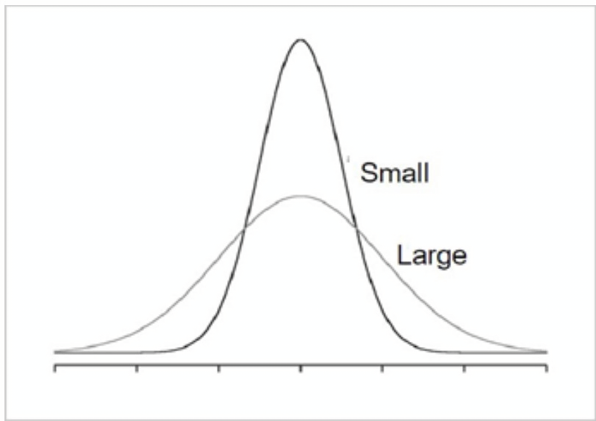
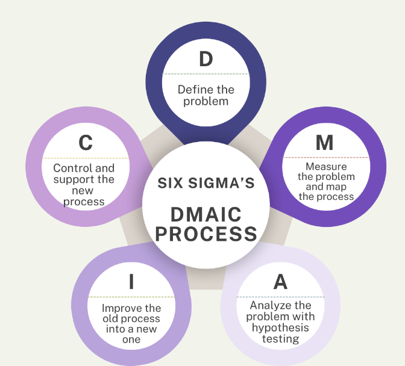

My first job out of college was in a semiconductor fabrication plant or fab, and Six Sigma was heavily promoted there. I worked with some very skilled Six Sigma coaches and earned a Six Sigma Black Belt for saving my company over $3M.

Despite transitioning from manufacturing to product management, I’ve found the Six Sigma approach and its DMAIC tools to be incredibly useful. It is, essentially, a structured way to solve problems and implement lasting solutions.

So, if you’re a product manager looking to improve your structured problem-solving or analytical skills, this article is for you. I will review the DMAIC process, its benefits, and how it can be applied in product management.

## What does DMAIC stand for?

In statistics, a sigma symbol represents the standard deviation of variance in a data distribution. A higher sigma value means higher variation in your data. So, a Six Sigma quality means that the process is so good that it will have only 3.4 defects per one million opportunities.

The goal of the Six Sigma is to reduce the variance in your process by improving the quality, reliability, and output of your product or service offering:

*The goal of Six Sigma is to move from a large to a small variance.*

Six Sigma uses the DMAIC methodology to identify and solve problems while focusing on variance reduction. DMAIC stands for define, measure, analyze, improve, and control.

## The DMAIC process

If DMAIC had a slogan, it would say, “If you can measure it, you can manage it.” The DMAIC process centers around problem-solving using five steps:

- **D**efine the problem
- **M**easure the problem and map the process
- **A**nalyze the problem and the process
- **I**mprove the old process with a new one
- **C**ontrol the new process

*The elements of the DMAIC process*

Each of the DMAIC phases requires you to see the world through the eyes of a scientist and the lens of experimentation. In this section, I’ll go deeper into the phases and detail which Six Sigma tools are used in each:

### Defining the problem

To improve and control something, you will first need to validate the problem and why it is happening. You will have to spend a considerable amount of time writing out a clear problem statement. In addition to defining the problem, you will want to gain sponsorship to execute your project, ideally from an executive. This helps ensure you achieve the support and resources you need to put your project into play.

For this first step of DMAIC, you can use tools like project charters, SIPOC diagrams, stakeholder analysis, or affinity diagrams.

### Measuring the problem

After you settle on a problem statement, you will need to measure the problem and collect observations or data points. In some cases, you’ll have those data points; in others, you might need to set up a measurement system to capture missing data. The key here is to determine your inputs and outputs or, as I like to say, your “x’s and your y’s.”

To measure the problem, I recommend using Six Sigma tools like process mapping (as-is process), sampling techniques, or SPC (statistical process control).

### Analyzing the problem

This is the most exciting step of the process, especially for analytical product managers and engineers. It is during this phase that you will need to analyze the data you’ve collected about your process and perform hypothesis testing. Validate or invalidate your problem hypothesis by running your data through statistical tests. If you do not have statistical data, complete qualitative analyses to prove or disprove your hypothesis.

To effectively analyze data, use tools like a [fishbone diagram](https://blog.logrocket.com/product-management/cause-and-effect-analysis-fishbone-ishikawa-diagram/), a Pareto chart, ANOVA, scatter plots, or [Five Whys](https://blog.logrocket.com/product-management/the-five-whys-framework/) analysis.

### Improving the process

The next phase of DMAIC is where you gather your stakeholders to review the work you’ve done so far, ground them in the problem, and begin brainstorming potential solutions.

The key to this phase is building a shared understanding of the problem with a diverse, cross-functional team. It’s important to have a diverse team because increasing levels of diversity will result in diverse ideas and potential solutions.

In this phase, you and your cross-functional team will need to draw up concepts and test them to improve the process. In tech, most people would refer to this phase as “running a pilot.” Use tools like FMEA (failure modes and effects analysis), DOE (design of experiments), and pilot testing.

### Controlling the new process

The final phase of DMAIC involves developing a “to-be” process, transition change management, and implementing a control plan to ensure the “to-be” process doesn’t break.

In most industries, the new process will involve people, so you will need to provide documentation, training, and support. Plus, some individuals might not like change, so you may want to partner with professionals from transition change management to help you.

In addition to implementing the change, you will need to put monitors, controls, and response flows in place to ensure the new process does not go off the rails. To do this effectively, I’d recommend tools like control plans, “to-be” process flow, training documentation, process documentation (SOPs), SPC charts.

## Six Sigma and DMAIC: Benefits for product management

I found the following Six Sigma and DMAIC aspects to have great benefits for product managers in terms of:

- **Defining problems** — Defining the problem can be difficult at times, and Six Sigma provides great tools and methods to do that. Product managers can leverage these tools to define problems to communicate better with engineering teams or customers
- **Leveraging analytics to measure and quantify** — Six Sigma focuses heavily on data collection and analysis. So, product managers who do not have an analytics background or experience will benefit from going through a Six Sigma program
- **Technology pilots** — Technology pilots are a very useful sales tool often required for large B2B enterprise sales for defining value, quantifying impact, piloting, and testing new products. The Six Sigma program will come in handy to set up technology pilots where you want to show a percentage lift or improvement

## Best practices for DMAIC

When using the DMAIC methodology, keep the following best practices top of mind:

- **Don’t skimp out on problem definition or jump to analysis** — We tend to make assumptions about the problem and jump straight to solutions. But only when the problem is clearly defined for you and your team should you jump to the next DMAIC steps
- **Estimate the financial impact and costs upfront** — Always determine what impact the problem is having on your process in financial terms before you take up DMAIC. How much is this inefficient process costing you? How does that stack up against your other priorities?
- **Automate your controls** — Once you’ve put in all the work to implement your new process, ensure that your controls are in place by automating as many of them as you can

## Key takeaways

In many ways, DMAIC and product management may seem like apples and oranges, but when you look a little deeper, you can see some overlap between the two.

While DMAIC doesn’t bring as much creativity, it does bring a structured methodology to problem-solving. In addition, modern product managers need analytical skills that complement their product sense and execution skills.

For those product managers who don’t have an analytics background, Six Sigma offers green and black belt training programs that can provide hands-on analytics training and experience.

For those product managers with an analytics background, I hope this article provided some useful insights and tools you can bring into your next analysis.

> This article first appeared in [Logrocket's product management blog](https://blog.logrocket.com/what-is-dmaic-in-six-sigma/) on August 20, 2024.
