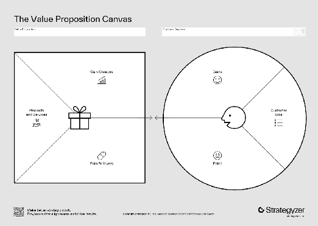
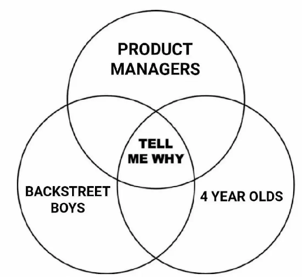

Most first-time founders make the same mistake. They get a great idea, spend months building it, launch with excitement — and then hear the silence. No signups. No word-of-mouth. Maybe a few polite "interesting!" responses from friends, but no one actually pulling out their credit card. The product works. The engineering is solid. But nobody asked for it.

This isn't a rare tragedy. It's the default outcome when you skip the most important step in building anything: understanding what your customer *actually needs* before you decide what to build.

The antidote starts with something deceptively simple — a value proposition. Not as a tagline for a landing page, but as a living hypothesis about the problem you solve, for whom, and why they'd ever switch from what they're already doing.

## What a Value Proposition Actually Is

Here's the plain truth: a value proposition describes the benefit your customer derives from your product. Not the features your product has.

***Theodore Levitt, the Harvard marketing professor, nailed it decades ago: "People don't want to buy a quarter-inch drill. They want a quarter-inch hole."***  

Your customer doesn't care that your software has an AI-powered dashboard. They care that it saves them two hours every Friday afternoon. The dashboard is a feature. The two saved hours, that’s the value.

A strong value proposition answers three questions simultaneously:

1. **What problem do you solve?** — The pain that exists whether or not your product does  
2. **What benefit does the customer derive?** — The measurable or felt improvement in their life or work  
3. **What need do you satisfy?** — The underlying job they were already trying to get done

When those three questions converge on the same answer, you're in the right territory. A practical template that forces this thinking is:

**Start with first principles:** "What problem is the customer actually trying to solve?" 

| Customer Segment: |  |
| :---- | :---- |
| Job to be done: |  |
| Pain you are reducing: |  |
| Gain you are creating: |  |

Now turn those four things into a natural statement that resonates with you.

No buzzwords required. The more specific and plain this statement is, the more testable and valuable it becomes.

**Alternative Approach:** [Use the Value Proposition Canvas from Strategyzer](https://www.strategyzer.com/library/the-value-proposition-canvas)

## The "Job" Your Customer Is Hiring You to Do

One of the most useful mental models in product strategy is ["jobs to be done."](https://jobstobedone.org/) Your customer isn't hiring your product, they're hiring it to accomplish something specific in their life or work. That job shapes everything: who they compare you against, how they define "better," and when they'll finally decide to switch.

Think of decision criteria as the knobs and dials your customer uses to evaluate any solution — **independent of your product entirely**. These criteria typically fall into three categories:

- [ ] **Functional:** Does it perform at the required level — speed, accuracy, reliability, throughput?  
- [ ] **Social:** Does it make the buyer look good or reinforce their credibility inside an organization?[2]  
- [ ] **Emotional:** Does it reduce anxiety, increase confidence, or give someone peace of mind?[2]

All three matter, even in B2B contexts. People inside companies make buying decisions, and they have personal stakes: *career risk, status, trust* riding on those choices. Additionally, context matters just as much as the job itself. The same job performed in different settings produces completely different decision criteria. 

*A DevOps engineer deploying AI inference in a cloud data center has entirely different "better" criteria than a hardware engineer embedding inference at the edge in a factory.* 

If you don't understand the context of the job, you can't know which knobs they're actually trying to turn.

## A Hardware Giant That Started with a Sharp Hypothesis: NVIDIA and CUDA

NVIDIA is now synonymous with AI computing, but its path there is one of the cleanest examples of a validated value proposition shaping an entire product strategy while forcing hard decisions about what not to build.

In 2006, NVIDIA introduced CUDA (Compute Unified Device Architecture), a software platform that let researchers use GPU parallel processing for general-purpose computing. The target customer was narrow and specific: computational scientists and researchers, physicists, chemists, fluid dynamics engineers  who were computationally constrained by CPU-based processing and needed massive parallelism for simulation workloads. The job to be done wasn't to"buy a graphics card." It was: run complex scientific computations orders of magnitude faster without a supercomputer budget.

The pain NVIDIA targeted was acute and persistent:

* CPU clusters were expensive, power-hungry, and slow for parallel workloads  
* Existing GPU APIs (OpenGL, DirectX) were designed for rendering, not general computation  
* Researchers had real, unsatisfied decision criteria around throughput, programmability, and cost per computation

What makes NVIDIA's story instructive for founders is what they chose not to build in the early years. They didn't chase gaming enthusiasts as the CUDA beachhead. They didn't try to make CUDA cross-platform or open-source to maximize adoption breadth. They went deep with a narrow segment: HPC and scientific computing.  NVIDIA validated that the job was top-of-mind and severely underserved, and then let the 2012 AlexNet breakthrough (an AI model trained on NVIDIA GPUs that demolished every benchmark) confirm the value proposition in the most undeniable way possible.[1]

Did NVIDIA stumble into AI dominance? This is an age-old debate which this post isn’t going to focus on. This blog post is about leveraging customer discovery techniques and following a tried and true process.

My perspective is that NVIDIA followed a tried and true product strategy and stuck it out. NVIDIA tested a hypothesis: that their hardware can do jobs no one else can do, for customers who are desperate for that capability.[1]

## A Hypothesis, Not a Statement to Defend

Most founders write a value proposition, fall in love with it, and then talk to customers hoping to confirm it. That's not customer discovery, that's confirmation bias with better branding.

The right mindset: start discovery with genuine humility that you don't have the answer yet. Your early value proposition is just your best guess. The customer will evaluate your offering as a **combination of all ~~features~~ benefits and all costs** — including switching costs, training time, workflow disruption, and integration effort. For your solution to win, the net value has to be meaningfully positive. In order to do this you’ll want to put yourself in a beginner’s mindset.

Here's how to treat your value proposition as a testable hypothesis rather than a statement to defend:

* **Write it down explicitly** — vague intuitions can't be tested or refined  
*  **Identify the assumptions baked into it** — which customer? which job? which pain? which gain?  
* **Rank those assumptions by risk** — which one, if wrong, kills the whole idea?  
* **Design your first conversations to stress-test the riskiest assumption first**  
* **Update the statement after every interview** — if it never changes, you're not learning

**Your real enemy isn't a competitor. It's your customer's inertia.** 

Your solution doesn't just need to be good — it needs to be good enough to make someone change their behavior, retrain their team, and absorb real switching costs.*"When it comes to change, we'd rather not."*

## How to Test Your Value Proposition in the Real World

You don't need a finished product to begin. Here's a practical, step-by-step approach you can start this week.

**Step 1 — Draft your initial value proposition statement**

 Make it specific. Vague drafts produce vague interviews.

**Step 2 — List your hypothesized decision criteria**

Before your first customer conversation, write down five to ten criteria you think customers use to evaluate solutions for this job:

*  Functional criteria (speed, accuracy, cost, reliability)  
* Social criteria (team adoption ease, vendor reputation, compliance)  
* Emotional criteria (reduces anxiety, builds confidence, simplifies decisions)

These are your hypotheses, not facts. Label them as such.

**Step 3 — Identify the right people to talk to**

Your ICP (Ideal Customer Profile — the specific type of person most likely to need and buy your solution) should guide who you interview. Look for people who:

* Are actively doing the job your solution targets *right now*  
* Have expressed frustration with current solutions (forums, reviews, LinkedIn posts)  
* Work in a context where the pain is highest

Aim for at least ten conversations before you draw strong conclusions. Patterns require data points.

**Step 4 — Conduct discovery interviews the right way**

The goal is to understand, not to pitch. Effective discovery interviews follow a consistent structure:

* Open with the job: *"Walk me through how you currently handle [target job]."*  
* Probe for pains: *"What's the most frustrating part of that process?"*  
* Surface decision criteria: *"If you were evaluating a new solution for this, what would matter most to you?"*  
* Test switching cost: *"What would it take for you to actually change what you're doing today?"*

**Step 5 — Analyze patterns and refine**

After each round of interviews, revisit your value proposition statement. Ask yourself:

* Did the pain I assumed exist turn out to be real and top-of-mind?  
* Did new, higher-priority pains surface that I hadn't considered?  
* Are the decision criteria I hypothesized the ones customers actually mentioned?  
* Is the context of the job different than I assumed — affecting what "better" means?

The hardest part of building a great product isn't the engineering (as AI is proving day in and day out these days for our friends in software), it's resisting the urge to fall in love with your solution before you've fallen in love with your customer's problem. Your value proposition is not a line of copy. It's the lens through which every product decision should be made, and the only way to sharpen that lens is to test it relentlessly against the real world. Go have the conversations. The answers are already out there.

1.       [https://macronetservices.com/nvidia-strategic-analysis-ai-ecosystem-executives/](https://macronetservices.com/nvidia-strategic-analysis-ai-ecosystem-executives/)

